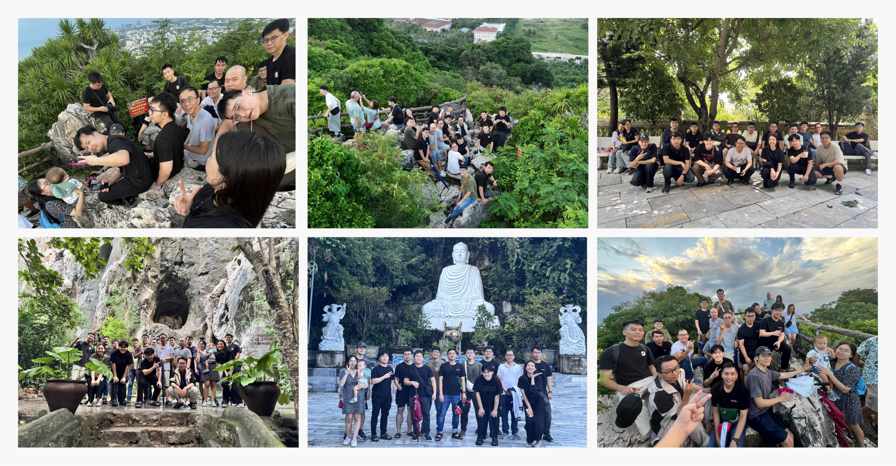
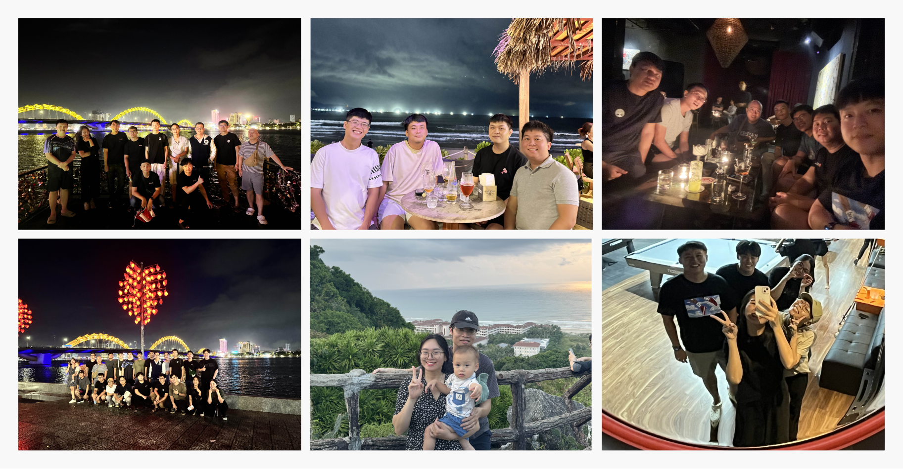

## Why we met this year

We set aside a few days to be in the same place. We work in a hybrid way: some of us meet at the office, others join from different cities. The goal was simple: spend time together and share a few easy activities. 

Work stayed in the background. Conversation was unhurried. Walks and meals gave us time to talk, and the quiet parts felt comfortable. We moved together, paused when needed, and everyone had room to join.

## Together as a team

One team sharing the same days. People who see each other weekly sat with teammates they mostly know from calls. On the trail, walking partners changed naturally; at meals, seats shifted and the talk moved with them. Conversations stayed light: travel tips, coffee setups, family updates. By evening, names matched faces and starting a chat felt easy.

## How the days went

We arrived in the afternoon and walked up to the highest lookout at the Marble Mountains. The stairs set a steady pace. Jokes moved up the line. At the top the bay and city sat clear below. After the climb we made our way to the Hàn River and took a slow loop along the water and the nearby streets.

The next day we visited Linh Ứng Pagoda on Sơn Trà. We kept an even pace, stopped when someone wanted to look closer, and moved on when it felt right. The afternoon was open: some rested, some swam at the beach, a few took a quiet walk on the sand. We regrouped without fuss.

Evenings stayed simple. We chose a mix of restaurants and small local spots so everyone had a fair mix of experiences. The first night stayed in Đà Nẵng with a short walk by the river. Another night we went to Hội An, spent time along the old streets by the water, and rode back without hurry. The pace stayed level and the group stayed close.

## Off the screen but better handoffs

Seeing each other in person filled gaps that video calls cannot cover. People matched names to faces and understood small preferences that matter during the week. It became easier to read tone and intent. Teammates who usually meet at the office spent time with those who join remotely and got a better sense of how they work. Remote teammates got a feel for the office pace. None of this needed workshops. It came from being together for a few days.

## Small moments that stayed with us

A few small scenes carry the trip for us. None of this needed a program. Being in the same place was enough.

- The steps fell into the same rhythm, the bay came into view and we had a quiet minute at the top.
- A small detour turned into the best lookout of the day.
- We took our time at the top because the shade and the view were both good.
- Seats changed at the table so new voices could join.
- On the river walk we matched pace without planning it.
- The ride back from Hội An was calm and the talk stayed easy.

## What we brought back to the week

- Better familiarity across locations and squads.
- Day-to-day chats that now start easier after time in person.
- A steadier read on tone because names and faces click.
- A simple reminder: a few shared days help a hybrid team stay close.

Thanks to everyone who made time to join. Đà Nẵng gave us a straightforward setting to be together. We returned rested and more comfortable working with one another. We will make space for days like this again.