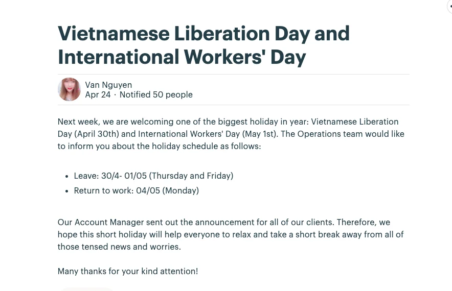

Last Wednesday was the last day of social distancing. Diners & cafes are back in the city. It's getting crowded in no time, better take care of yourself until the pandemic is actually over.
\_\_

### Liberation & International Labour Holiday

Van has just posted the holiday schedule on Message Board. To sum up, we'll take days off from 30/04 until the end of 03/05/2020. Just exactly when we think we've had enough of the days at home right 😏

### Design Updates

Domain research

- The Blockchain Design Principles blog post was completed and ready for branding activity.
- Thanh D. is working on Remote Testing blog post for a partner
- Khai will continue to transfer the knowledge, as well as pick out the product for the team to analyze biz model
  Internal Training
  We went through the first loop successfully, by getting used to invest on ourselves through target setting. Some mini achievements have been made, such as webinar, sharing and research on new domains.
  The next goal will be more detailed on what can we do to distribute the knowledge amongst the team to boost up visual ability.

### #Software Craftsmanship @DF - Another approach to real Software

You may compare it with TechRadar, the tech investment of discover and approach new languages/methods. Software Craftsmanship @DF is a series where we discuss more about the practices, skillset and mindset toward the industry. But one way or another, both strives towards the same goal - widen our knowledge, validate our current working style and make it better.

This week led us to the Introduction to Craftsmanship - a Craftsmanship sermon from An D
The term Craftsmanship may ring a bell, since it has been covering on our channels when it comes to description. But not all of us actually understand it at its core. The team has conducted a webinar to walk us all through the definition of Software Craftsmanship, the nature of a Craftsmen, what to expect in a well-crafted software, and why we chose it in the first place.

Hosted by An Duong and Huy Nguyen, Introduction Craftsmanship webinar lasted for 90 minutes with this table of content:

1. Software Craftsmanship

- The definition of Software Craftsmanship, including the philosophy of Uncle Bob, and our own definition
- The vibe: what portraits a real Craftsman
- The result: the final expectation of every craftsman - Well-crafted Software

2. Characteristics of Craftsmen
   A brief intro on 4 key characteristics of Craftsmen

- Discipline
- Professionalism
- Pragmatism
- Incremental Improvement

3. Well-crafted Software
   The explanation of a qualified & top-notch software, i.e, the utmost quality that a real engineer must reach.

4. Agile <> Craftsmanship
   A side-by-side comparison between Agile and Craftsmanship, and how we manage to combine the two into our working system. Other than that, this part also demonstrated how we pursue Craftsmanship at DF, through a number of values and knowledge research activities.

The transcript of the talk is being polished and expected to reach you all in no time. Meanwhile, the team has upload the presentation slide in PDF version in Team Drive.
