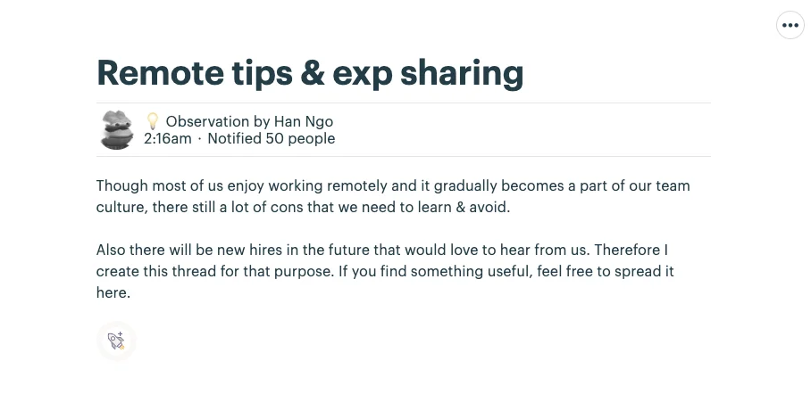
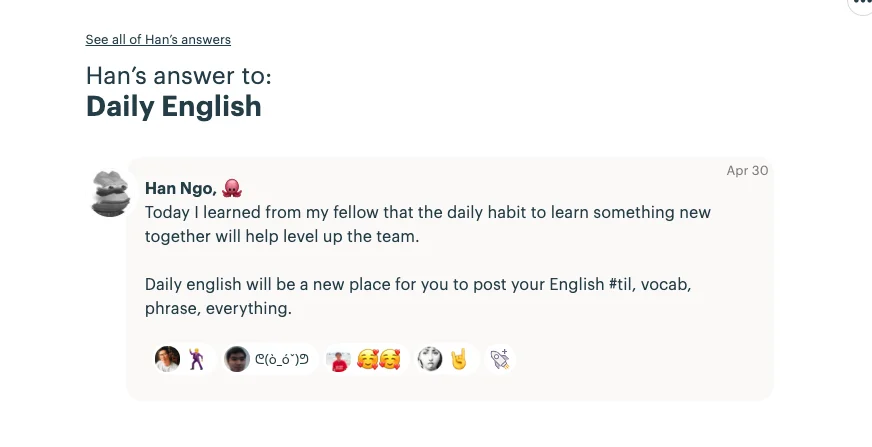
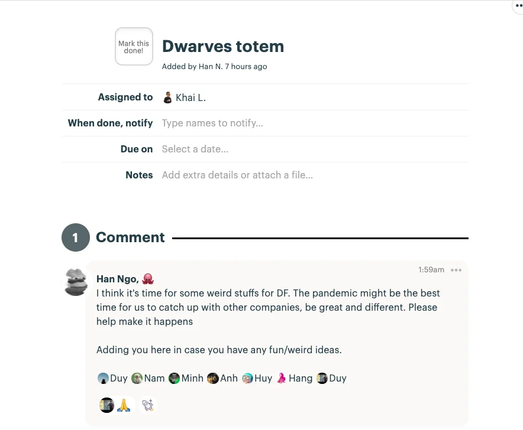
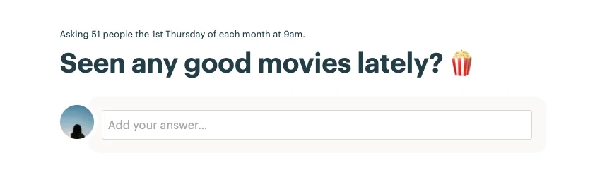

As I remember, this time last year, we worked through the Holiday, which took place on a Tuesday. Back then, the BOD decided to let us take our real days off from May 2nd to May 5th. Brilliant idea, but we barely had any buddy to join us since we were the only firm who went for that choice. Maybe this year will be better, tho. How's your holiday so far?

Almost forgot, some new spaces were made for ideas & sharing. Have a check then 👇

### Remote Tips Sharing 👀

Gradually, remote working takes more place in our culture. Sure it'll leave us we both pros & cons, and we believe will be helpful for the soon-to-be Dwarves. This space was created to jot down the things we should avoid in working remote. Feel free to drop yours in.

### Daily English 📓

Personally I do think we also need a channel for Daily Tieng Viet. Some of us need that.
Daily English is expected to share new vocabs, phrases, facts, or slang also. Anything that keeps English fun to learn.

### Dwarves Totem 🔸

The word 'totem' means an object that is respected by a group of people, especially for religious reasons. But please don't see things that larger than they are, let's just put on the stuffs which in your opinion - distinguish us from others out there. Terms like 'remote' and 'book birthday gifts' may works. Let's see what makes us unique 🌚

### Movies of the Month 🎬

Guess I won't need to explain this one :chewing popcorn:

