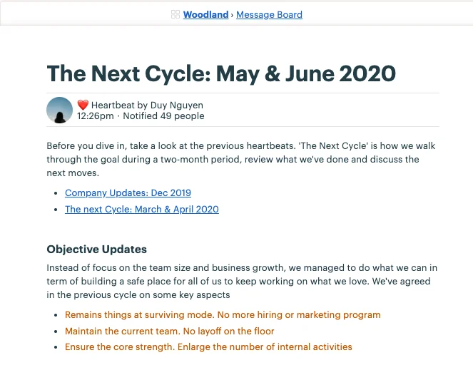
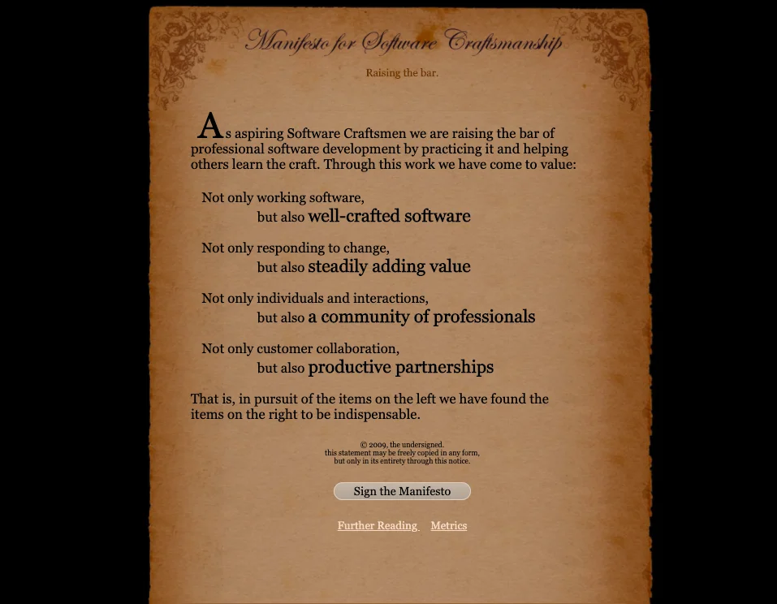
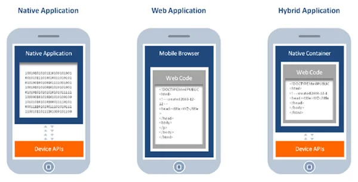
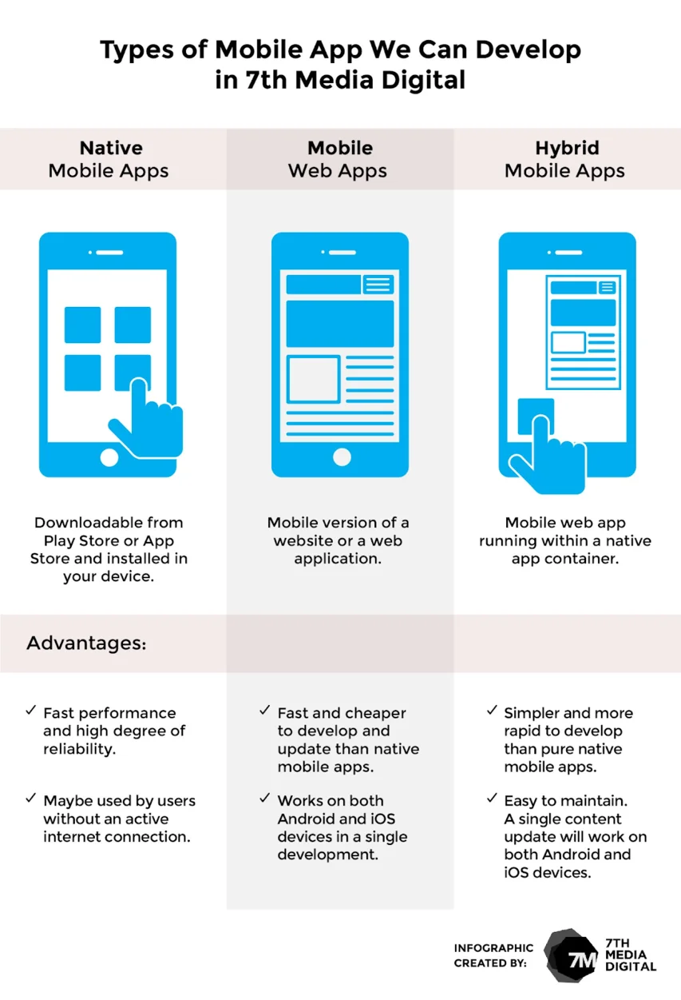

### The Next Cycle: March-April Updates and May-June Roadmap

Two month passed by in a blink of an eye. And we're here with the new achievements. The detailed update has been posted on Woodland > Message Board. It was hard time collecting the pieces for the report, so I do hope it brings something you may find motivated & a clear vision on our next Roadmap.

### Software Craftsmanship @DF: Introduction to Software Craftsmanship

The previous talk of An Duong & Huy Nguyen, on the brief intro of the term Craftsmanship, as well as why we believe it's important to adopt it into our core values. Here below is the transcript I've promised. For the presentation slide, you may check out our Team Drive >Training >Engineering >Craftsmanship.

INTRODUCTION TO SOFTWARE CRAFTSMANSHIP
Craftsmanship has been our motto since the first day. But to the newbies and even some current Dwarves, the real definition of software craftsmanship is still vague, or being understood in different ways.

Most of us have been working in software industry for a long time. For newbies, it might be unfamiliar to catch up the term of Craftsmanship and how it is applied into our industry. So to make sure everyone is on the same page & using the same brush, this talk aims to cover our point of view on this term and why it matters that much to land a seat on our core values.

We'll walk through these main points:
Agenda

- What we stand for: company name, 3 core values and why Craftsmanship is one of that
- Software Craftsmanship: what it is and what for
- Characteristics of a Craftsmen: what makes a decent Craftsmen
- Well-crafted Software: the expected final outcome when we live the spirit of Craftsmanship
- Agile <> Craftsmanship: advantage & disadvantage, our point of view on Craftsmanship
- What's Next: what we do to discover and apply Craftsmanship onto the team
  What we Stand for - An Duong
  Our company name is quite hard to pronounce. Dwarf (/dwɔrf/) is a term for a mis-shapen creature in Svartalfheim, one the 9th Worlds, whom are best well known for their wisdom and crafting skills, or in other words, the best blacksmiths that create the top-notch tools.

We took that definition as their tools are our software, and given that nature, our goal is to product just the most value tool that helps bring impact and make impossible things possible. We make that happen through massive products and a wide range of activities:

- Technical Partnership
- Venture Investment
- Offshore Development
- OSS Development
  Software Craftsmanship
  The definition of Craftsmanship is to conduct things with scrutiny. In every detail, at every stage, which makes us satisfied to witness the impact of our product to other clients or departments.

It's a spirit to do the best we could in any circumstance.

Software Craftsmanship @DF is a series for engineering training. When you reach an acceptable level of building software, the series is what levels up your current skill and enhance the work ethic to approach the work in the most professional way. Unlike Techradar, which is looking for the news. Software Craftsmanship @DF is about looking for the right.

When technology was still a long way down the road, everything must be handcrafted. When machine wasn't exist, craftsmen must put all of their effort on product creating. So that product can become a thing to be proud of. Take the Katana sword as an example. It requires meticulosity in every stage, from material to process and maintenance. Katana wasn't just a sword to fight, it's something to be worship. That's how craftsmanship converts the spirit into product.

Before 1940, there was only one computer in the whole world. Literally, one. Until 1970, some of the mainframe made their ways to the lab. But now? Computer is everywhere. Technology is basically our lives now. Computer. Laptop. Cellphone. Airplane. Household appliances, ...etc. Have you ever wonder how bad it could be if it can't perform due to lack of maintenance or bad code?

People tend to treat software as a commodity that can be traded, instead of an integral part in their lives. So developers tend to write software quality based on the amount of payment they receive, which is full of crap, which is runnable but isn't maintainable. It affects things in several ways.

So, our definition of Craftsmanship?

Do the best you can in every stage and every part. Not only make things right, but make the tiniest thing right.

Characteristic of Craftsmen
Craftsmanship doesn't just happen in engineer. It appears in every type of work. People with Craftsmanship will pour their right attitude into the process of making the final product. One good thing about them is they will try to reach their best limit and take pride on what they build.

There are many things to form up a good craftsman, but we decided to narrow it down to 4 key points

- Discipline: It requires a deeper level than the typical rule & obligation. Discipline in engineering means there are things that people won't take seriously, but the engineer himself will feel the need to make it happen, just because it will better meet the standard, or raising the bar. Every time Thanh P releases a new code, although the client has accepted and things go south, he still manages to follow up with the code and optimize it, just because he feels it's a necessary thing to do.
- Professionalism: The code of conduct. This can be understand through a small example. When a task is assigned with a tight deadline, a craftsman will estimate the time he needs to get it done to make sure things work out precisely. He'll discusses and offers his estimation, rather than sticking with the deadline and come up with something that is unusable. Be honest & straightforward. Quality > quantity.
- Pragmatism: Dealing with a problem in a way that suits the conditions, rather than following the fixed theories, ideas, or rules. When a craftsman receives a plan, he won't get lured by the requirements. It's gonna be a bit more realistic and down to earth. It will be facing the facts and coming up with suitable solution.
- Incremental Improvement: Moving gradually toward success. Shorten the feedback loop & minimize the risk. Divide the improvement process into small rounds and focus on it. At the end of the day, we end up with mini achievements, rather than a long list of to-dos.
  Well-crafted Software
  We've been through the traits of Craftsmanship and what it takes to become a good craftsman. Now it's time we moved to the result that every craftsman wishes for: the Well-crafted Software.

Unlike working software, well-crafted software contains a clean design, high test coverage, easy to understand and maintain. Bugs and side effects are under control.

Whether it's adding to changing features, well-crafted software ensures the process is as fast as it used to when the codebase was small.

From a QA's perspective, people may thinks QA is the one who tests and locates the bug in our software. However, we take QA as someone to check the product quality, rather than a hair splitter. Our software can sometimes be runnable with no red bugs, but the codebase is a massive mess, and it will be difficult for future maintenance. That's when the importance of well-crafted software dives in.

Before I hand over the next part to Huy, I'd like to look back the reason why people want to apply Software Craftsmanship onto engineering at this time. We're surrounded by technology devices nowadays. Everything comes with micro-processor, and run by software. The ratio of causing sever damage due to sloppy software is getting higher. Say, in the next 5 years, the amount of engineers will be as twice as it is now. That also means if the current workforce don't do things right, their descendant might step in the same path. It's not hard to imagine what type of product we'll be using if engineers focus on the money they make more than the product quality.

Agile <> Craftsmanship - Huy Nguyen
I read in a meetup of Agile team in 2008, Uncle Bob once said: Craftsmanship over crap.
Years later, he came up with a Manifesto for Software Craftsmanship

and people tried to compare it to the Manifesto for Agile Software Development

I've noticed Craftsmanship would be a next level of Agile. Sure, people from Agile will get offended, or being under-looked.

Then I got caught up in a blog of Martin Fowler, Chief Scientist of Thoughtworks, who stated that if people care too much about making a top-notch software; other key points, such as teammate communication, will be underrated. Dan North, the originator of Behaviour-Driven Development, also agreed as he published a writing called "Programming is not a Craft". He claimed that the value that software brings to the table doesn't depend on how careful we are in the process. In short, Agile mindset always thrives towards end user and the impact that product creates, rather than how it was created.

For those who support Craftsmanship, I'll take 8thlight.com as a prime candidate. At first, I found it's surprised that 8thlight stands by every word of Uncle Bob, until I realized the founder of 8thlight was his son :kappa:. But on top of that, 8thlight does believe that software is a craft and craftsmanship is a part of creating a ground-breaking product. They even chose 'crafter' to describe their team. They manage to promote that value out loud and take good pride in their work.

So the question here is: Do we really need to care about crafting a first-class product, or there are more underlying issues for our attention?

I've attached some links on the slide, you may find that helpful in the case of reference.

At our woodland, we live by the code of Craftsmanship. Beside, we don't eliminate other side values, such as the team collaboration. That is a big part in any process, along with the attention to detail. I always favor this saying: When you pay too much attention on perfection, there won't be any product. Perfect is the enemy of Good.

To compare the core value and our current status, still DF is in need of more effort to match up the two. Which is why our main goal this year is to better the working process and build an environment where people can create the best product in their ability. To make that happen, we've launched some technical activities, such as TechRadar and TechTalk. QA team is conducting a Testframework, to create rules & guidelines for test cases creating & designing. This helps set up the new bar for testing process quality once the framework is finished and applied.

I've also realized the mini improvement along the way. Team communication during project sometimes gets hard. We create a wiki for that by documenting every retro meeting with transparent meeting notes where both clients and our team can discuss and raise up ideas/issues.

In a Nutshell
This only to help summarize the key point of this talk, which can be listed as

- Definition of Craftsmanship: an attitude and an approach of how we solve the problem
- Core value: we strive to create the best product quality, that motto outweighs all others
- The need of collaboration and interpersonal skills
  What's NextSoftware Craftsmanship @DF will be rolled out every week or two, and the main topic should cover all aspects of our day-to-day workflow. For the next talk, we're thinking about Huy G giving his talk on Frontend coding; or Khiem's opinion on Software Modeling. One way or another, it's all about technical knowledge sharing and how things can be level up.

### Software Craftsmanship @DF: Software Modeling

Khiem gave his research on Software Modeling through a webinar last Friday. The talks covered

- Why we need Software Modeling
- What it is
- How can we make it happen

### Product Design Talk: Design Better Mobile Application

This workshop wraps up the useful information on 2 types of operating system for UX/UI designers, based on the personal research on iOS and Android. The purpose is to create an application that brings comfortability and great experience to the end user.

If you're working on a product for both iOS & Android, and still have room to discover, this workshop is for you.

Table of Content

1. Introduction to iOS & Android
1. The platforms to build application
1. Useful tips to create effective mobile application
1. Introduction to iOS & Android - Thanh D.

1. The Platforms to build Application - Giang V.
   Based on the programming languages, mobile application can be categorized into 4 types

- Native App: applications written to work on a specific device platform, using the suitable language for each platform, such as Java for Android, Objective C for iOS, C# for Windows Phone. For example, games written for iOS cannot be used in Android.
- Web-based App: A computer program that utilizes web browsers and web technology to perform tasks over the Internet. This type of application is run on web platform, written by web languages like HTML5, CSS, Javascript of jQuery Mobile. Basically this is a website with application interface and data is loaded from browser.
- Hybrid App: combines the elements of both native and Web applications. The basic parts of the application is still written in web language, but it will be placed on the native container.
  

- Cross Platform (Multi-platform): one codebase is applied for all platforms. Developers only need to write the codebase once, then translate or transpile it into different Native App versions that for each different platform. This is known as the most cost-optimized one.
  Still, there are some researches claim that Hybrid App and Cross Platform are the same. Some said these two are different, so I'll put these into 4 types, so the traits of each type can be described clearer.

Pros & Cons of each Platforms

3. Useful tips to create effective Mobile Application

- Read the Human Interface Guidelines
- Talk with Dev
- Component Structure between Android & iOS

