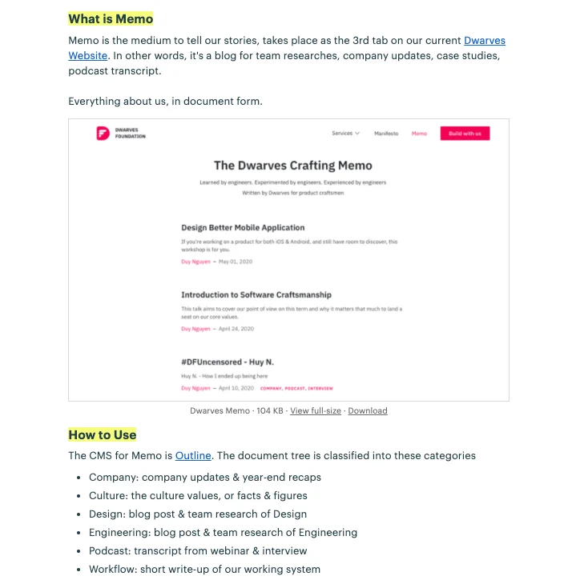
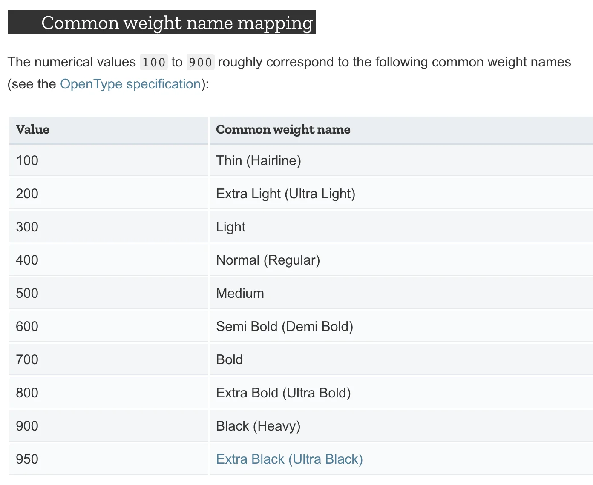

### Introduction to Memo

A tutorial on Memo - our medium to keep the team stories alive, has been put on Woodland > Message Board. This aims to help you know about how Outline and Memo co-work for the team blog posts, the format and the topics you may find interesting.

Hope the message makes your future writing easier. If you have any struggle working with Outline, Duy will be the person to ping.

### Transcript: Software Modeling - Khiem V

I'll continue the series of Software Craftsmanship @DF with today's pick: Software Modeling. The team is also heading for 1 talk from Design Team, and another one from QA Team. By bringing up different topics from different teams, we get to know better on our obstacles and how to collaborate smoothly.

AGENDA

- Why do we need Software Modeling
- What is Software Modeling
- How to do Software Modeling
  This is how I approach a new topic or knowledge, starts with why, understand the concept and figure out how to make it happen.

1. WHY DO WE NEED SOFTWARE MODELING
   This can be summed up into 2 definitions:

- Maintainability: Software Modeling helps to maintain a system, or a project. It ensures the based document for newbies to approach and get to know the system thoroughly.
- Scalability: helps developers to add sub-system or new feature onto the current one, without creating conflicts.

2. WHAT IS SOFTWARE MODELING
   According to Wikipedia, Software Modeling came out in a lengthy definition. So I took the privilege to paraphrase it like below:
   → Software Modeling is how to turn an activity of an object from reality to a form that computers can understand and execute.

3. HOW TO DO SOFTWARE MODELING
   People create things to help them solve a problem, instead of doing that themselves. Tools are made to help us do the work easier. The purpose of Software Modeling is to reconstruct the actions that an application needs to take, or the product owner wants to happen.

Action
I'll take the marketplace as an example of Action in the business world. A marketplace is a platform where buyer and seller exchanges the goods. An action in marketplace can be defined as:
→ Buyer buys Product from Seller

MODEL OF A MARKETPLACE SYSTEM
After defining an action, we need to break it down and find the core objects. In this case:
→ Core Object: Buyer-Product-Seller

AARRR FRAMEWORK
In the business world, AARRR is a habitual method. AARRR is a funnel to analyze the business growth and business development orientation of a company.

Our Design team is using this to follow the final goal of an application or a system. By applying AARRR, designers won't get lost along the way, or happen to conduct redundant things. The action of an application/ system will go through the end of the AARRR funnel, which lets us know how that action derives revenue stream.

After that, we'll find out the relationship between them. Read the full article at Software Modeling

### Transcript: How a Design System work - Giang V

This talk is created from my experiences & lesson learnt, the rule and self-code I've built and believe to be applicable. So I can guarantee you may not find some of it in any other places on the internet.

Table of Content

- Color Style & Text Style Naming Convention
- Component Naming Convention & Component Structure
- Auto Layout Application
- Description of Design System
  COLORESTYLE NAMING CONVENTION
  There are 2 types of color: Flat & Gradient. We use a slash to categorize the color styles. Here are a few types we may go through:

- Main color
- Text color
- Background/ Base
- Status/ alert/ label background
- Alert/ notification
- Social network brand color
- Table
- Gradient
  TEXT STYLE NAMING CONVENTION
  Text Style Generator is a tool in Figma that helps to create text style easier using plugins. Naming convention for Text Style will be based on a front-end method - the Common Weight Name Mapping.

When Common Weight Name Mapping is used in UI, we need to know the ratio between the font weights, which one is bold and which one is light. What we need is the consistency of text style in the overall UI, and Text Style Generator in Figma plugin makes it possible. It generates a new unified style by writing overlay on the previous one, and have it updated for all.

COMPONENT NAMING CONVENTION & COMPONENT STRCTURESpecial Atom

- Iconography (Atoms)
- Assets (Atoms)
  Component Naming Convention

- Formula 1: Variations > Size > State
- Formula 2: Type > Level > Variations or Component Position > Size > State
- Formula 3: Variations or Component Position > Type > Level > Size > State
  If Variation and Type (kind) have complex modify, we can consider dividing the Variation into Artboards.

Component Structure

- Constructed in atomic design
- Created from the micro elements, Atoms; then expand it through the levels: Molecules - Organisms - Templates
- Possible cases: create folders for automatic show/hide function in UI
  AUTO LAYOUT APPLICATION
  Helps analyze the components:

1. Button (Molecules) / Button Group
1. Table Row
1. Breadcrumb
1. Input Field
   DESCRIPTION of DESIGN SYSTEM

- Turn UI file/ design system into document
- Helps to note down a detailed instruction for the team (with >2 designers). This drives better communication between designer-designer and designer-developer.
