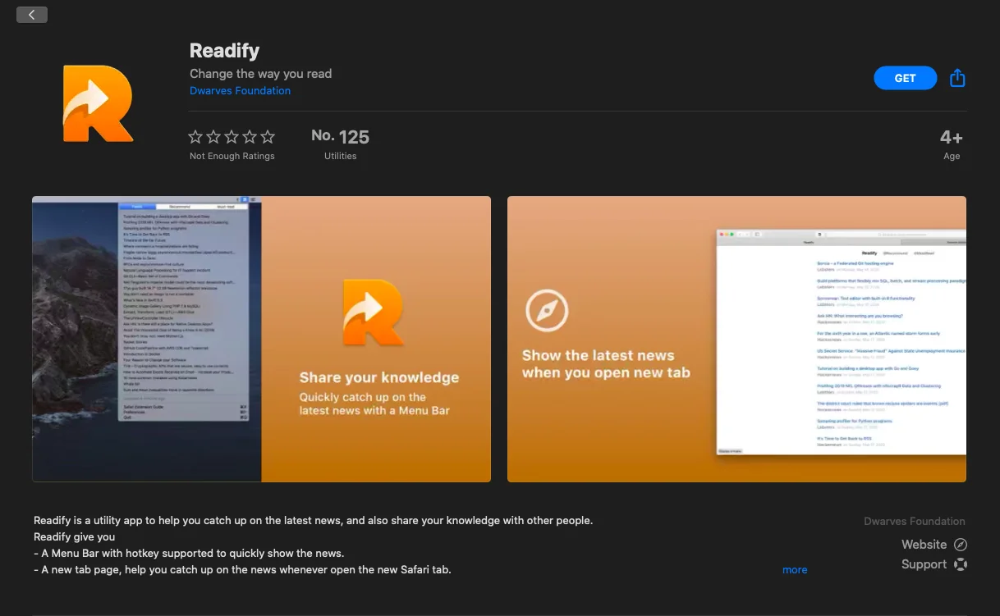
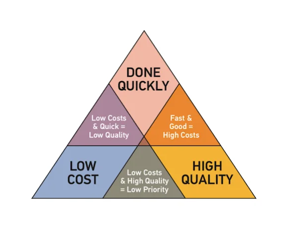

### Celebrate the 1st Milestone of Dwarves Foundation

Yah we know it's been 2 cycles (which means 4 months already) since our 5th Anniversary, thank God the feeling is still there to craft up this recap.

We're looking back the past journey with pride and heading to the next one with excitement. For those who have just joined the gang, taking a good look at this will help you understand more on what we've walked through the last five years.

Read the article at Dwarves Memo - Celebrating 5 years of Dwarves Foundation

### Readify on App Store

One of our latest bits from Superbits.co has made its way to AppStore, thanks to the hard work of MacOS team. This version contains a real-time book mark where your favorite articles can be save in two collections: mustread & recommend. Currently, Readify acts as an extension on 3 browsers: Chrome - Edge & Safari.

To know more about Readify's feature, we have this article here: Readify's Feature & How to use.

### Software Development Life Cycle

Conducted by Khai Le & Huy Nguyen, this workshop contains the basic knowledge on Software Development Life Cycle, provides people with a step-to-step guideline and the artifacts which will be created on the way. We don't dive in the details. Instead, we treat it as an overview look on how to build software successfully.

Table of Content

1. What is Software Project?
1. Software Development Life Cycle
1. SDLC Models
   What is Software Project
   We build software, and we need a planned undertaking. So call software project is “A specific plan or design” or “A planned undertaking”.

Project Constraints
A software project has a lot of constraints. Cost, scope, quality, customer satisfaction, risk, resource, time, or anything in between.
But the most important ones are

- Quality
- Budget
- Time
  

Why does the project fail?

With a lot of constraints, the project is easy to fail. We could have plenty of reasons why a software project fails: team politics, overdue payment..but three of them could be prevented easily with proper methodology, framework

- Unclear/misleading project requirements
- Wrongly defined tech stacks
- The wrong approach, develop practices
  Project Success
  If it's easy to fail, then what is a successful project?

Read the full article at Dwarves Memo - Software Development Life Cycle 101

### Adjust the way we work, in Basecamp style

Being in a remote team is dope. Manage your own stuff, remove the time and cost of commuting, select your work ambiance, and got equipped with all types of supporting tools.

Our path with Basecamp didn't cross by accident. Moving the whole theme to Basecamp wasn't easy, especially when we have gotten used to the small daily talks. At first, there wasn't much conversation transpire in Basecamp. We only touch it for project briefing and note down the to-do list.

As time goes by, we're getting closer to the part where Basecamp acts as a great supporter of team communication & project development. Basically, this is how we organize things, in one place. Read the full article at Dwarves Memo - Adjust the way we work, in Basecamp style
