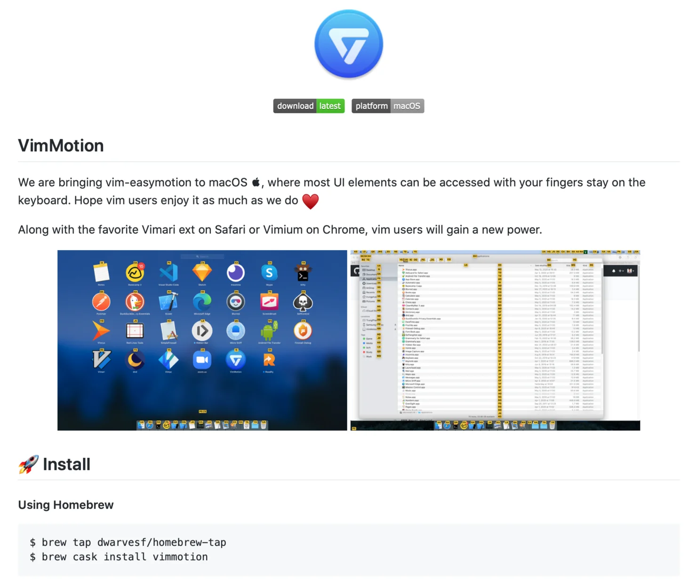
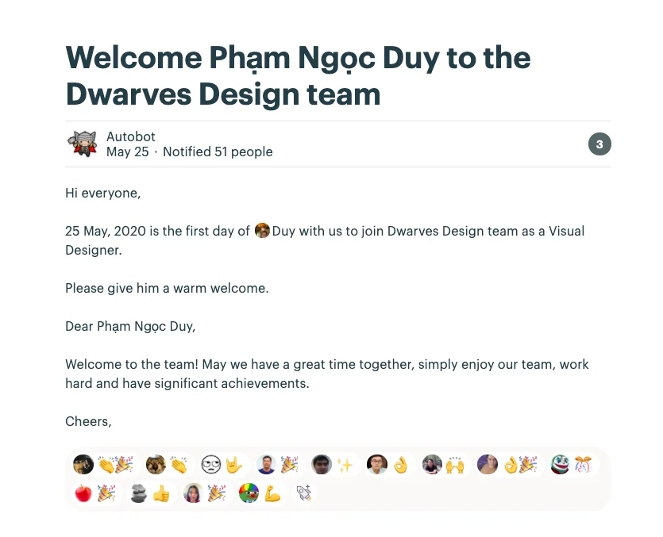

### Roll out Vim Motion

If you are, or trying to become one, then installing this app may be a good idea.
Inspired by vim-easymotion & avy-mode, it simpler your motion without the need of a mouse. Feel free to access and work with any UI elements and still keep your fingers on the keyboard.



Download the app here

or take a shot through Homebrew

```plain text
brew tap dwarvesf/homebrew-tap
brew cask install vimmotion
```

### New Dwarves in town

We welcomed another Dwarves last Monday. Duy Pham joined us as a Visual Designer. Under the guidance of Anh, he’ll be expected to level up the skill and helping with our products in superbits.co.



### Bach Khoa Internship Program

We’re launching another internship batch, partnering with Bach Khoa University. The Ops team is currently taking the applications from the school, interviewing and preparing the paperwork to have them ready by July.

If you happen to know a suitable candidate, maybe a recommendation would help.

Community

Going strong in external communication is one of our goal this year. Sharing team research, conducting Newsletter on industry observation, interviewing cool people in the tech world & writing stories. Apart from those, bring our voice to the outside world through 2 communities: Golang-vn & Webuild, is also a path we’re embarking.

- Golang-vn: has been deployed onto production. Our primary focus is to resume the activities on Facebook & Slack (post, meetup & webinar)
- Webuild: Cuong is working on some minor task before having it gone live.

