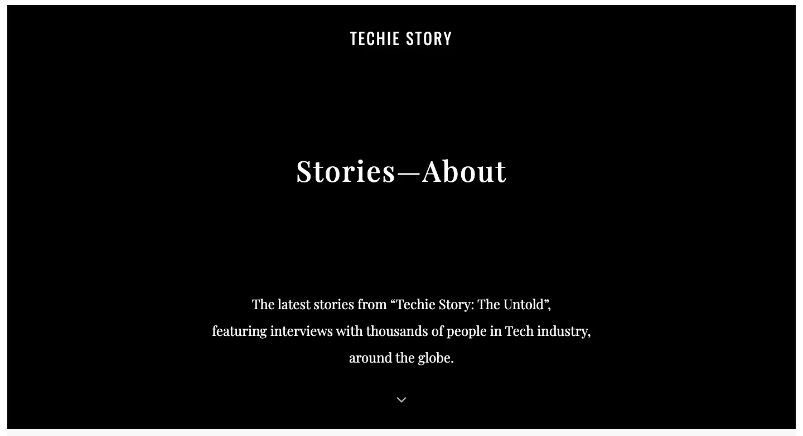

### Dwarves Team Expansion

A few juniors joined us this week. Looks like QA team & Design team are expanding their size 💪

QA

- Vy Nguyen: QC Engineer
- Nguyen Tran: QC Engineer
  Design

- Thao Nguyen: Visual Engineer
  People are getting back to the office, and it’s a great chance for newbies to explore more about the team. Welcome on board, may you have a great time becoming a Dwarf and gain many achievements.

### Culture Write-Up

TRANSPARENCY

‘How much do you know about this woodland?’ is the question we all get during the first interview. Sure, if you're lucky enough to nail the final offer; you're likely to get a better chance on gradually discovering the company's essential information.

But then what?

You step on the project.

You get swiped away in work.

You check up the daily to-do.

You have no idea what's happening in other places. Teammate. Departments. Or even the company. And this is why information transparency is a real thing.

Read more

CONSTRUCTIVE FEEDBACK

I’ve realized ‘constructive feedback’ plays one of the most vital part in keeping the team sane. I haven’t gotten to work with all the Dwarves, but for those who I've been working with, they all have one thing in common - The ability to point out what was wrong with my work, and to suggest what can be improved.

So I decided to craft up a small article about it. And I hope it’s helpful enough to apply for all.

Read the article

### Techie Story: The Untold

Techie Story is a community project where we discover the untold aspects of the technology world, one techie at a time. It’s the way we choose to honor the people behind the cool stuff and bring them out to the spotlight. It can be a short memo for our Dwarves, or a start-up story of other tech-minded of the outside world.

Huy G has helped to create a website here, while Van conducted the interviews with them. We’ve been telling 4 stories so far, and the number keeps going on.

### New in Project

Community

We still need to be more active on the page & groups. There will be a detailed plan to work on this at 10pm this Sunday.

sudo.fm

Phuc has begun to create UI based on the finished design from Anh, while Thanh was auditing the source and optimize bundle size. The expect output is sudo.fm should be able to load the music through youtube iframe, contains full media control function (play, pause, forward, backward, shuffle) with hotkey for Media control and integrate with CMS API.
