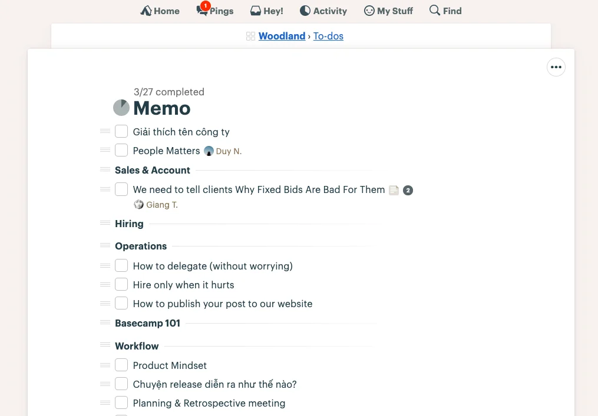

### Join a hand for Memo

We’ve moving Memo out to the backlog of Woodland. Previously, Memo was quite of a responsibility for a few members. But after all, if it’s meant to be a platform for our voices, it should be conducted by anyone. Currently, the list of writing still has many unwritten articles. Should you find any topic that might suit your favor, just us a heads-up and we’ll assist you along the way. And if you’re having other cool topic to add in? Even better.

### Business Updates

We closed a deal with a key client this week and Nam N is going to start 1-week trial in the next Monday. This is our second project in the US, so we can leverage more this potential market and continue practicing the working process in 12 timezones distance. We hope to contribute to this healthcare startup to see the growth opportunity for the industry in the Covid-19 pandemic.

### BK Internship Wrap-up

Van has help wrapped up the Internship recruiting with Bach Khoa University. That leaves us with 5 soon-to-be Dwarves joining us this July.
