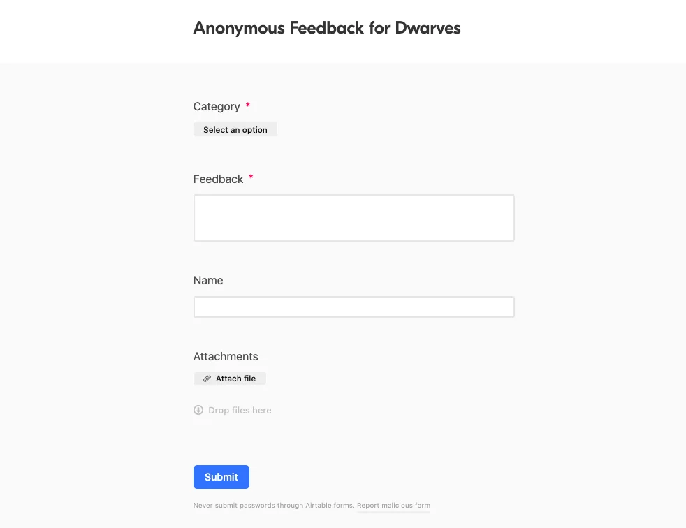
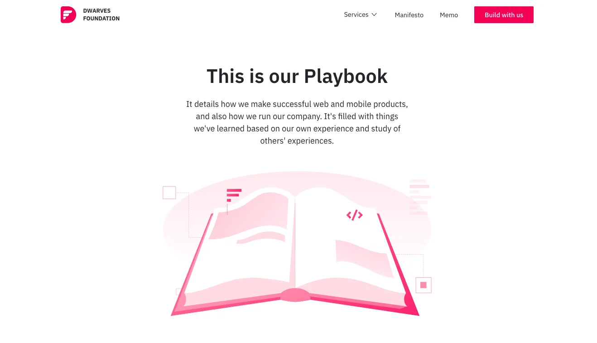

We might have a solution. Keep scrolling.

### Feedback Form

Building a place where we love to work is one of our main goals. It’s the people that create an organization.
Along our way to success, we know there might have been things that need improvement. And more than that, we know your idea matters.
It’s great to hear from everyone’s point of view on how to enhance things. And don’t worry, this form stands anonymous, so you don’t need to worry about being payback, or something like that.

### End of Cycle Dinner Invitation

Yep, it’s not always about work, we guarantee!

We’ve been working remotely for too long. Though it didn’t affect much on our workload, it somehow didn’t give us a chance for a real meet up. We believe it’s the time to do so, and that leaves us with an invitation for you on July 3rd - An End of Cycle Dinner.

Please help click on the link and leave your RSVP (+1) in the comment thread. If you can’t make it, we’d love to know your reason to help adjust since it’s been so long for a catch-up with beer & dining.

Oh, and we welcome all the suggestion for the venue!

### Playbook was moved to Dwarves Memo

Some of us once checked on Dwarves website to realize some clicks led to nowhere. Well, we’ve heading closer to resolve that. One website at a time.
Each of our team has their Playbook. It’s the principle and practice we’ve summed up and polished for the juniors. Huy N has spent some nights to combine all of those, structured it in the SDLC model, and ended up with a version of “How to build a Software firm from head-to-toe”. Kudos, bro. We all know how hard it is to deal with the freaking Outline layout.

Check it out on Dwarves Playbook.

### Short Reminder

We’re heading closer to the end of June, which means another cycle is about to wrap up. It’s about time to sort back all the todos, noted down what went well and define what’s the next milestone. Hope you have everything under control.
