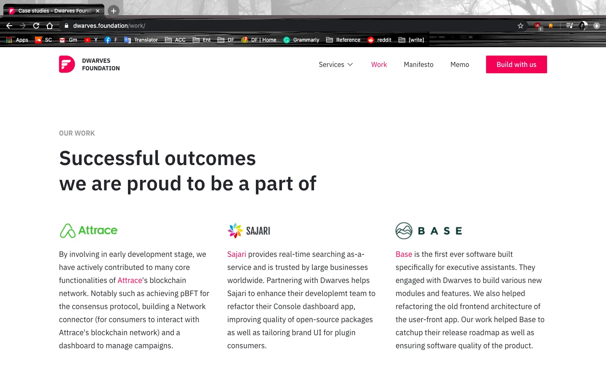
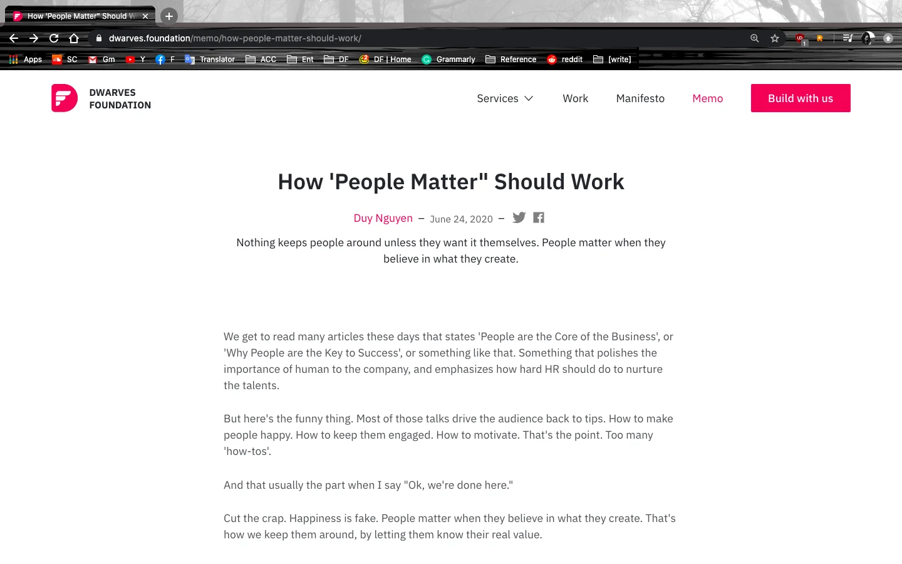

### New UI Setup for Dwarves Website/ Our Work

A few last touches have been added to perfect our Work Section. We have adjusted the content structure, added up some new case studies and re-designed the whole layout. This helps the potential client to understand more about our experience in various way, and log back our previous work for the junior to catch up.

### Memo: How ‘People Matter’ Should Work

As we’re calling for some hands to help with the culture code write up, there’s one topic that caught my attention - It all start with people. While many firms out there keep propagating about the importance of people, and end up with a list of mundane how-tos to keep their employee around. It bugs me, and motivated me to come up with a memo called How ‘People Matter’ Should Work.

### Last Call for End of Cycle Dinner RSVP

It’s a few days left until our End of Cycle Dinner. We have received many RSVP from the Dwarves. If you haven’t drop yours yet, please do help to comment in this thread. It would be nice to have another suggestion on the venue also. The current options are BiaCraft, Zumwhere and Kpub.

It’s been forever since our last catch up on the 5th Anniversary, let’s don’t miss this!
