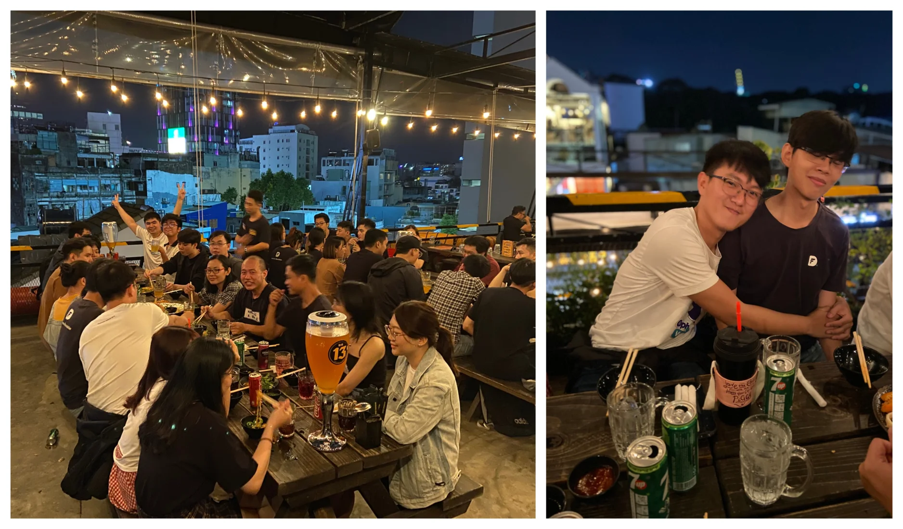

We’ve just had a small party to recap the 3rd cycle of 2020. Hope you enjoyed the treat. For those who didn’t make it, we hope to see you next time 👋

### Design freebie: Cryptosy

During their way toward on working Freebies to enhance the skills and domain knowledge, Design Team has come up with another achievement. Cryptosy is an open financial system for the digital currencies world. The team had managed to optimize its flow and give the whole mobile app a better look✨

### End of cycle review

Another cycle has come to an end. And that leaves us with many things to proud of. The review session on Friday last for an hour as anh Han walked us through some main points, with all the things we have done and and the gain we have made. Thank you so much for your hard work.

We have also uploaded a detailed note in Woodland>Message Board>Cycle Review. It’s was a long reading, take your time to digest.

### Team Dinner 🍻

Of course, it was a good time with beer and the overload of food. As usual.

