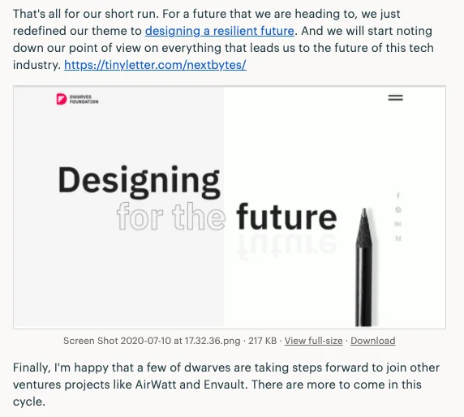

### Cycle Planning: July-August 2020

After the Cycle Report and the part retreat last week, some of us have collected and decided what will happen in the next cycle. We have a short wrap-up at the comment below this message. The main theme we’re heading to would be Partnership Expansion and Tech Upgrade.

All the todos & goals have been updated in Roadmap/July-August todo.

You may find the upcoming goal of your team there, and please feel free to add up more if you think there’s still many rooms to explore.

### Performance Review

It’s the time of the year again, Huy has composed a short announcement on Woodland about our incoming Performance Review. The review is expected to happen somewhere next week.

The main theme is to review your skillset, evaluate the contribution and discuss on your career advancement in the next 3-6 months.

### Golang Meetup #17

We resume the work on Golang Community lately. The latest achievement was the successful launch of Golang Meetup #17.

With the support of Nam, Khiem & Phat, the meetup got wrapped up nicely, conducted with 2 talks

- Microservices: created by Chuong Nguyen, Senior Software Engineer at VNG
- Effective Go: created by Khiem Vo, yes. our Khiem Vo
