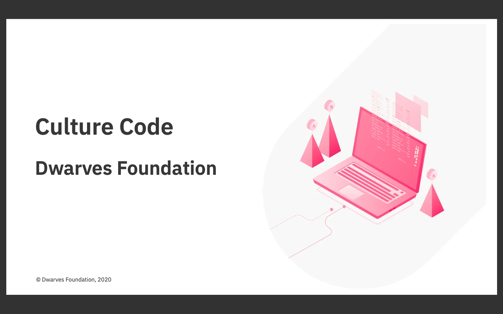

### Company Culture Code

After weeks of drafting and editing, we have finished a presentation slide for our Culture Code. Still, we’re heading for a hard copy. And yes soon to be displayed in a glass surface case at our office. Until then, this online version was summarized for main point to use internally and for onboarding purpose.

### Canada Internship

We’ve finished the interview process and picked out 4 Dwarves-to-be. They’ll be onboarded to the woodland next Monday.

### Design Blog post: Startups vs. Junior Designers

From a perspective of a Design Lead, Ngoc described and analyze the hiring pain points of a startup. More particularly is why start up at the early stage need more from a senior designer to help them set up the process, rather than spending time on endless hand-holding training session.

It’s her first attempt on Memo, and I gotta give her credit for the length. Anyway, here’s the full reading.
