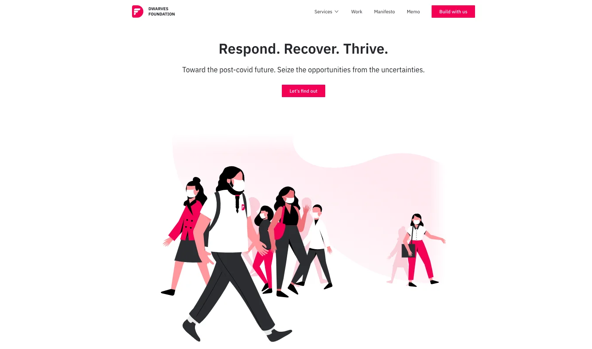

### Handbook update: Routine

As mentioned earlier last week, we have finished a walk through for A typical week with the Dwarves. It’s a small section in our Handbook, describing how our day usually transpires. This also an expectation for our soon-to-be Dwarves, getting to know the team and other things beside client projects.

### Program: Covid support

Covid Campaign is a program we started a few weeks ago with an aim to deliver the best support as a tech partner during this pandemic. Our utmost goal is to help those SMEs and startups who find it hard to keep the business going, provide them with our affordable service suite and the strong know-how of remote working.

We’ve been starting to reach out for most of our connection, and thanks to Huy G & Anh T, a whole new website for further detail.

