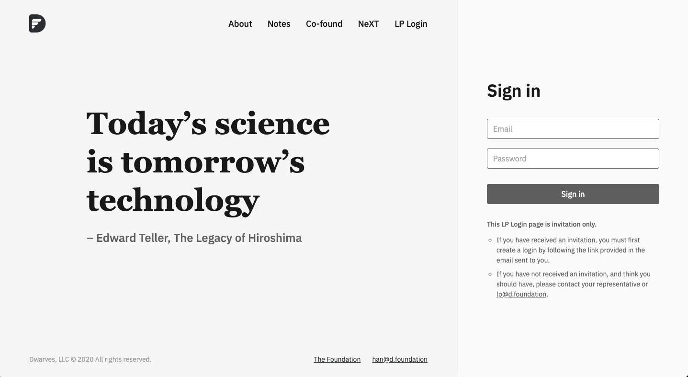
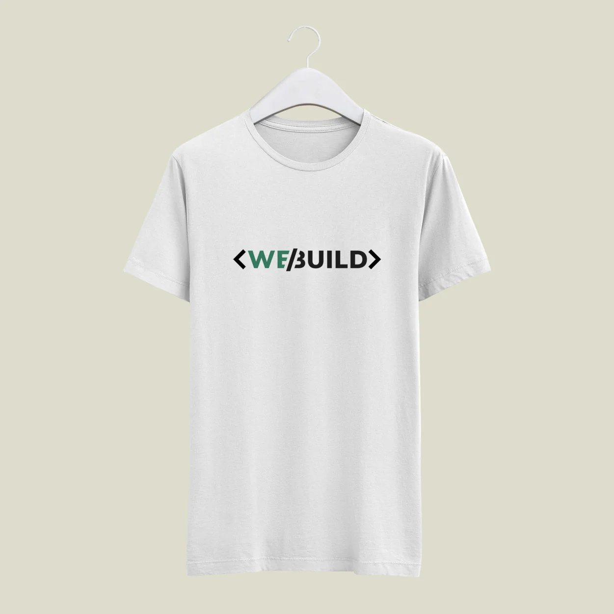
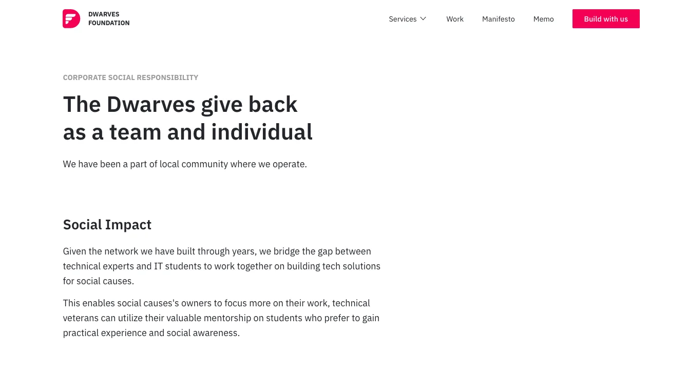
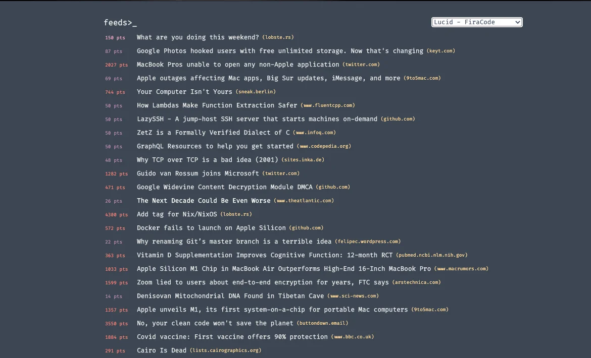
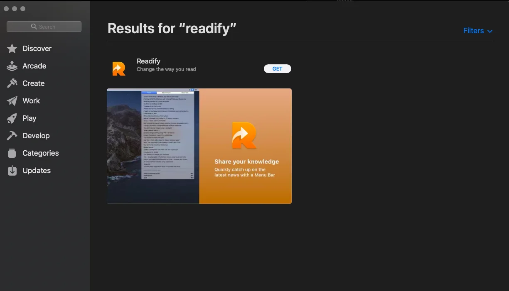

### Development & Tech

Ventures Website

Thanks to HuyG, Ventures website were upgraded with a detailed perks for limited partners. These includes discount from 3 partners: Dwarves Foundation, Circo Coworking Space and VHA Consulting.

Toward automation: Gdrive auto backup

We live to believe in the power of automation, last week, Minh Luu has helped setup the automation for document synchronization from our projects into team Google Drive. This one help everyone can access to the same resource with ease, we believe that can bring the quality up.

Envault Puffer

On our way to ship the product, we realized the "vault" part sounds a bit common and easy to mistaken with other apps. The team has suggested an idea which we ended up choosing as the new name - Puffer.

Readify is (almost) ready for MVP release

Data is part is quite a challenge in Readify, since we are not only aggregated data through multiple sources, we also need to index it with the nice ranking system, you know, to make sure the feed is hot and worth your time. Kudos to Khoi Le for putting an enormous effort toward that.

The data for Readify has been well prepared and ready to bridge us with the newest technology movement. We've already distributed them through a few channels:

- Thanks to Tuan Dao, the website version looks lit.
- Phuc also helped to port it to the macOS version to keep the geek up-to-dated
  Our next move would be developing UI, which Anh will surely gets her hand on, while Bien works on integrating Readify into all of our current information source: Basecamp, Website & Newsletter. (see the bottom of this?)

### Sale KPI

Last Monday, Business team led by a.Linh had finalized on some key moves for our sales strategy, one of them in re-create the KPI dashboard. Only this time is a bit different. We don’t just spend effort on the team KPI board only. The SDRs are creating KPI board for themselves as well, as we figure it’s best to define our own limit and have it synced with the team it the long run for better result an collaboration.

### Community

Webuild day

If you have never heard of Webuild, have a glance at their Slack and website. WeBuild is our backed community for tech in Vietnam. We've planned for an event to bring the human in tech together while sharing the constant industry movement.

Take a look at Anh's great work on designing the t-shirt for this year.

We've also heard that our MacOS team (Phuc + Trung) will be this year speakers to talk about the latest state of the art of Mac-related-topic 👀

Golang workshop #3

After the successful of 2 previous workshops, we are heading to the 3rd one. Phat is putting a few final touches to make it happen. ideally, the workshop will be conducted on next Saturday.

Turing Alley

While being in this industry, we have seen the difficulty to hire the right people. And we decided to do something about it. If you ever have heard of Hubspot in the past few weeks for data enrichment, it’s a stepping stone for this one.

Turing Alley is a platform to connect employee & employer, where we help sort out the finest engineers from the talent pool. Van is preparing the website content & workflow for its operation.

CSR branch

Corporate Social Responsibility (CSR) is how we engage more to the community by creating social impact through technology development. The Dwarves is currently working pro-bono with Salt Cancer Initiative - a non-profit organization that focuses on providing support for cancer patients in Vietnam. Check out thedwarves/csr for more.

Birthday Gift(s)

After a few month of giving a birthday gift to our employee, we think it's a good time to extend the category. From now on, our choice for birthday gift will personalized picked out for you. Stay tune.

### News of the week 🤔

Apple event

Undoubtedly this one is the biggest news of last week, people are talking about M1 chip everywhere, some even bench that M1 chip is out-perform the 16 inch pro Macbook. On the other hand, few bugs have been reported unsurprisingly for the new release, some come from a very familiar guy Docker so we think it best to hold off your update for a few minor releases.

