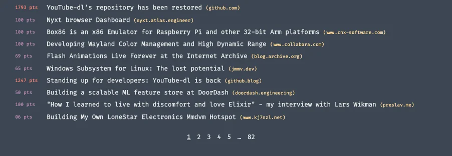
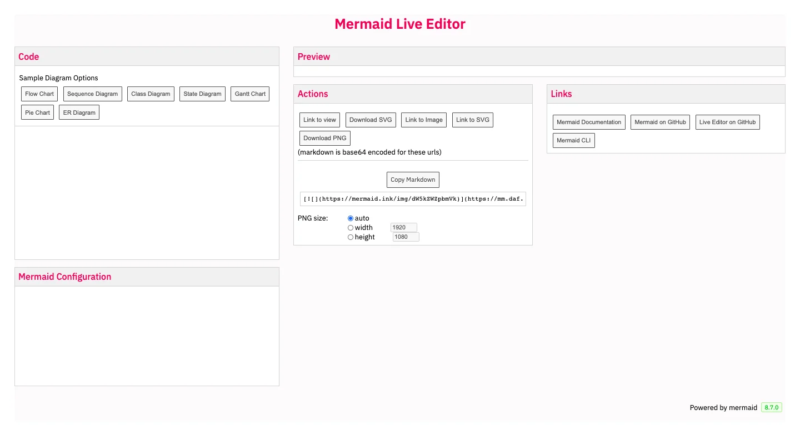

### Readify: on progress, what’s your input?

Many updates have been added to enhance Readify for the past few months. And we think it is the right time to hit a pause on development, we'll be glad if you can give it a try at readify.app and come at us with some feedback

### New looks for mm.daf.ug

We adopted Mermaid as a diagram tool not too long ago. But we still want to make it a bit more personalized. Ly has put on some work to redesign its color with DF palette, which Huy spent a few days to bring it alive. Check out the work at mm.daf.ug if you plan on create diagram.

### YEP is on the way ✔️

Yah we know, it's a bit early to throw out this new. But YearEnd party is what we all hope for and the Ops team is currently seeking for a great spot for us. We have had some options in mind, with rooftop, good food and yes, beer refill 😏

### News of the week

Stand on the developers side

Last week, youtube-dl - one of the most well-known library for downloading youtube - has been removed due to copyright violation. Since the beginning, the CEO of github has shown the intention to help the develop reinstate the repository. Until this week the repository has been restore and github has gained a huge credit for standing on the right side.

After that, Apple has also done something for the small business/indie developer that reduce the commission through Appstore by 15%

Tailwind v2.0 release

TailwindCSS is one of the most used library in our Frontend team, and this week has marked the official v2.0 release along with a lot of more feature.

The funny things is, if you remembered it, Huy Giang did the migration from Tailwind v0 to v1 in our website a few week ago, guess he should have waited 🤣
