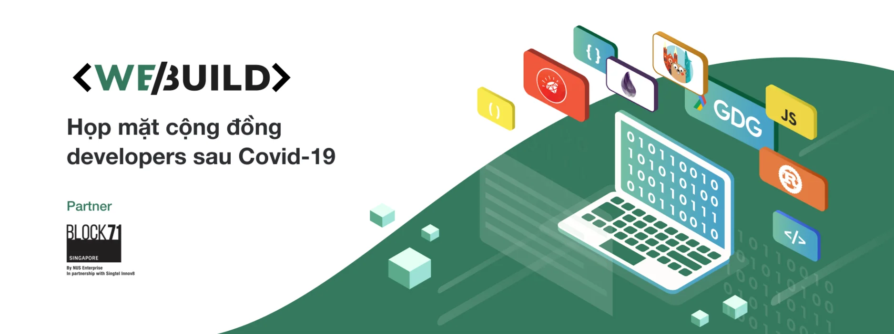
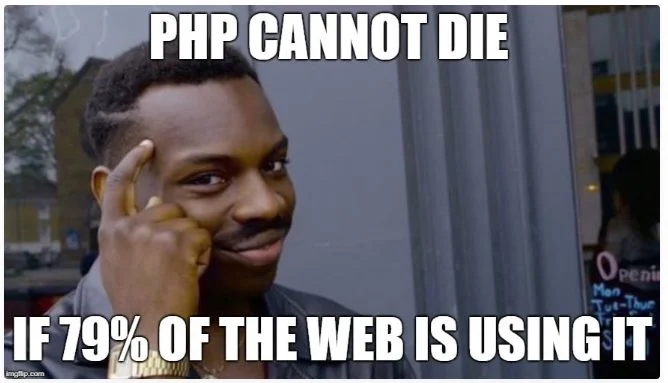

Seem like our current projects are going smoothly. The workload stays steady and no update on resources adjustment.

### Monthly report

Thanks to you all weekly report, we now have collected enough the material to compose project report for Product Owners. We’ll trial this firstly this month with our key clients, when the other will begin from December.

The report will be CCed all the project member to make sure everyone is in the loop.

### And the Memos ?

We received 4 new memos within a week. Splendid.

Giang Vu decided to set some ground rules for designers to follow to ensure the smooth handover between designers and developers, while Ly spent the past few weeks noting down the work of an MVP payment app for market validation.

Meanwhile, in Business end, Giang gathered her observation to craft up an overview on how KPI should be built and functioned, while Duy explained our current information flow.

Oh, in case you haven't known, Memo post can now be searched by author name ✌️

### Year-end party venue

After days of searching, Van has finally founded the next place for our year-end retreat - The Street. The expected timeline would be January 15th, 2021. We’ll roll out the detailed info once the date is getting closer.

### WeBuild day

WeBuild day will occur on Saturday, December 12th - which is only two weeks from now. We’ll hold the event at Block71 Saigon, a brand new event location in district 2.

Anh has greatly finished her work on the material for branding image. This time event will contain a few talks brought by our iOS team, and including Golang workshop #4 as well.

### News of the week

PHP v8 release

Yeah, my reaction is exactly the same that “isn’t that thing already dead”, turn out there is almost 80% of today website is written in PHP, so yeah, I guess the new version is still a thing and people are talking about it, enjoy the meme since I don’t even bother to check out the changelog

Good Blog spots

Not exactly news, but these are worth to check out.

- Reasoning about colors
- API is a user interface
- Parse, don’t type check
- How to think for yourself?
