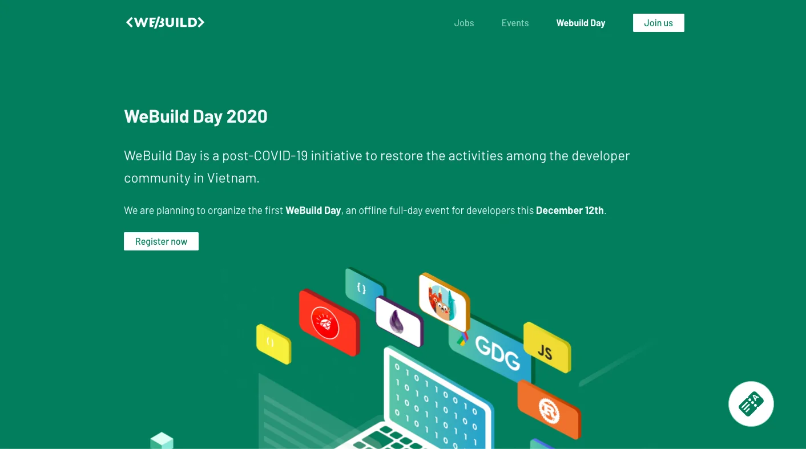
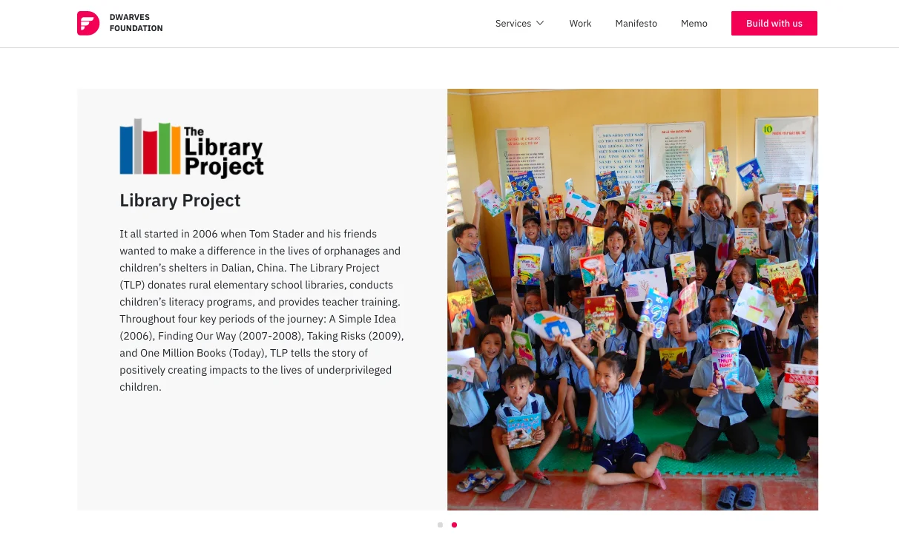

We all heard of some mfs messed up the community safety by bringing Covid back, but things are getting dealt with now. We still got the latest on Covid-19 updated here, pls input if you have any news. Stay tuned & stay safe.

### Artzy Production

Artzy just shipped their latest achievement at Artzy.vn. This version contains bug fixed and optimized the load time of production website.

### WeBuild Day

It’s one week left until WeBuild Day. Anh has spent her time working on polishing this year’s website. The main theme is, still, Covid 19 and a brief on 8 keynote, and as I have mentioned in the previous digest - two of them are from our Dwarves.

### The Library Project press release

We partnered with The Library Project as a technical supporter for their libraries donation channels, which recently TLP has issued about on their press release.

### Website

Our website got some updated in the past week

- Full development of CSR work, with update on our partnership with The Library Project and Webuild Community
  

### English Class

Last but not least, the English class. We’ve had 8 Dwarves on board so far, and the first class will take place on next Tuesday, Dec 12 at 6h30.

Duy has created a group on Basecamp for better discussion. In case you wanna join, give her a ping.

### News of the week

Saleforces acquisition of Slacks

Earlier this week, Salesforce-Slack deal was officially announced and the number did raise many eyebrows - $27.7B.

People have their own opinion toward this. Some think that’s a good deal since Saleforces landed pretty similar product Chatter a while ago, but it didn’t work out so well, so Slack would be a good fit for its ecosystem. Others might think differently, they believe this deal is all about generating revenue.

If you ask us? We would say it an understandable move, because of the competition from Microsoft Team on larger accounts, it’s hard to see how Slack could survive as an independent company. But it might hard if Slack decides to transform from a “cute chat app for startups with emoji” to an Enterprise-level.
