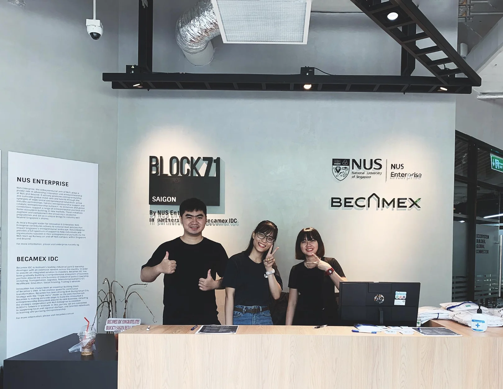

### Puffer

Puffer is getting closer to finish its Proof of Concept, considering the features are gradually built, including the automatic reachability, access management and CI setup. And more than that, project from different environment can now be imported easily using drag & drop.

### Website: Tech stacks <> Current services

We starting to link our tech stacks with our current services on d.foundation, and also attach in the related case studies. This helps to portray a clear vision on our key strength, and how we put them into product development.

### WeBuild Day

As most of you have heard, we conducted WeBuild Day this Saturday. Kudos to Vy, Cuong, Anh, Van & Nam for putting a lot of effort in this.

And also, an applause to Phuc & Bien’s work at the events.

### News of the week

Bumped into this news a few days ago (and maybe some of you have read it already), Samsung was believed to follow the footsteps of Apple, by stop providing chargers, which, ironically, go back to what they claim not so long ago. Classic.

This year has been a hard year for Airbnb due to the invasion of Covid-19, it'a hard to forget when they laid off nearly 25% of the team resource, though after the first day of IPO, their valuation was roughly at $100B.

But unlike WeWork, Airbnb’s business model has proven its ability to generate a positive cash flow, which means the company can grow organically without relying on external funding to survive.

