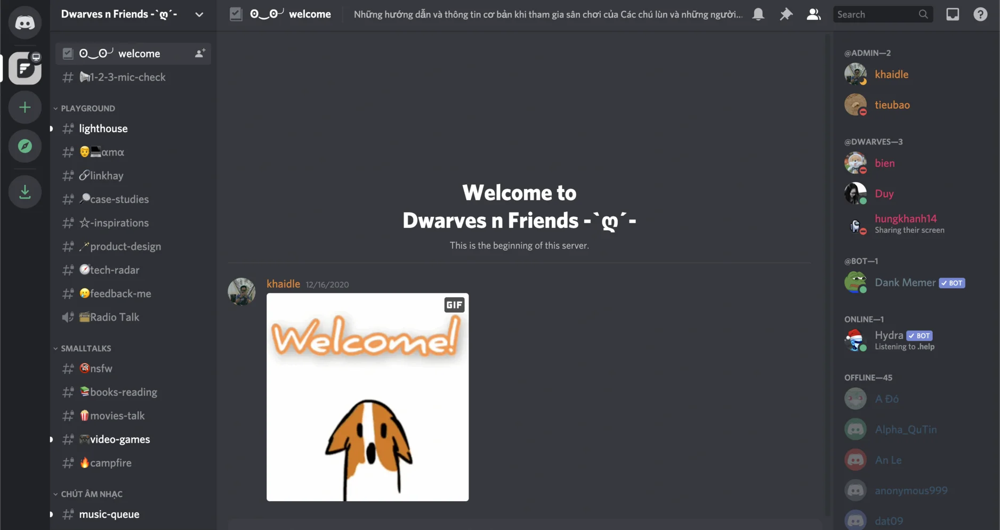

for a hell of a year. May we never speak of 2020 again.

### All hands Meeting

Spent 30 minutes running through the Nov/Dec Changelog last Thursday but I can’t believe we’ve finally reached the end of 2020. Thank you all for being here, for your hard work and support.

The goal for 2021 will be updated soon. But for now, wish you all the greatest in the first weekend of 2021 🖤

### Team Birthday - the Dwarves is turning 6

This Sunday marks the 6th birthday of the Dwarves. But as we’re all spending New Year holiday with our family, we’ll celebrate this on our next team retreat, which takes place in the middle of January, as I remember.

### Training for Consultants

We decided to roll out some courses to upgrade ourselves as tech consultants. More than engineering and technical skill, being able to consult and advice clients in daily convo should be a must to define us as solid technical partners.

If you’re interested, drop a hand here. Looks like it’s getting crowded.

### Join Discord yet?

Khai created this few weeks ago. If you miss the vibe of using slack, then I guess Discord can help. There’re many channels can catch your attention, but the two most active ones so far are ‘campfire’ and ‘linkhay’. Join us at Dwarves Discord.

### News of the Week

Microsoft’s source code gets visited by SolarWinds

Seems like user's data isn't the only privacy that gets violated last year. As you may recall, it happened with GHTK not too long ago.

Despite its well-known history of being particularly careful about cybersecurity, Microsoft received a big hit when its source code got touched by SolarWind hackers. In the rumors, Microsoft still claims there's no evidence of access to production services. But even if it's true, reviewing the code can still allow hackers to analyze the insight and subvert Microsoft's product. This reminds me of Prison Break, where Michael collects the blueprint and figures different alternative exit instead of one.
