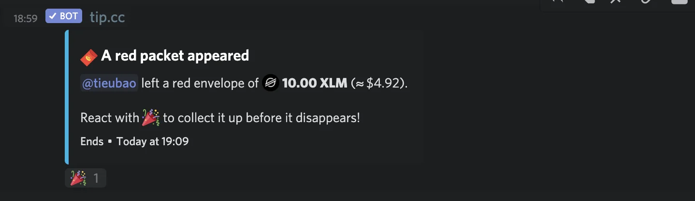

Last week passed by quickly thanks to the holiday. 3 days for all of us to clean up the plate and buckle up for 2021.

### Healthcare Reminder

A heads up for March to make sure we maintain our health after the season of bánh chưng 🥲. We’ll be conducting the annual healthcare on 15/03/-16/03/2021 for the blood test, and please reserve 20/03 for the overall checkup.

Check out this message for detailed info, or come to Van if you have any further questions. Also, your Bao Viet insurance card is being renewed and expected to reach us soon.

### A coffee-maker at the office

There has been a discussion on which type of coffee maker we should get for the new HaDo office. Cool, I know. Heard that they’ve decided to go for Etam, the all-in-one where you can have espresso for the morning and cappuccino in the afternoon.

### 2021 利事 on Discord

and here I thought Momo lì xì is the new high tech, but no. Have you grabbed yours yet?

### Memo

We’ve crafted up some new memos. Noting down the CI/CD process, our perspective on the title, and wrapped up the recap for Dwarves Radio #4. Memo is getting heavier.

### News of the week

Ask HN: Is it crazy that software developers have to study for interviews?

Personally, I think this doesn’t apply to just software developers, but frankly, all other jobs. Interviewers tend to ask tricky questions to test candidates on the ability to improvise. But those questions shouldn’t outweigh the real tests for job-related problems. Interviews result should describe how a person performs on the job, not what he sees himself 5 years from now. Jesus christ, people sometimes don’t even know what they might get for dinner.

Is coding strong enough to make other skills obsolete?

Got to read this yesterday, and since one of our theme for 2021 is going automation and save our effort for real work, I figure this may be a good thing to catch. Though coding is changing the world, still it’s not an end-all skill that makes other expertise obsolete. There are more and more ways to leverage technology that is driving the future better, low-code and no-code adoption is an example.

