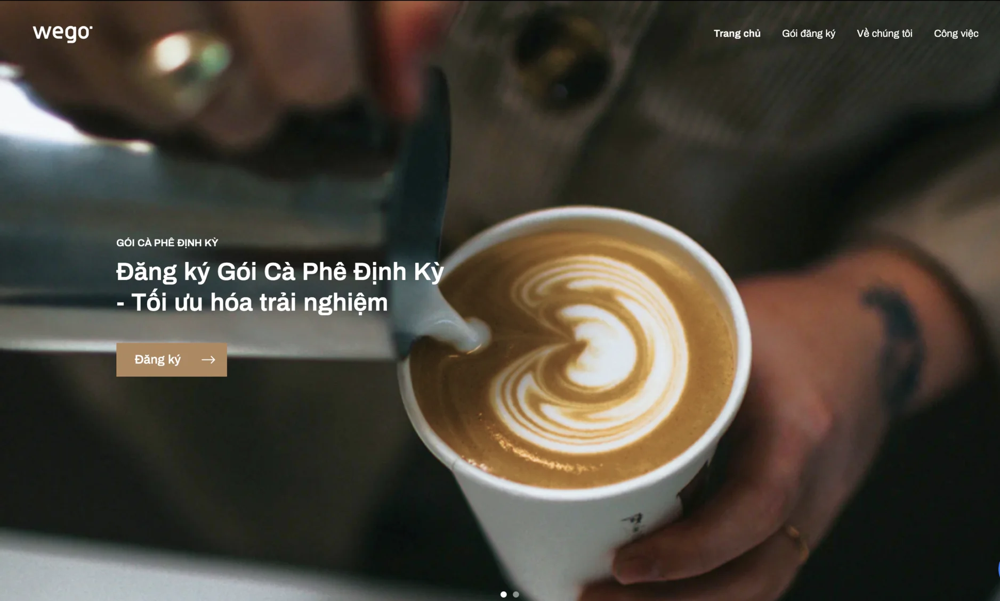

### It’s getting real in Tech “Adoption”

Remember our latest achievement on Upptime and Webflow? We’ve finally integrated them into the latest projects.

### Webflow

We’re kicking off the design work with ATVPro, a real estate management company using Webflow to polish their current website.  Giang & Duy are the person in charge to trial that out. We also have another Webflow project queue up, Ngoc is getting requirements from them.

We also give bubble.io a shot for another US-based project, Bubble is pretty the same with Webflow, we will see how things turn out. Minh T & Chinh are looking on that end.

### Dwarves Radio Talk #6: Continuing the series of Startups?

After the first move with Startup definition, we got back with a higher approach on Startup development stages. I’ve done a bit research on this and realize they might come at us with some different names on startup lifecycles. We’ve note our notion here: Dwarves Radio Talk #6.

Should you find any other source that can widen up the team’s knowledge, feel free to pitch 🙆🏻‍♀️

### Wrapped up on Performance review

The Ops team has done reviewing all the good work and it’s the time we’ve all been waiting for. yeb you know what I mean 😏. We’ll be sending email for salary adjustments in short. If you have any question, please give a ping to your lead, or drop a message to Huy N.

### WeGo goes live

The coffee platform is ready to sail. I mean sell. Get your first experience at wegocoffee.com ☕️ . All the great credit goes to Anh for the stunning design, and Thanh, Vy for shipping the website on air

### Collect your new BV Insurance card

Van has just finished renewing our Bao Viet Insurance card. The last one expires on Feb 10th, if my memory serves me right. Check with Van to receive your new cards. In case you can’t find your name in this list, maybe Van’s planning on another batch for renewal. Just check with her if you need anything related to the insurance coverage in the mean time.

### News recap

Flutter 2.0

This week, Google dropped the news about Flutter 2.0 that broadened Flutter from a mobile framework to a portable framework. In simple words, We can write code once and run from every single platform from mobile, website, desktop and even embedded devices. tbh a world like this is a bit too good to be true.

Windows Pain - A frustrated journey

An engineer’s work required the involvement of Steam VR, which only supports Windows only. This is a noted-down frustrated journey where he was  forced to get Windows to do what he considers "basic development tasks". Some of the struggle highlights happens, starting from the switch from vim to emacs, the windows terminal and xterm, or how he misses NixoS as a desktop operating system. Hope this would be a note for who wants to know the different between the twos.

Brave buys a Search Engine

The battle of data privacy somehow triggers some business ideas. Brave is planning on creating its search engine, with a strong focus on protect user’s privacy by promise no-ads , no profiling and no tracking. They even acquired Tailcat to better create the experience. Though it doesn’t plan on taking over the market of Google (bc to be frankly that’s impossible), but a new search engine without ads and data tracking sounds like a good thing to expect.
