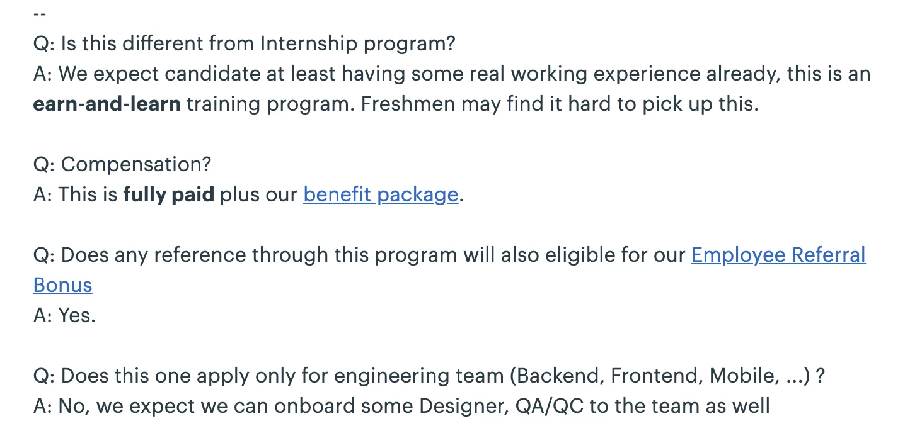
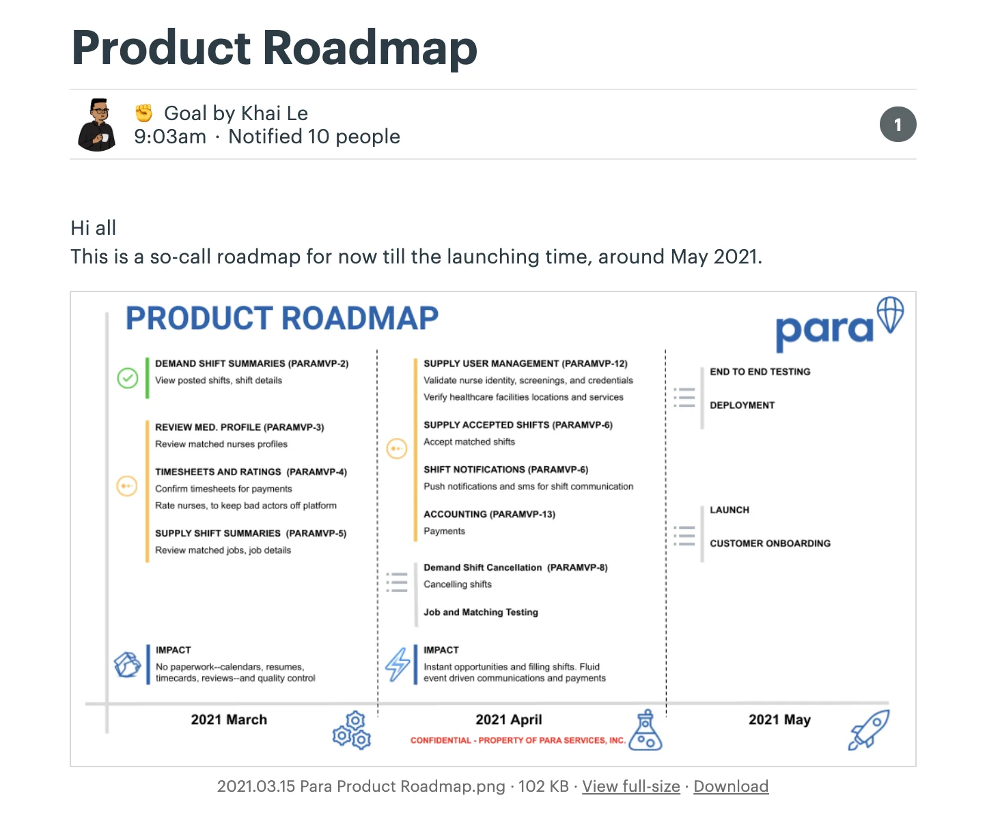

### Apprenticeship launching

Apprenticeship has officially launched last Wednesday. Thank you for all the effort during preparation stage and the Dwarves for help sharing the message. If you have any connection who might be a good fit for us, please help connect them to the program through any of these channels below. Kudos to all the support 🖤

- Github
- Memo
- Facebook
- LinkedIn
- Medium
  Also, we have crafted up some Q&As here, just in case.

### Dwarves venture recap

As you all know, we have many ventures projects over the past year. But we never have an official announcement on that. Ngoc has helped to note our journey down, and came up with two memos explaining how our VC works ✔️

- Dwarves Ventures, Fund 0
- Dwarves Ventures, Fund 1
  Btw, our Memo’s word font has been switched to Georgia thanks to Huy, as we believe it might help the reading experience becomes better. As a fan of Medium, can’t express how much I’m grateful for this update.

### Healthcare checkup

As headed up, our Dwarves will have the healthcare check up this Saturday afternoon. Pleas help bring your ID card (and a 3x4 photo in case you need a health checkup confirmation note for military service). See more from Van’s detailed message.

- Time: 13:00, 20/03/2021
- Address: Vigor Healthcare, 102A Trương Định, Phường 9, Quận 3, TP.HCM
- Contact number: Van - 0979291600

### Project delivery status update

As the new Delivery Manager, Khai has set up many things to fine tune the ongoing project status. Starting with the product roadmap for each project, and the Kick-off Checklist for upcoming ones. We hope this enhances the project quality, as it keep us all on the same page and make sure we’re stay ahead of what’s happening.

### News recap

Why Rust and Go are better together

The pros and cons of these two languages and how they support each other. The two are recommended as the creators made it to resolve the current issue in software development: concurrency, scalability, open-source aware, safety and team productivity.

Should Docker be kept?

A short article that explains why golang packaging can outweigh docker in terms of minimizing the process release in building web service. While docker takes time to deploy & troubleshoot, golang builds and runs thing in a 10 line shell script that does all the build goodness needed.

Tinder now supports background check

To make sure you won't spending dinner with a serial killer, Tinder has finally decided to save user's effort by partnering with Garbo - a female-founded non profit group on embedding technology into Tinder for account's background check. Garbo collects public violence/ abuse record and other reports on violent crimes. A smart move, if it actually works. Tinder was created to match alike people and somehow they're turning it to a place for booty calls, which somehow cause bad images. Integrating this kind of technology can drive people's awareness and accelerate its growth in a better way.
