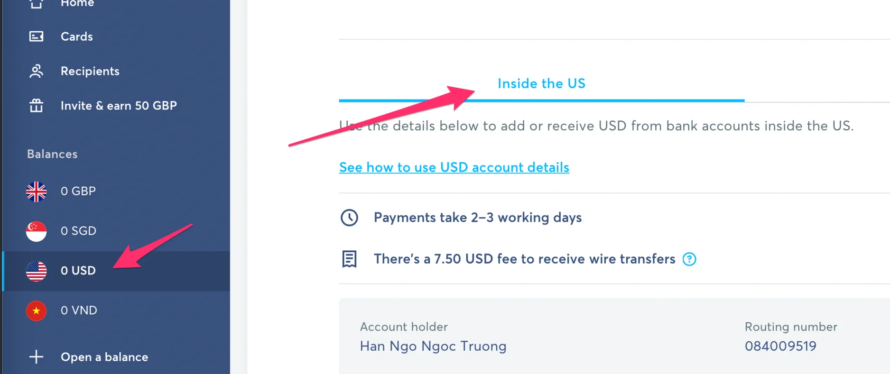

### Biz Update

The Dwarves will kick off the work with a Malaysia’s fuel e-payment app. This client has set its foot in all over Malaysia’s fuel booths, where people can select the item, flash the barcode and scan to pay.

We’re heading for a higher level in client engagement. This not only shows the team’s ability to handle the next level of tech consultancy, but also a proof of how we have updated our tech quality and involve more on their product roadmap.

### Reduce in Workload. Upgrade in the team

As you all know, we're launching Apprenticeship Program. Finding more hands is the utmost goal to balance with the workload.

Apprenticeship is receiving its first applications. Van is putting a lot of effort in handling the screening process to make sure they match our expectation. The number is speaking very well, and we’re thankful for all your effort in help sharing the message. 46 applicants, 8 interviews and 4 onboarded Dwarves

### Quality Enhancement

QC team shape up

We’ll be conducting some client interviews in the next few week and find out whether or not our delivery has met their expectation.

We have just catching up with QC team about the delivery output goal. QC Team plays a crucial part in ensuring the project value and bring them closer to the client’s bar. They'll need to look up in SOC2 and GDPR as a part of the security compliance.

No-code is optimized effectively

As a part of tech stack trial progress, I guess it’s safe to say the adoption of no-code is getting improved and make great impact.

The adoption of these allows us to spin off a new service line for low-cost client, supporting them for product launch with affordable cost within a short amount of time.

We have recently received 2 projects based on no-code. ATVPro of webflow, and Arrow Coffee for bubble, in which the bubble stack is calling for more hands to join.

### Moving from GBP to USD

TransferWise has just allowed us to have USD bank account detail. And we will likely use USD for payroll instead of GBP. Please help input your USD bank account detail into this file before your next payroll: df-transferwise

### News recap

Practical Go Lessons

A learn from basic tutorial ebook for Golang Guides. The agenda contains from beginners to pick up computer knowledge and how to setup Golang as the programming language. Pretty detailed and easy to understand. Highly recommend for non-tech ones to know more about the Dwarves main voice.

Build your next data pipeline with Arc

An open-source framework from AGLEnergy, an energy company that offers electricity, gas, solar and renewable energy services. Arc is an opinionated framework that designed to move the pipeline alongside customer data. AGL has recently noted down their journey with Arc, which states how open-sourcing Arc helps them draw on the collective intelligence.

### Farewell to Giang Vu

We're saying goodbye to Giang Vu, our Product Designer. Giang has had nearly 2 years with us. The value he brought to the team doesn't just stay in the work, but also the knowledge he helps sharing through the webinars and other study materials. As Giang is off for the next chapter, we truly wish him all the best.

### What we're up to

- Earlier this week, Hieu helps juniors to understand the dotfiles concept and some of its usecases in our Radar Talk.
- Phuc help us build a capturing tool, a few issues will be fixed before we can use it
- Comment
  Events

- SheCodes x WeBuild: Cooperation in IT Industry
  Sign up and stay tuned at WeBuild Discord
