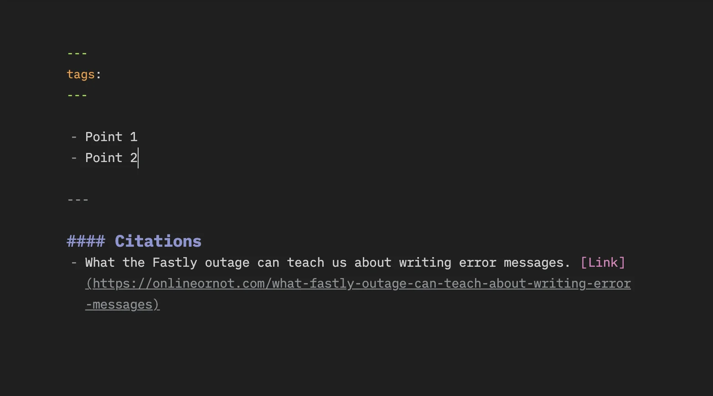

### Team & Quality

dwarvesf/brain repo sync up

dwarvesf/brain is a team repo we introduced last week to aggregate the knowledge puzzles from everyone. Following up the Zettelkasten practice, we motivate people’s effort to read and write down the learning curve into fleeting note.

File and pull request are greatly welcomed, as we’re able to record the git commit by the end of the month. A post into repo will be approved complying to this format

- Hashtag: for categorize
- Link: for reference source
- The content: meaningful and beneficial
  and kudos to Tuan D, for the great effort of building Discord Zettelkasten bot to observe and aggregate the post highlight 👀

### Apprenticeship Training: Communication 101

We hope the (nearly) 2-hours training can somehow support you in daily communication practice. Being straight and honest in communicating things will help deliver fast & effective outcome, whether it’s in work or casual chat.

Many questions and sharing happened during the talk, and we are thankful for all of them. It’s great to know you’re open to share and seek for feedback. Dealing with communication conflicts is never an easy task, let us know if there’s anything we can help.

### WFH heads up & Announcement

Team product request

The list has been piling up with many requests from the Dwarves, needless to say we’re all aware of this 😏 Within the budget of $300/pax, please help to drop your wishlist and the product link. We’ll soon scanning through the request and announce the purchase soon.

Update personal ID for Social Insurance

Van has just announced the member list of July’s Social Insurance renewal. For those who have successfully changed your ID card, please help to update your latest ID number into the Basecamp Thread, or ping Van directly. This helps to synchronize the paperwork and avoid future’s roadblocks.

WeGo coffee subscription

This work from home period turns out to be a great case to adopt the coffee subscription. Drop your shipping contact to this thread during the weekend. We’ll collect and process them to WeGo by next week.

### News of the week

Apple WWDC 2021

Apple WWDC last Monday leaves us jam-packed with news and announcements as usual, starting with iOS15 and macOS Monterey. You can try the beta download for developer here. This time WWDC also supports more videos to illustrate the news in SwiftUi, marking the effort in supporting mobile app development.

However, after a few days of trial, some of us do realize Apple FaceTime doesn’t function as neat as it should be. It gets lagged and blocks down the activity of others task while the call is happening. What else happen in your experience so far ?

Good & Bad Elixir

A blog post from personal experience during Elixir code. Some practices and alternative syntaxes to prevent the chance of writing worse code in Elixir, for example, why pipeline approach should not be used for side-effecting functions; or why revealing higher-order functions can help make functions reusable in a broader set of contexts.

Discord Nitro Free

Discord has just rolled out the Nitro boost free, a limited offer for first-time Nitro users. Discord Nitro is a feature where adopted users get to create the animated avatar, custom tags and personal emojis
