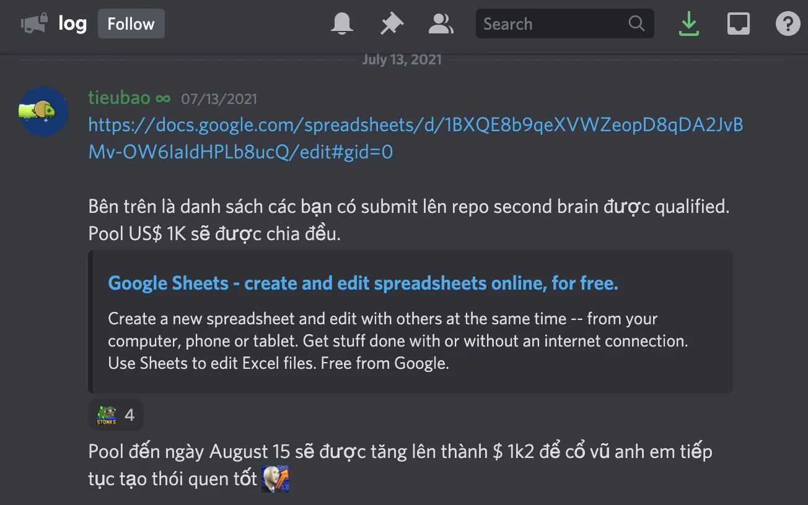

### We released a few work with Notion this week

I've just shipped out the first draft of Dwarves Updates - our monthly newsletter. Every month we will wrap up the highlight and communicate it out for people who wants to stay tune with us. July changelog is coming.

- Careers: <https://careers.d.foundation>
- Manifesto: <https://careers.d.foundation/manifesto>
- Life at Dwarves: <https://careers.d.foundation/life>
- Dwarves Updates: <https://log.d.foundation>

### First reward batch for team brain contributor

### Release the first directory for startups and investors

In collaboration with team Startup.vn, Ngoc & I helped them build 2 pages. You will see it around.

- <https://startup.vn/investors>
- <https://startup.vn/startups>
  Thanh just join the Saturday study group this week to help with Readify development. Let's welcome him.

### This week's Post

- Making the decision: Latest memo on how we make decision as a team member.

### On Turing Alley

As an effort to fine-tune our HR branch, Van has finished on some points of view on How a remote team should function

- Remote Onboarding
- Remote Team Playbook
- Engineering Retention
  The fleeting notes have been collected, input into the brain repo and turned into reward for contributors. It's great to see the first step. The updates are in discord/log.

We'll get back with the next pool on Aug 15, hope to see more of the likes 👋

