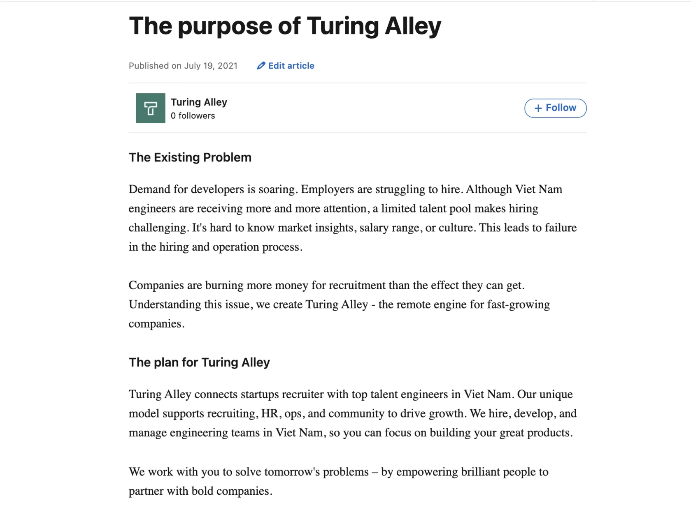

### What's your MBTI?

Nam has published her MBTI research and showcased to the team last Monday. Some of our leaders have already looked into and applied it on the team. Got your MBTI result? See if you find any match here

- The team's MBTI: bit.ly/3eJLFVv
- Reference card: link.d.foundation/profiling

### The Notion Movement

Memo

As mentioned lately, we're slowly moving to Notion. The latest migration is the team Memo. From now on, Memo can be accessed through memo.d.foundation.

Project Changelog

Another achievement with Notion this week is the Project Changelog - it can be written and sent directly from Notion. We had introduced it for engineering team. Hope to see the adoption goes well. Kudos for Huy & Minh for the hard work.

### AMA channel - Office Hours

We just saved a place for dedicated office hours from 4:30 to 6 pm in the discord/ama stage channel.

Join and ask anything. Product questions, pre-sales questions, suggest feature requests, lodge complaints, offer praise, or talk about good or bad experiences using our products. Nothing is off-limit. Everything is welcomed. ✌️

### On Turing Alley

We've just launched some new places for Turing Alley on social

- Facebook: facebook.com/turingalley
- LinkedIn: linkedin.com/company/turing-alley
- and an article on Our purpose: linkedin.com/pulse/purpose-turing-alley-turing-alley/
  
