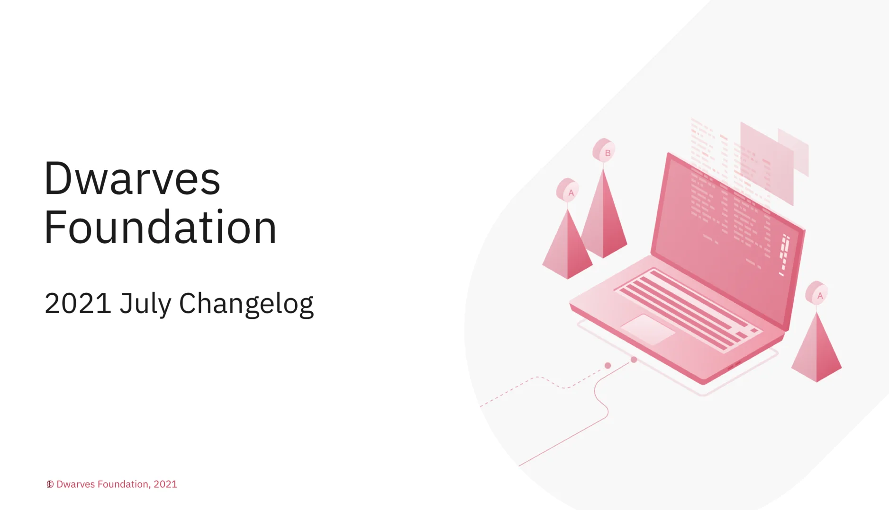
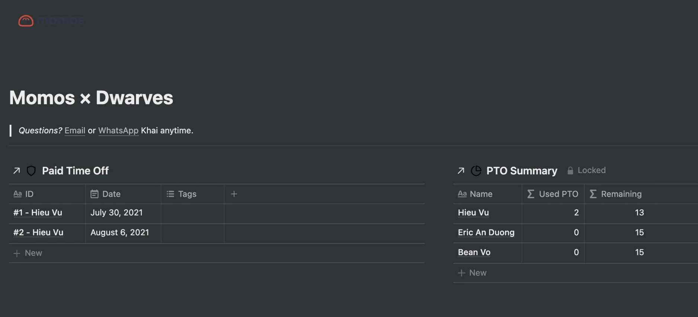

### July's Updates

### Performance Review Announcement

As mentioned, we'll start the annual Performance Review next week. To schedule, please follow the process in Github or Notion and catchup with your lead for a 1-1 meeting.
We expect the meeting can provide you with constructive feedback and achievement recognition.

### Paid-leave Policy

The process stays the same. But it's an upgrade in output to have the synergy between us and the clients ✔️

### Case-study Streak

Thanks to the team input, we're able to upload 4 new case studies to note down own success in memo.d.foundation

And we're on the path on recreating the rest. Hope to see more of the likes.

Last Friday marked our July wrap-up.

Some notable points were put in Woodland/MessageBoard. I just wanna thank you for all the hard work. Looking forward to August spotlights.

For a tl;dr version, visit our GDrive for slides recap.

We create a portal in Notion for leaving request.

From now on, project changelog in Notion will have real-time update whenever project member submit their leave-request in Basecamp.

