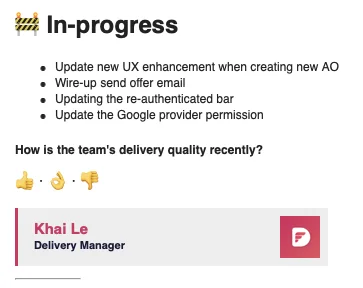

### V-model approach for project

Nam has finished setting up the automation testing workflow. He'll now join LFW to apply this and adjust the flow for V-model approach.

### 4 new members joined Turing Alley

We welcomed the 4 new members in Turing Alley last week to expand our Arrow Project team. Happy to have you onboarded Nam, An, Tai & Lam.

### Published the Dwarves Brainery

Visit the latest crafts at <https://brain.d.foundation/Engineering/>

I'm glad to see more & more contribution for our brain repo. We just got the latest pool on Aug 15. Most of them came from Taylor & Andy. Kudos on the good work ✌️

The next pool continues. There are 2 folders to input your notes: Literature (for links excerpt) and Fleeting (your thoughts on the subject/topic)

There are new ways to submit beside Discord: via iCloud and via GitHub. So if you are planning to join the R&D team, send me your iCloud email or learn some git.

### Upgrade on feedback flow

It's great to see you all adopting it. Stay safe & healthy.

### Performance review progress

We've wrapped up the performance review after 2 weeks. We will contact you shortly for the follow up note on feedback input and salary adjustment ✌️

### New techie story: Tony Dinh

We introduce you the latest techie story, featuring Tony Dinh - the founder of DevUtils.app. A pleasure to recite his sharing as an Indie Hacker. Also, his product at hopamchuan.com can light up your day as a musician 🎵

Sending thanks to Ngoc for helping us connecting with another cool fella.

We have a weekly changelog to keep the client updated. Last week, the team just upgrade them. We add a small section to collect client feedback on the deliverables quality.

Also, we understand it takes up to 48hrs to recover from the symptoms. Please help to submit the off request as soon as you have the vaccination schedule. Giang will help to handle and inform the client.

