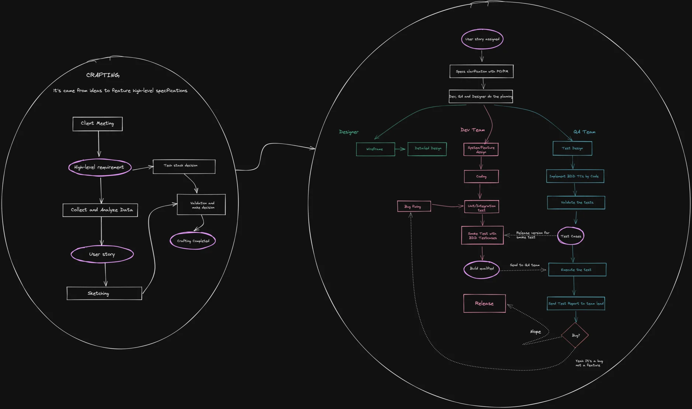
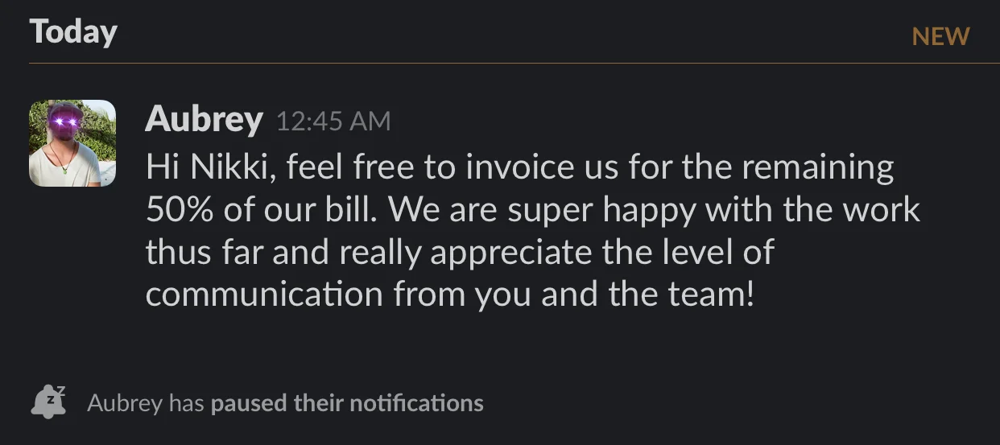
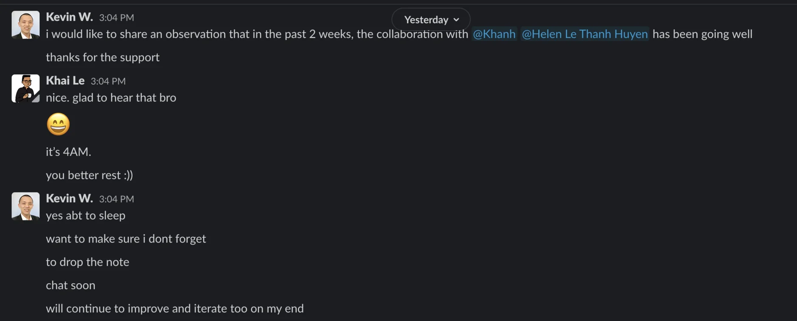

### Project kudos

Good words earlier last week from the clients. I would like to give a big congrats our two teams working on Blockchain projects. Shout out Nikki, Hien, Khai, Huyen, Vy and Khanh. Please keep the good work coming 🙌

### Project compliance

Han did a quick non-technical audit with Hieu, An and Bien for their project. The dev team got full aware of project charter, direction and milestones. For next month session, please translate them into diagrams and notes.

### Workflow update: V-model approach

V-model is an approach to make the collaboration between dev and tester more efficient. Nam has finished mapping the V-model approach testing flow. He is applying it to a blockchain project. He'll be giving a presentation to the project heads later this week.

### Growing the audience

We move toward automation. That's our all time motto.

Thanks to Minh, Huy & Khoi, we're able to automatically update new resource from Dwarves Updates, Dwarves Feedback and Turing Alley - all linked to our central db.

### Techie x OV

We got our latest story featured on Overseas Vietnamese, the global community of Vietnamese professionals. Expanding our network with one more like-mind team. Nam will work with them for our next stories co-sharing and community building.

### ESOP

Latest update the our team, we've done the minting and ready to onboard new shareholders.

And finally, the new covid wave is hitting Vietnam so hard. Make sure you are staying safe and prepare for the worst situation.

