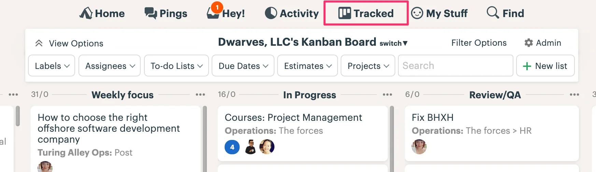

### Basecamp Updates

If you don't know, we can use Track extension to enable Kanban in Basecamp. And Han has forced every board using the same terminology for column. They are

- To-dos
- Weekly focus
- In Progress
- Review/QA
- Completed
  

### Picking up LinkedIn profiles

A small gift was given to employees who takes their LinkedIn profiles to a higher level. Congrats and thank you for your extra effort 👾

We strongly encourage y'all to adopt this practice. Keeping LinkedIn stay professional is how we let people know this team is made from impactful teammates.

### Brainery: Completed Git flow

Git workflow is our fundamental course for engineers to pick up. Hieu & Thanh has helped to create a completed training docs on Gitflow, currently air a <https://github.com/dwarvesf/brain/blob/master/Engineering/git.md>.

The brain repo was arranged into Map of Content structure. Demo on this workflow coming in short.

### Cleaning up August

We're closing another cycle next Friday. Please help to clean up the todo and update their status. The all hands meeting will (expected to) be held on Wed, Sep 01. Look forward to having all of you there 👋

Last but not least, the final holiday of 2021 🥲 - We're taking our National Day off schedule as below

- Leave: 02/09/2021 - 03/09/2021 (Thursday and Friday)
- Return to work on 06/09/2021 (Monday)
  Enjoy.
