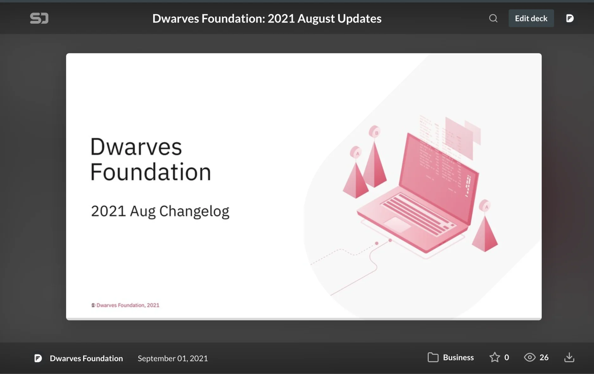

Hi folks, just wanna welcome y'all back from the Holiday, though the lockdown makes it no difference from typical days. Those discord channels are still pumped with active messages. 🥲

Performance review has finished. I'm delighted to note down the progress you've all made. It's great to see both team growth and personal growth. The Ops team is finalizing those confirmation emails. Reaching your inbox in short.

September has begun. And we want nothing more than advancing the team, in its size, level of expertise & professional presence. In the previous all-hands meeting, we had a small vote for Brainery contributors. Nearly half of the team vote for ✅, I'm seeking to see what's next. A catchup call for topic input would be nice.

That's all for this week's update. See you around.

We closed August with many kudos, for which I was proud to feature on SpeakerDeck.

It was a month of growth and achievement, and it's thanks to all of you.

For those who wants to take a detailed look, this is our August Changelog.

