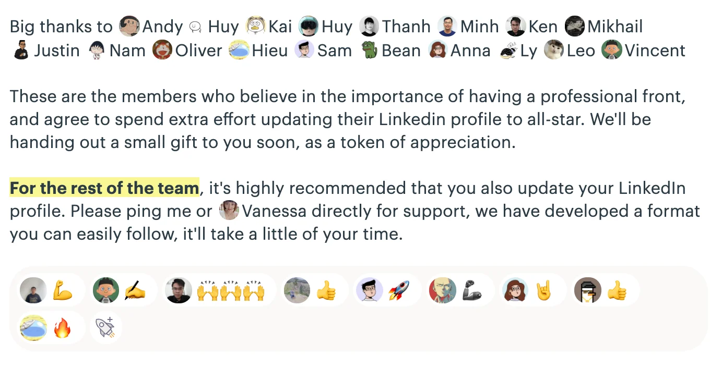

Been a cycle with such many kudos ✔️

### Projects Highlights

It delights us to hear good responses from the client for your dedicated work. We'd like to give you all a special gratitude for spreading the craftsmanship spirit into every work shipped out.

### Workflow Progress

---

Basecamp Updates

If you don't know, we can use Track extension to enable Kanban in Basecamp. And Han has forced every board using the same terminology for column. They are

- To-dos
- Weekly focus
- In Progress
- Review/QA
- Completed
  

Project Compliance

To build a more professional presence, it must come from the team inside. We did a completely Audit Session from project team to quality shipment.

- Reaction feedback icon: That mini section under every weekly changelog. As the client starts to test them, it give us hype and heart-attack at the same time 🥲
- Project audit: A full cycle from technical to management audit to grab the team's understanding on projects on a higher level than merely coding. By doing this, we're able to uncover new opportunities that benefits the products and businesses.
- Case study feature: The long streak of case study crafting journey. All air at memo.d.foundation in case study hashtag.

### Team Growth

Into the Blockchain world

We're advancing fast on Blockchain. console.so was built as our blockchain lab with NFT projects and blockchain-based activities.

With this, the number of Dwarves who could write smart contracts has increased recently. The team starts to equip themselves with blockchain insights & technical grasp.

You are encouraged to do so. To search for help, I think Huy, Phuc, Tay & Quang are the ones you need.

Dwarves Brainery

Through 2 pools, the team brain got escalated. Our brainery has official launched at brain.d.foundation, in which the team's work are arranged into ΩFleeting notes & ΩLiterature notes.

Road to a more diversified knowledge area.

Performance Review

Last August marks our annual performance review. A chance to look back and reap what we have sowed. We hope you're happy with the results, received the constructive feedback, recognized with achievement and all figured out where to head for.

Level up LinkedIn profiles

Building a professional team interface to let the world knows there're more of us than just the lines of code. A creditable team is made from impactful teammates.

### Heading for a bigger & better team

Here's the goal for the last quarter of 2021

- Actively seeking new hires
- Build up a more professional presence for the people of the team
- Not only expand the team due to high demand, but also increase level of expertises
  

We move towards automation. Having things automated helps us focus more on the real work.

For the last 2 months, Nam has been head over heels on his V-model automation testing framework. That left him with the demo last Friday, which transpired with success.

Upsert flow for audience db

We're growing the audience community. The Fortress team has uplifted the workload by creating an upsert flow. This auto-upsert mechanism logs all contacts from our social channels, puts them into our Notion db for further team publication: Dwarves Updates, Dwarves Feedback & Turing Alley.

