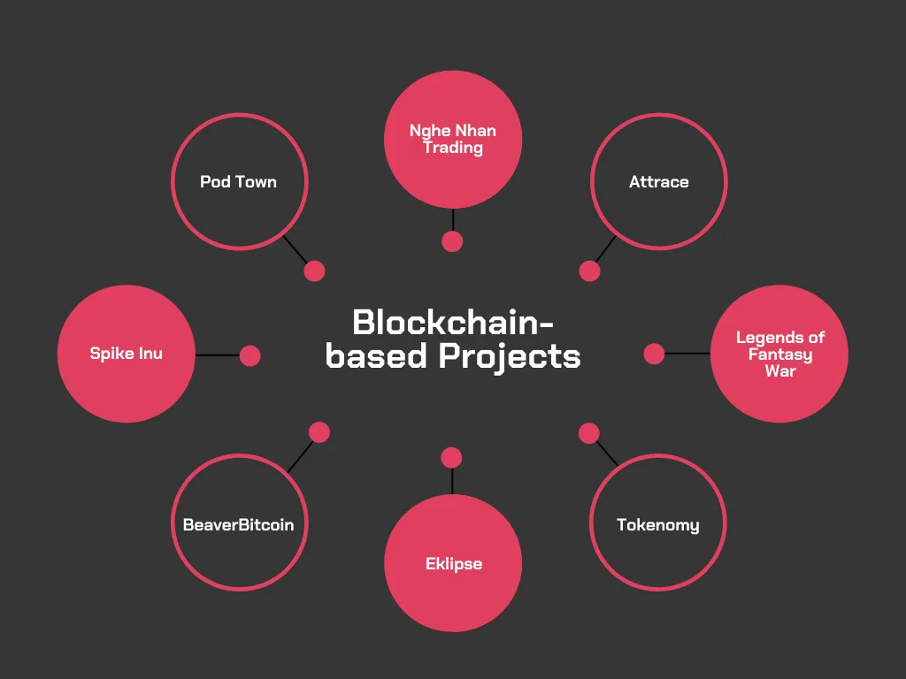
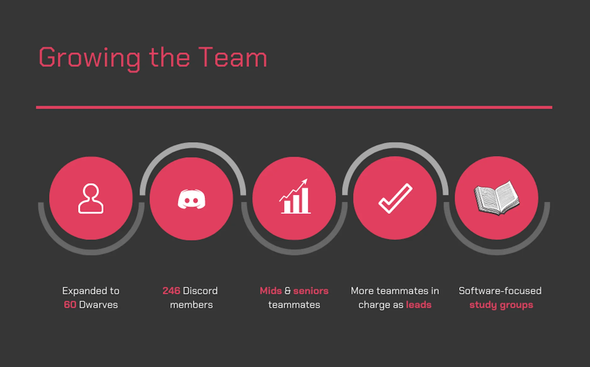
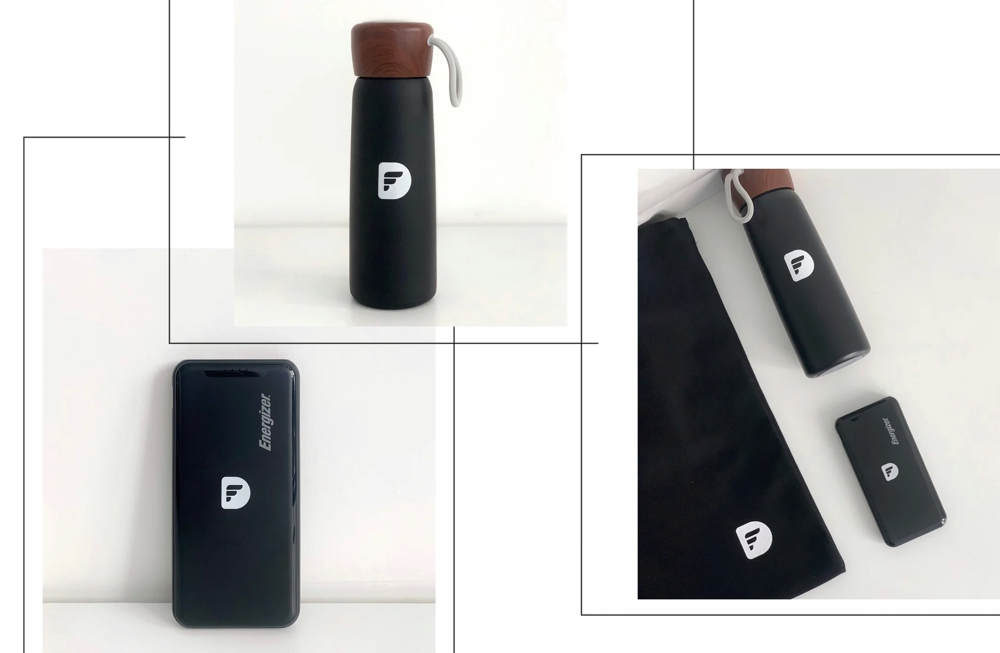

## Moving with Blockchain

---

## Selective in Project Decision

---

It’s a promise of bigger clients & better team deployment.

We were able to drop the long-term projects that no longer match our business direction; successfully committed to deploying the minimum of 3 Dwarves for almost all remaining projects. With this coming, we also increase the headcount rate as we believe it should grow alongside our ability to deliver.

## Growing the Team

---

A special congrats to Cuong Mai, Tom & Ngoc Mai for passing the probation and becoming the Dwarves for real. The Dwarves are growing, by all means.

## and the Attached Benefits

---

That growth explains our upgrade on the benefits package. We did a full upgrade on the team, from base salary to WFH station upgrade. You guys really earned this.

Office Status

I think it’s safe to announce that the one-way ticket to our remote hubs will be available by the 1st quarter of 2022. More especially, we might host tech events, seminars and training in Da Nang.

Dwarves of 2021

A huge congratulation for our Dwarves of 2021! Please help to tick your wishlist items so we can proceed them asap.

We’ve received much input to help improve the team - just to confirm that all of those ideas have been logged into our 2022 todo-list.

Dwarves, don’t forget to drop your info at Team Address - I’ll have these small gifts delivered to you real soon.

Here’s to rock 2022!

We shift our focus to real deals.

Meanwhile, #blockchain #web3 channels are there for the Dwarves to learn & exchange their knowns. Grab your seat.
