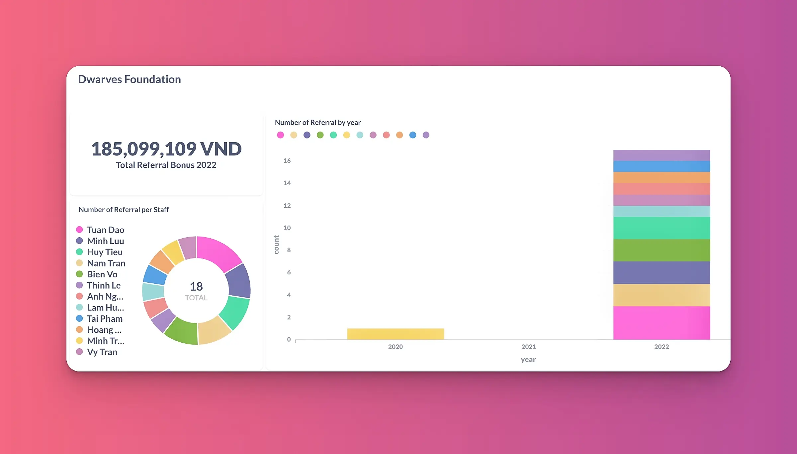
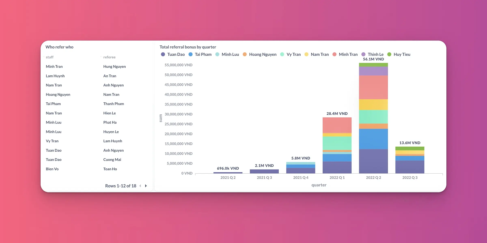

2022 matched us with the 80th Dwarves. A notable highlight, and we're ready to have more. It's not easy to find people that has the same value. It takes true & solid seeks.

On our way to meet the 81th and onward, we're launching a mechanism to help us find like-minded DNAs, and co-create our future using tech.

### The Dwarves Referral Program

We usually hire and keep the quality bar. The Dwarves are encouraged to recommend friends they think might be a good match for the team. The suggestion, then, appears more valuable that you already know who the missing piece is. A quick suggestion on the talent pool

* Ex-colleagues
* University acquaintance
* High school peeps

We want to spend the bonus on you rather than the headhunting agency. Once the referral gets successfully converted into a full-time position and deployed to a project, the referrer will receive **2.5%** of the project service fee. This ratio is applicable until Jan 01/ 2023.

#### Calculation

This bonus is paid upon completion of the project invoice. The referrer must still be employed with the company when the bonus is to be given.

Let's take this for example:

* A refers B to Dwarves Foundation
* B works on project C, with a monthly service fee of $5000
* Every time clients finish the monthly invoice for project C, A will receive a referral bonus of $125

📍 Thus, for **5** referral cases, you’ve just grown the passive income to **$625/ month**.

### Backed by the automation

If there's one amongst the things we stay proud of, is that whenever the situation calls for ad-hoc solutions, the team is ready to provide. Folks, meet the **Dwarves' Referral Dashboard of 2022**.

The latest stats on our current referral bonus & the top leaderboard. A huge thanks to Huy Nguyen & Khoi Le for helping making this happened.

Referral from the team will have a higher chance of being prompted.
