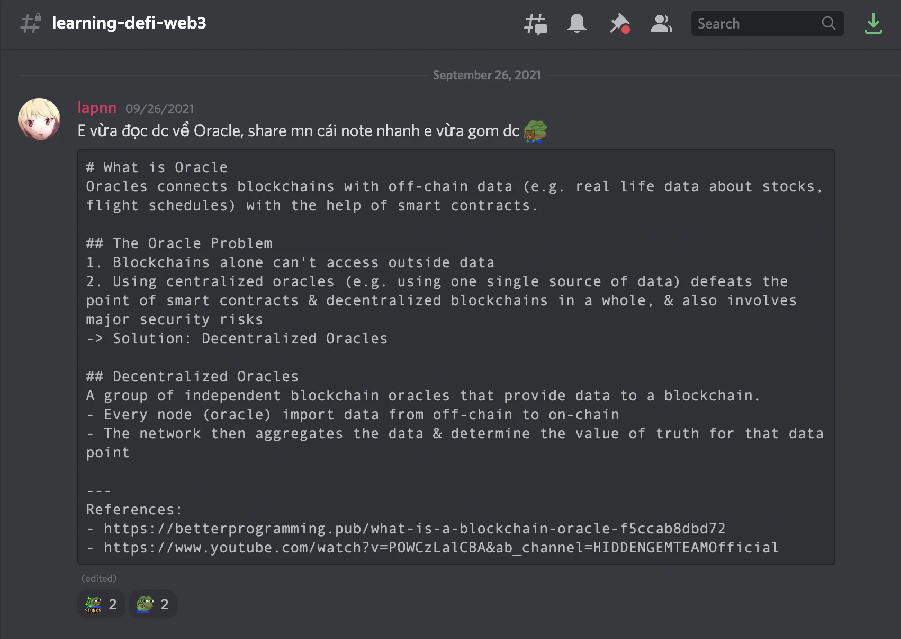
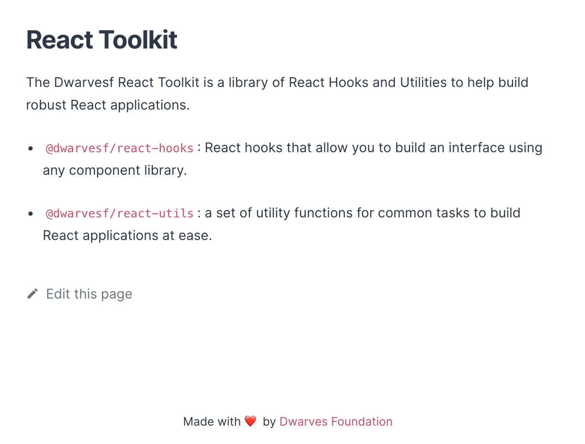
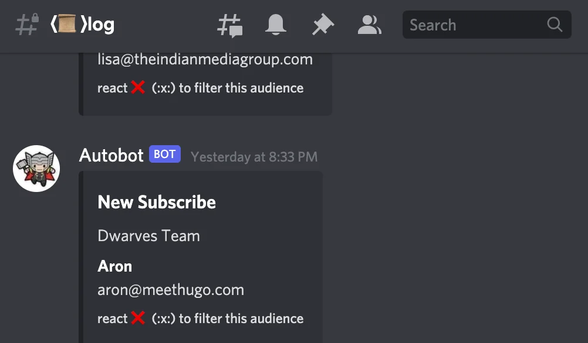

### Foundation

Project Compliance

As you've noticed recently, we continually conduct project compliances. The goal is

- Check on team's knowledge about the product they're building
- Let the team experience further into the product development life cycle
  So far, two of our projects have done their session. We got the chance to inspect the underlying issue and resolve bottleneck. The management team is open for more. Give us Ngoc or Huy a ping if you feel this could help improve your current team.

Performance Review

As the work output grows, so is our value. We're happy to announce our official salary adjustment, applicable since this Sep.

Note Renew Contract

Van has help to announce some change in our current contract. In this renew version, the Dwarves will be signing the working contract with Turing Alley LLC, our HR-focus stretch arm. The new contract has been sent out and await for your signature.

Please help to submit them soon, and ping Van should you have any question.

### Consulting

PROJECT

Open Fabric: The latest onboard

Open Fabric is a platform to enable interoperability and removing friction in online payments. It's our mission to help them create an open commerce network that offers consumers maximum choice and convenience.

Hieu & Dung are working directly with their head of product & head of engineer, laying out the ground work for their system. Dung stepped up to help with coordinating project and collaboration. It's been almost 1 month in, and they're ready to add more team members from Dwarves.

BUSINESS DIRECTION

It's time to trial bigger things. Besides turning our direction to more challenging projects, there are some criteria we want to meet:

- New tech & trending techs. Blockchain & DeFi, for example
- Opportunity to involve in projects at a deeper layer, i.e, be able to provide & decide technical aspects
- Working directly with founding teams

### Engineering

Shape up hiring pipeline

We're applying hiring template to make sure the candidates fit the role. This aims to tighten up the screening process and lead us to the right ones.

Knowledge Input

We're glad to welcome Nam, Phat, Minh, Hieu, Nhut to join the team, starting with Software Quality topics & Modeling/ Architecture.

It's a great chance to practice the team's approach for system architecture, and layer the next core team foundation.

We're learning channel for DeFi & Web3 too. If you're interested, join us by dropping a note on #campfire 🤞

React Toolkit
The team is working on https://react.toolkit.d.foundation/ - a library of React Hooks and Utilities to help build robust React applications.

We're trialling this with project LFW, and expected to launch a demo once everything is on set 🚀

Automated Bot

After a few weeks run, these two new bots are going official:

- 👍 Reaction Bot: To get project review through changelog
- 📈 Upsert Bot: To update new fella who joins us through subscribing
  
