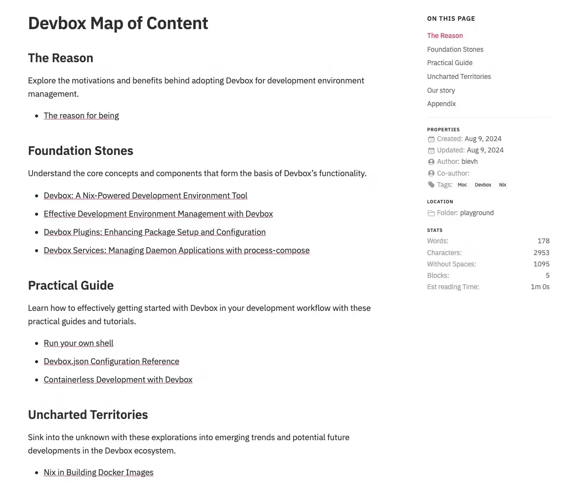
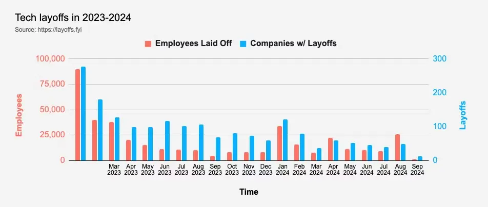
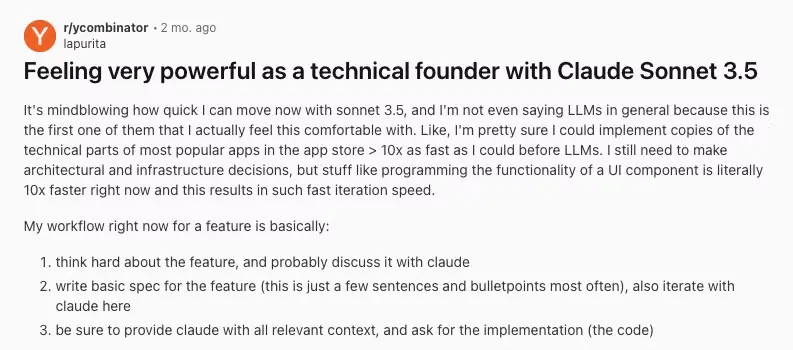
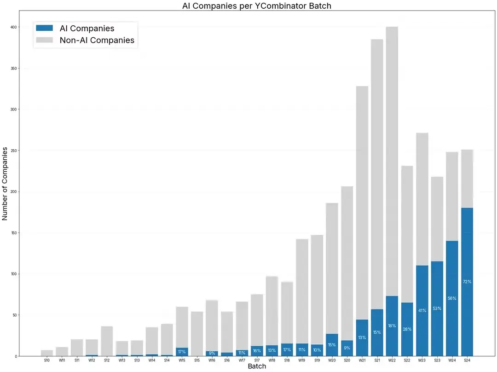

At Dwarves, technology is our passion. We create it, study it, test it, document it, make it open source, and always striving to enhance it for the benefit of all. Our goal is to promote software craftsmanship and drive innovation. In this issue of Forward Engineering, we’ll walk you through our experiments with new tech stacks, share insights on achieving engineering excellence, and reflect on key lessons from the tech market over the past three months. Unsurprisingly, AI has been a central theme in many of our discussions. We invite you to join us as we explore these discoveries and encourage you to freely contribute your own thoughts along the way.

## Tech Radar

### Dify

**Adopt**

[Dify](https://dify.ai/) is an open-source platform that's making waves by simplifying the development and orchestration of LLM (Large Language Model) applications. With its robust set of tools, developers can create intelligent workflows, from simple agents to sophisticated AI-driven apps, using a retrieval-augmented generation (RAG) engine. What's impressive is how it makes AI workflow orchestration intuitive and accessible, even if you're not a tech wizard. The drag-and-drop interfaces and clean UX/UI reduce the complexity of building LLM-based applications, enabling rapid prototyping and testing across multiple models.

We've been using Dify to quickly prototype product ideas by scaffolding agent workflows and testing their output with various models. It's been a game-changer, especially in building workflow automations like a tech summarizer, memo chatbot, or report composer. Its simplicity and flexibility allow us to experiment with different models and agent workflows without getting bogged down by infrastructure concerns.

 _Our engineers have built and experimented with dozens of workflows on our self-hosted Dify server._

### LangGraph

**Assess**

[LangGraph](https://langchain-ai.github.io/langgraph) is an emerging library designed for building stateful, multi-actor applications using large language models (LLMs). It facilitates the creation of agent and multi-agent workflows by leveraging a graph structure. Each node in the graph acts as an agent responsible for specific tasks, and interactions are managed through edges. This approach enhances productivity by letting developers focus on the specialized functions of each node without worrying about synchronizing inputs and outputs.

The key benefits? Improved visualization and management of complex interactions, division of tasks into manageable sub-problems, and high control over individual agents and their transitions. Despite its promising capabilities, LangGraph is still in its early days. Many techniques and designs are available on GitHub, but it requires further exploration and validation in diverse real-world applications.

### RAG

**Adopt**

Retrieval-Augmented Generation (RAG) is enhancing AI by allowing it to access and utilize data it was never trained on. This makes it invaluable for companies needing to leverage their own data efficiently. Currently, it's the most cost-effective way for organizations to integrate their proprietary information into AI models. By retrieving relevant documents or streaming the latest data, RAG enhances the contextual understanding of LLM-based applications, thereby improving their performance.

We mostly use RAG to enrich input contexts, whether by referencing static documents like PDFs or streaming real-time data from the internet. Its ability to integrate seamlessly with existing workflows and improve AI performance without extensive retraining makes it a practical choice. However, challenges like ensuring data quality and managing latency during retrieval need careful consideration. Alternatives like purely generative models lack the dynamic data access capabilities, making RAG a superior choice for many real-world applications.

### LangSmith

**Trial**

[LangSmith](https://www.langchain.com/langsmith) builds on the foundation laid by LangChain, which simplified the prototyping of LLM applications. But LangSmith shifts focus towards production, emphasizing reliability and maintainability. Its standout features include tracing agent workflows for easier debugging and automating testing with dataset creation and evaluators.

While its monitoring tools and tracing capabilities are beneficial for scaling and debugging, it's still relatively new, and widespread adoption is still in progress. We've been trying out LangSmith in projects where robust production support is crucial. It's got potential, but it needs further industry validation.

### Cursor

**Assess**

[Cursor](https://www.cursor.com/) is a fork of VS Code designed to enhance coding with AI while retaining a familiar text editing experience. What sets this IDE apart is its ability to register documents for reference, significantly boosting productivity by generating accurate and contextually aware code, especially when combined with Claude 3.5 Sonnet.

Our engineers have been testing it out, and the results are promising, particularly in creating templates and skeleton code. The impact is more noticeable at the unit level, making coding more enjoyable and reducing the mental load of syntax and specifics. Since it's an emerging technology, we've placed Cursor in the "Assess" category due to its potential to revolutionize coding practices, despite being relatively new and requiring further exploration.

### Devbox

**Trial**

[Devbox](https://www.jetify.com/devbox) is a tool designed to create isolated, reproducible development environments without the need for Docker containers or Nix language expertise. It simplifies onboarding by using a single `devbox.json` file to set up dependencies and environment configurations, avoiding the clutter of global environments.

Devbox addresses common issues like version conflicts across projects and the resource-intensive nature of Docker on Windows/Mac by leveraging native applications built with Nix. It significantly enhances battery life and system performance, but it does require some familiarity with Nix and can present file permission challenges. We're giving Devbox a trial run, especially for teams seeking cleaner, more efficient development setups.

_The journey of experimenting with Devbox is documented in [our memo](https://memo.d.foundation/playground/-devbox/)._

### Shadcn/ui

**Trial**

[Shadcn](https://ui.shadcn.com/) offers beautifully designed, accessible, and customizable UI components that you can easily copy and paste into your applications. This open-source tool enhances development speed by allowing developers to quickly scaffold UI components. In our recent projects, we saw significant time savings.

Initially, we had concerns about maintaining consistency with a copy-paste model, but our experience proved otherwise. Customization at the Tailwind config level ensures a cohesive theme, and the lightweight nature of the tool keeps applications fast to load and build. While it may lack the comprehensive ecosystem of full-set frameworks like MUI or Chakra, its modularity and potential AI-backed features with [v0.dev](http://v0.dev) position Shadcn as a compelling alternative.

## Highlights on memo

### AI & LLM

[**History of Structured Outputs for LLMs**](https://memo.d.foundation/playground/01_literature/history-of-structured-output-for-llms/)

Why are structured outputs, like JSON, in LLM API endpoints so vital? We believe this will soon become a standard in all tooling.

[**Re-ranking in RAG**](https://memo.d.foundation/playground/01_literature/engineering/ai/re-ranking-in-rag/)

Sometimes, embeddings might not effectively extract the most accurate sources to enrich the context. Re-ranking offers an additional step to sift out the most relevant context for the initial query.

[**Design feedback mechanism for LLM applications**](https://memo.d.foundation/playground/01_literature/feedback-mechanism/)

Capturing user feedback while they're using the app is crucial for understanding the app’s performance and accuracy. This indispensable step precedes any further plans to improve app performance.

[**Multi-agent collaboration for task completion**](https://memo.d.foundation/playground/01_literature/engineering/ai/multi-agent-collaboration-for-task-completion/)

We discuss the architecture and setup of the "divide and conquer" strategy to distribute workloads to multiple agents.

[**Journey of Thought Prompting: Harnessing AI to Craft Better Prompts**](https://memo.d.foundation/playground/01_literature/engineering/ai/journey-of-thought-prompting/)

AI proves to be an excellent tool in crafting and improving system prompts, which are among the most important parts in maximizing any LLM benefits.

**Further research**

- [Evaluating search engine in RAG systems](https://memo.d.foundation/playground/01_literature/hybrid-search/)
- [Building agent supervisors to generate insights](https://memo.d.foundation/playground/01_literature/supervisor-ai-agents/)
- [Multimodal in RAG](https://memo.d.foundation/playground/01_literature/engineering/ai/multimodal-in-rag/)
- [Developing rapidly with generative AI](https://memo.d.foundation/playground/01_literature/developing-rapidly-with-generative-ai/)
- [Evaluating caching in RAG systems](https://memo.d.foundation/playground/01_literature/caching-with-rag-system/)
- [Function calling in AI agents](https://memo.d.foundation/playground/00_fleeting/function-calling/)

### Golang

[**Golang Weekly Commentary Series**](https://memo.d.foundation/tags/go-weekly/)

We've been diving into the Go Weekly commentaries, and here's what we've found:

- [Go Weekly #2: Go 1.23 iterators](https://memo.d.foundation/playground/00_fleeting/go-weekly-511/) Go 1.23's iteration proposal highlights the tension between adding functional patterns to a traditionally imperative language, raising questions about its future community adoption
- [Go Commentary #3: Generic collections, generics constraints, AI bot](https://memo.d.foundation/playground/00_fleeting/go-commentary-jul-12/) Go's generics implementation remains underutilized and poorly documented, presenting challenges for developers
- [Go Commentary #7: Releases, websockets, and struct behavior](https://memo.d.foundation/playground/00_fleeting/go-commentary-aug-16/) Go 1.23 highlights both the subtle complexity of struct behavior and improvements in websocket handling, reinforcing the importance of understanding how slices and copies behave in the language.

[**Go in Enterprise**](https://memo.d.foundation/playground/go/enterprise-standard-language/)

We strongly advocate for Go due to its simplicity and performance. We believe the Go programming language should gain more popularity, especially in enterprise adoption. This belief prompted us to collect opinions and use cases from others on the subject:

- [Why enterprise chose Java](https://memo.d.foundation/playground/go/why-enterprise-chose-java/)
- [When to use Go in the enterprise](https://memo.d.foundation/playground/go/when-to-use-golang-in-enterprise/)
- [Who is using Go in enterprise?](https://memo.d.foundation/playground/go/who-using-golang-in-enterprise/)

### Software architecture & modeling

[**GoF design pattern series**](https://memo.d.foundation/tags/gang-of-four/)

We're big fans of foundational topics, and it's interesting to revisit tried and true concepts. This time, we've chosen the Gang of Four Design Patterns. Many of the lessons are still significantly relevant to our current coding practices.

[**Design file sharing system**](https://memo.d.foundation/playground/01_literature/design-file-sharing-system-part-1-directory-structure/)

We discuss the design of a file-sharing system akin to Google Drive, where the path field for file hierarchies streamlines operations, offering fast, efficient storage and retrieval.

[**Designing a model with dynamic properties**](https://memo.d.foundation/playground/01_literature/designing-a-model-with-dynamic-properties/)

Anyone who has used Notion is awed by the flexibility of its properties, which can be dynamically created and altered without hassle. We'll reveal the structure of this flexibility from our experience in developing a very similar feature.

[**Local-first software**](https://memo.d.foundation/playground/01_literature/local-first-software/)

An overview of Local-First software, where data ownership shifts to the user, offering privacy and offline functionality, but facing technical challenges like CRDT complexity and secure synchronization.

### Blockchain

[**Solana core concept**](https://memo.d.foundation/playground/01_literature/solana-core-concepts/)

We dive into Solana's unique architecture, separating program code from data and leveraging innovations like Proof of History (PoH) and Program Derived Addresses (PDAs).

[**Ton: Blockchain of blockchains**](https://memo.d.foundation/playground/01_literature/ton_blockchain_of_blockchains/)

TON's innovative model refines how decentralized applications and transactions can function on a massive scale.

[**Using Foundry for EVM smart contract development**](https://memo.d.foundation/playground/01_literature/using-foundry-for-evm-smart-contract-developement/)

Our thoughts on Foundry, a framework developed for creating EVM smart contracts. This unified toolchain leverages the speed of Rust for faster workflows and supports advanced features such as Solidity scripting and dependency management.

## Market report

### Layoffs continue in tech world, surge in August

August's surge in job cuts reflects growing economic uncertainty and shifting market dynamics. According to the report:

> The biggest growth in planned layoffs came in the technology field, with companies announcing 41,829 cuts, the most in 20 months.

Some of the companies announcing cuts include:

- Intel (~15000)
- Microsoft (~1000)
- IBM (~1000)
- Cisco (~5900)
- Bytedance (~450)

The increasing trend in layoffs year-over-year is concerning. It suggests that the tech industry's job market instability is not a short-term phenomenon but potentially a longer-term restructuring. This could lead to a reimagining of workforce strategies in tech, possibly emphasizing more contract work or AI-augmented roles.

_Source from [https://layoffs.fyi](https://layoffs.fyi)_

### The state of tech market in 2024

The broader tech ecosystem, with JavaScript as a prominent example, is experiencing notable shifts in 2024. A tightening job market for software engineers has slowed career progression and increased competition, leading to several key trends across the industry:

- A shift toward "boring" technology and monolithic architectures, emphasizing stability over adopting the latest innovations.
- A surge in Full Stack development, with TypeScript gaining traction as a preferred language.
- More responsibilities "shifting left" to developers, particularly in areas like testing and security.

The 2024 Stack Overflow survey highlights intriguing data:

- Erlang developers earn the highest median salary at $100,836, followed by Elixir and Clojure developers.
- AI tools are poised to become integral to development workflows, with 81% of developers expecting AI to assist in documenting code, 80% in testing, and 76% in writing code.
- While JavaScript remains a dominant language, its median salary has seen a decline.

### AI makes a real impact in programming

AI is no longer just a buzzword; it's making a tangible impact in programming.

As Amazon's CEO, Andy Jassy, noted:

> In under six months, we've been able to upgrade more than 50% of our production Java systems to modernized Java versions at a fraction of the usual time and effort. And, our developers shipped 79% of the auto-generated code reviews without any additional changes.

Our thought on that:

- This highlights how AI-assisted coding is lowering development costs and replacing tedious tasks. As AI costs become cheaper and open tools become more available, building AI-integrated solutions will become more accessible.
- We might soon see one-person or small-team businesses becoming the norm, leveraging AI to handle tasks that previously required larger teams. The opportunities are vast for solo makers who can find niche ideas.
- It's clear that AI is reshaping the programming landscape. Those who can effectively harness AI tools will have a significant advantage. We might even see the rise of "AI employees," where founders proficient in AI lead the way, and AI application skills become a prerequisite in hiring.

### AI companies continue dominating YC batch

According to [a Reddit post](https://www.reddit.com/r/ycombinator/comments/1fbb9m0/the_rise_of_ai_companies_in_yc/), in the current Y Combinator batch (S24 - Summer 2024), a staggering 72% of startups are focused on AI, a dramatic increase from just 1% in the winter of 2012 (W12). Compared to the crypto trend, AI's momentum is exponentially greater.

Some key takeaways:

- AI will be utilized as a filter for data. Whoever owns the best fine-tuned models will gain the advantage in the future.
- "AI wrappers" will become essential middleware software. Every industry will finally have interfaces to interact with AI.
- As AI becomes accessible to everyone, differentiation will come from other factors, user experience, attention, branding, and distribution channels.
- As AI's role in automation grows, the workforce will increasingly shift towards AI supervision, prompt engineering, and ethical oversight.
- Data ownership will become a central competitive battleground, leading to more regulation, strategic acquisitions of datasets, and ethical debates around the use of data in AI training.

It's evident that AI is not just a trend but a fundamental shift in how businesses operate. The rise of AI-focused startups indicates a significant transformation in the startup ecosystem.

## References

- [Layoffs jump in August while hiring in 2024 is at a historic low, Challenger report shows](https://www.cnbc.com/2024/09/05/layoffs-jump-in-august-while-hiring-in-2024-is-at-a-historic-low-challenger-reports-shows.html)
- [What is old is new again](https://newsletter.pragmaticengineer.com/p/what-is-old-is-new-again)
- [Stackoverflow 2024 developer survey](https://survey.stackoverflow.co/2024/)
- [Feeling very powerful as a technical founder with Claude Sonnet 3.5](https://www.reddit.com/r/ycombinator/comments/1e7rtdw/feeling_very_powerful_as_a_technical_founder_with/)
- [Andy Jassy, Amazon CEO tweeting about the impact of AI in coding](https://x.com/ajassy/status/1826608791741493281)
- [The rise of AI companies in YC](https://www.reddit.com/r/ycombinator/comments/1fbb9m0/the_rise_of_ai_companies_in_yc/)
