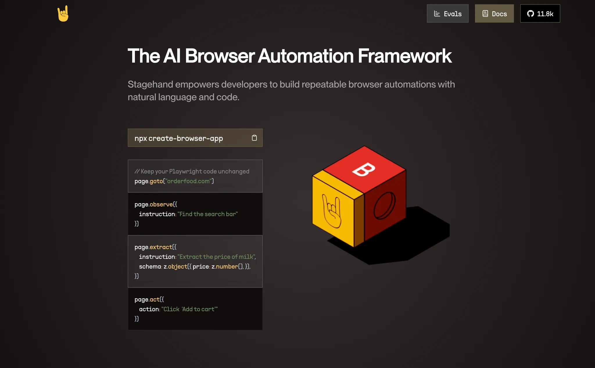
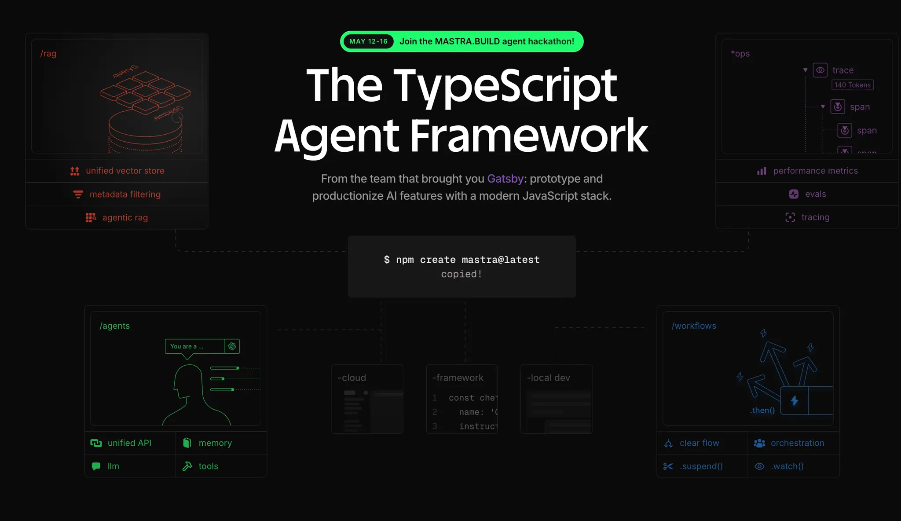
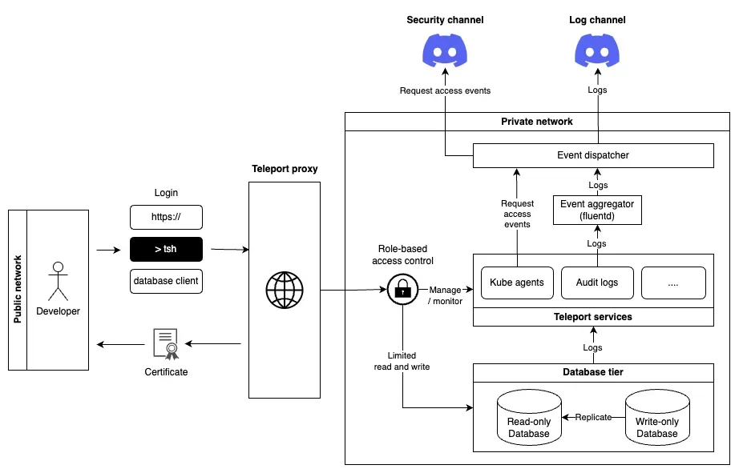
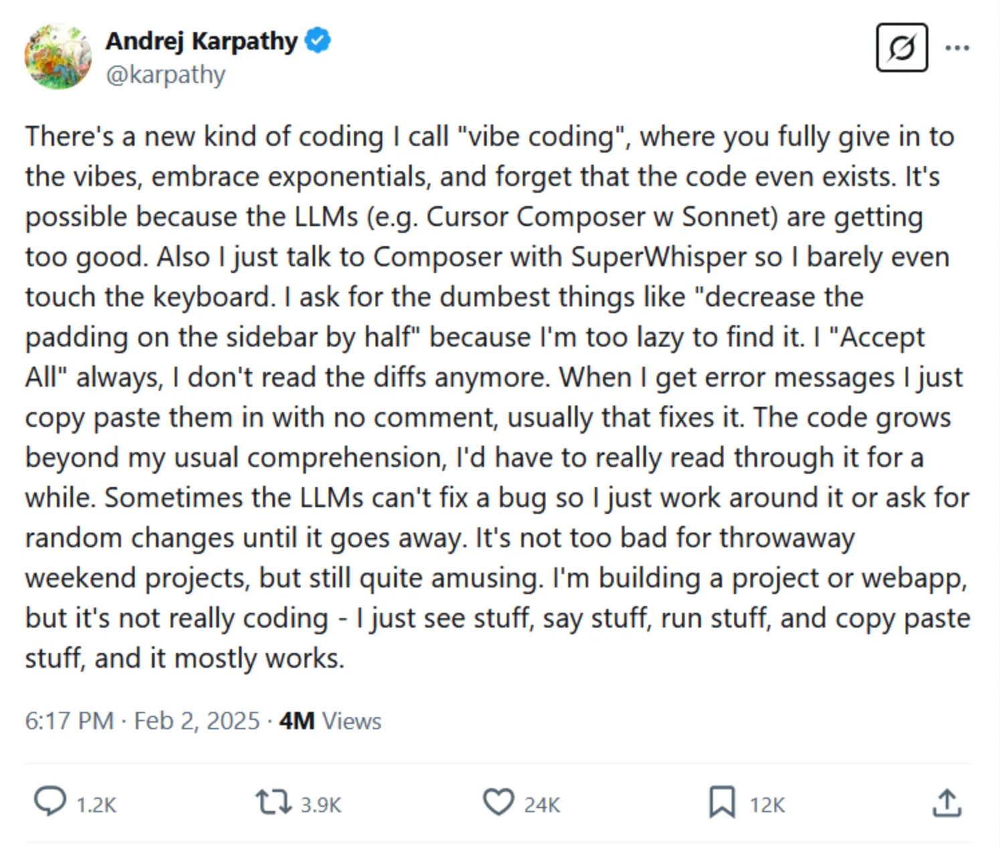
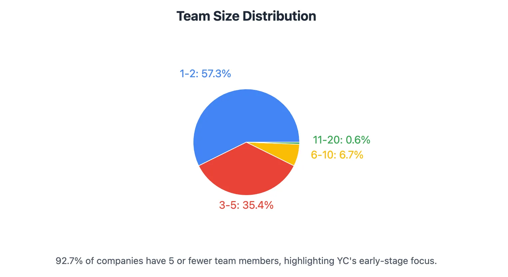
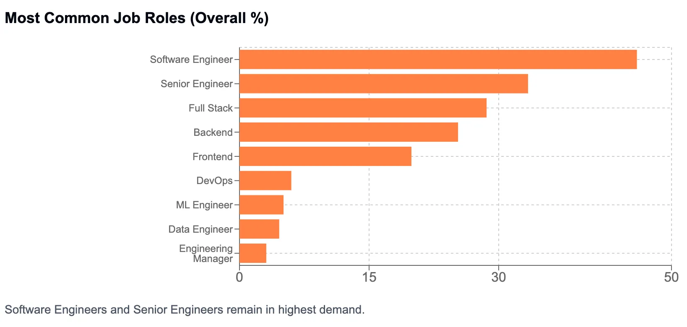
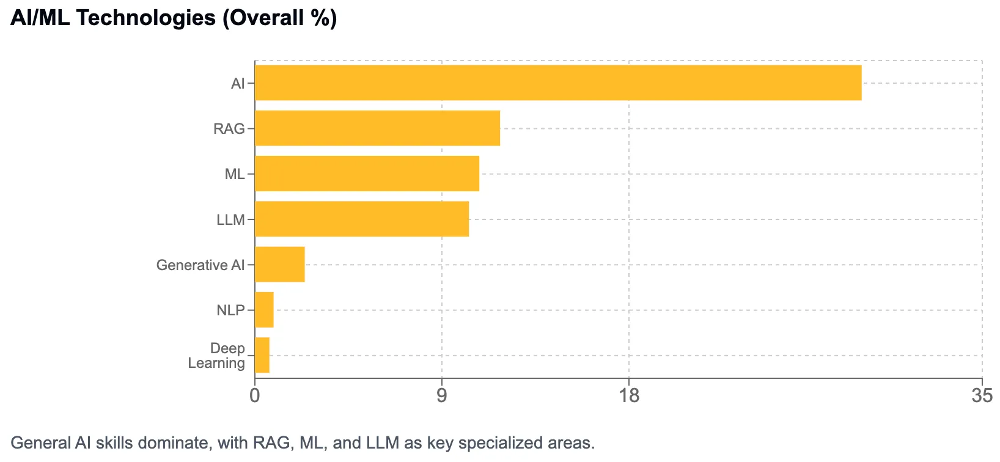
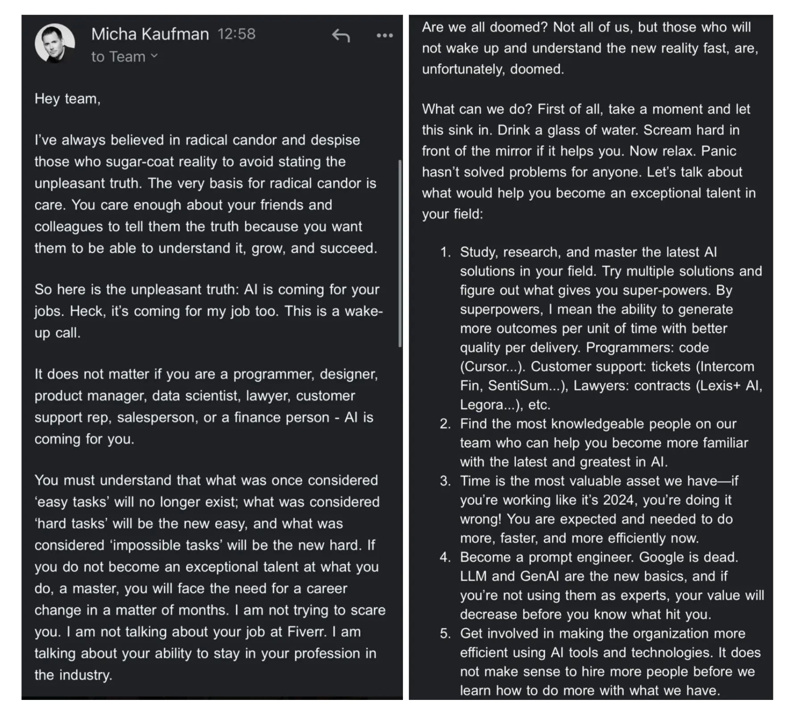

<strong>Table of contents</strong>

<!-- Begin ToC -->

- [Tech radar](#tech-radar)
  - [Structured instruction documents for AI-assisted software development](#structured-instruction-documents-for-ai-assisted-software-development)
  - [FastMCP](#fastmcp)
  - [AI crawler](#ai-crawler)
  - [Mastra.ai](#mastraai)
  - [Teleport](#teleport)
- [Tech commentary](#tech-commentary)
  - [Expecting MCP to be mature](#expecting-mcp-to-be-mature)
  - [AI agent-first paradigm](#ai-agent-first-paradigm)
  - [The good and bad of Vibe Coding](#the-good-and-bad-of-vibe-coding)
  - [Future of AI-Powered IDEs](#future-ai-powered-ides)
- [Market report](#market-report)
  - [VC still loves AI deals](#vc-still-loves-ai-deals)
  - [Are we all doomed?](#are-we-all-doomed)
  - [Does the shift only happen in tech industry?](#does-the-shift-only-happen-in-tech-industry)
- [References](#references)

<!-- End ToC -->

In this issue of Forward Engineering, we'll walk you through our experiments with new tech stacks as our engineering team has actively trialed various tools and technologies. We'll share insights on achieving engineering excellence based on these direct experiences, and reflect on key lessons from the tech market over the past few months. Continuously, AI has been a central theme in many of our discussions, from its integration into development tools and protocols like FastMCP and MCP itself, to its impact on the job market and the way software is conceptualized with the "AI agent-first paradigm". We invite you to join us as we explore these discoveries and encourage you to freely contribute your own thoughts along the way.

## Tech radar

Our engineering team has actively trialed various tools and technologies, the findings and opinions presented are based on these direct experiences.

### Structured instruction documents for AI-assisted software development

**Assess**

AI-assisted software development lacks standardized AI instruction formats. Our experience with early `.cursorrules` or `.clinerules` showed that informal, non-standard rules led to inconsistencies and maintenance issues, hindering broader adoption and tool interoperability. We anticipate a push for industry standards for consistent, maintainable, and shareable AI guidance, a need highlighted by our engineering efforts.

Effective AI instruction will likely develop beyond technical commands to include contextual depth, similar to RFCs or ADRs. We envision future CI/CD-integrated AI agents interpreting the rationale and consequences from version-controlled guidance, ensuring alignment with project history and strategic goals to prevent costly rework.

### FastMCP

**Trial**

Standardized protocols like MCP, accelerated by frameworks such as [FastMCP](https://github.com/jlowin/fastmcp), are fundamentally changing LLMs' role. Our team uses FastMCP to build internal MCP servers for specialized AI capabilities (e.g., automated documentation, intelligent log analysis), evolving LLMs from text generators to autonomous agents. This shift necessitates redesigning some systems into LLM-orchestrated distributed applications.

FastMCP's design enabled rapid MCP server prototyping, lowering developer entry barriers and increasing the number of LLM-addressable capabilities. As these services become critical, **we seek improved, standardized authentication, access control, and security solutions**, moving beyond current bespoke, per-server methods for better scalability.

### AI crawler

**Trial**

Building our "[digital brain engine](https://memo.d.foundation/updates/build-log/brainery/)" requires extensive, varied data collection, where AI crawlers are essential for speed and efficiency. Our tests show distinct tool strengths, necessitating a multi-tool approach.

**Crawl4AI**

[Crawl4AI](https://crawl4ai.com/) trials show its strength in bulk web data acquisition for initial model training, especially text-heavy sources. Its open-source, AI-pipeline-focused design allowed rapid crawler setup for our digital brain's foundational layers, facilitating quick baseline model training on niche internal topics.

Its structured data extraction is promising; we're experimenting with direct LLM integration for preliminary analysis. The goal is for AI models to reason over scraped structured information from diverse sources, feeding our digital brain's knowledge graph.

**Stagehand**

We've trialed [Stagehand](https://www.stagehand.dev/) for automating interactions with internal web applications having frequently changing UIs, a challenge for traditional scripts. Its AI-powered visual and DOM analysis shows promise for more resilient automation; a Stagehand script for a legacy reporting tool broke less than its selector-based predecessor.

**Hyperbrowser**

We trialed [Hyperbrowser](https://www.hyperbrowser.ai/) for high-concurrency data extraction with managed proxy rotation, especially for scraping public market data for our digital brain. Fast, isolated headless browser sessions were appealing; sub-second launch times and dedicated sessions helped avoid cross-contamination.

Engineers found it reduced infrastructure setup for specific high-volume tasks compared to managing our own browser farms. However, its pricing model required careful cost evaluation for continuous, large-scale scraping versus self-managed infrastructure. We suggested simpler, scraping-focused pricing tiers.

It has potential for agentic workflows requiring quick, isolated web lookups without full browser/proxy infrastructure management for transient tasks. Planned Cloudflare bypass and 2FA support are features we're watching, as these are common data acquisition hurdles.

### Mastra.ai

**Trial**

Many of our web-focused engineers use JavaScript/TypeScript. Python's prevalence in AI agent frameworks presented a learning curve. [Mastra.ai's](https://mastra.ai/) TypeScript-first approach caught our attention to lower this barrier. We're experimenting with it to build a "GitHub Agent" for automating Github workflow like standards checks and reminders.

Initial developer experience for TypeScript engineers was positive, with quick onboarding. Local playground and tracing features aided [GitHub agent](https://github.com/dwarvesf/github-agent/) development, helping debug its multi-step workflow (fetching PR data, checks, comments). However, its workflow chaining syntax was less intuitive for some than graph-based methods in other frameworks.

Its focus on modularity and observability is appreciated for scaling agents. Licensing (Elastic v2) and Vercel's AI SDK reliance are being evaluated for broader internal adoption, considering restrictions for future commercial applications. Our current GitHub agent is internal, but these factors matter for future, more complex production-grade agents.

### Teleport

**Trial**

For a new regulated trading platform, we needed secure, auditable infrastructure access for developers, SREs, and compliance. Traditional VPNs/bastion hosts lacked the required granular control and auditability. We trialed and then phased in [Teleport](https://goteleport.com/) to address this.

Results were very positive. [Teleport's](https://www.google.com/search?q=http://Teleport) zero-trust model (identity/device trust) enabled least-privilege access to the [trading platform's databases](https://memo.d.foundation/updates/build-log/database-hardening-for-trading-platform/). Its unified access simplified onboarding and temporary access elevation, with detailed audit logs crucial for compliance. This positions Teleport as a strong candidate for establishing robust, enterprise-level security in other sensitive environments, prompting further assessment for wider deployment.

## Tech commentary

We're taking a close look at pivotal tech trends directly impacting our work, aiming to anticipate what's next on the horizon.

### Expecting MCP to be mature

The MCP ecosystem, promising for standardizing AI agent interaction, showed typical early-stage challenges during this period. Debates on its technical readiness persist, with public concerns about documentation clarity and complex HTTP transport mechanisms (HTTP+SSE, "Streamable HTTP"), which attempt bidirectional communication but can pose scalability/security issues. Developer communities seem to prefer WebSockets for simplicity, aligning better with MCP's goals.

The simpler `stdio` transport is largely for local development, unsuitable for networked enterprise use. The alternative HTTP transport's complexity, especially state management, can burden server implementations, risking inconsistencies and vulnerabilities—a key concern for us.

Broader tech discussions included alternatives like [IBM's ACP](https://agentcommunicationprotocol.dev/introduction/welcome) or [Google's A2A](https://github.com/google/A2A) for exposing agent capabilities, though they lacked MCP's traction during this quarter. MCP should solidify core use cases with robust, simpler transport options before over-extending. We expect a push for production-ready SDKs in compiled languages (Go, Rust, JVM) beyond Python/JavaScript, crucial for wider enterprise adoption.

### AI agent-first paradigm

During this period, the idea of "Agent-first" software became more popular. This approach sees software built around proactive, independent "agents" that act as key parts of a system. It could mean a big change in how we build software, with more focus on designing and managing groups of these agents. These lines up with our company's long-term goals for more automation.

However, using AI agents to speed up complex tasks has both good and bad sides. This could significantly change the job market, perhaps faster than previous automation waves. This might lead to a split in the workforce: more demand for people who can design and oversee AI agents, but also changes for jobs that involve routine thinking tasks. This highlights why it's important for us to keep learning and adapting.

The main challenge to using these independent agents in important systems is balancing their freedom with what businesses need: reliable, controllable, and safe operations. It's crucial to make AI less of a "black box" and to develop strong ways to ensure these agent systems work correctly, are managed well, and can be easily understood. This is the biggest hurdle for using them in critical business applications, make AI governance even more important.

### The good and bad of Vibe Coding

"Vibe Coding" remained a hot topic this quarter, fueled by capable LLMs. It promises to broaden the software creator pool, potentially leading to niche, personalized applications. For us, this could mean empowering domain experts with guided, light development capabilities.

The implications of "vibe coding" point towards a workforce division: deep coding expertise for complex systems/debugging remains critical, but a new "AI wrangler/collaborator" role (skilled in prompt engineering, output validation, AI-workflow management) is emerging, impacting our training and role definitions.

A significant consideration is the risk of increased technical debt and the emergence of novel security vulnerabilities associated with AI-generated code. This concern, noted during the quarter, if AI code is adopted without deep human oversight, will likely drive investment in automated code auditing and AI-specific security tools. For us, it emphasizes rigorous code reviews and security scanning, regardless of code origin.

### Future of AI-Powered IDEs

Observations from this period, including discussions around tools like Cursor or Cline and emerging AI-centric IDEs, show significant changes in developer toolchains.

Firstly, AI engineering tools are observed to be developing beyond mere code generation. The trend is towards integrated, system-level assistants interacting with the entire development lifecycle (terminals, browsers, deployments). This alters developer workflows, requiring new AI-assisted testing/debugging approaches.

Secondly, future AI development will likely involve the orchestration of specialized AI models. Developers will likely use model suites optimized for different tasks (planning, coding, testing, security). This will drive tools for model management, cost optimization (especially for proprietary model API calls), and in-IDE workflow automation.

Thirdly, the criticality of openness and extensibility for AI IDEs is underscored by protocols like MCP, which show AI tools need to integrate with bespoke enterprise systems and adapt to the changing technological environment. This is vital to prevent vendor lock-in and encourage new developments.

## Market report

To get a better idea of how jobs are changing, we're looking closely at important signs about market funding and hiring, particularly within the startup sector.

### VC still loves AI deals

**Overall tech & software funding climate**

The investment landscape this quarter revealed significant trends in venture capital:

- The Information Technology (IT) sector represented **74%** of total US VC investment.
- While tech company deal volume decreased to **90** deals, the average tech deal size hit a record **$123.4 million**.
- In April, US startups secured **$14 billion**, approximately 62% of the $23 billion global total for the month.
- AI was a major driver, accounting for over **70%** of IT investment (according to EY) and **53%** of global funding, totaling $59.6B (according to Crunchbase).
- Major AI deals this quarter included: OpenAI (**$40B**), Anthropic (**$3.5B** or **$4.5B**), and Infinite Reality (**$3B**).

**Early-stage startup landscape: YC 2025 Batch analysis**

An analysis of 164 companies in the YC 2025 Winter Batch provides insights into early-stage startups ([detailed report](https://claude.ai/public/artifacts/db8c4b4f-4262-4fc4-9908-c214216d0fad)):

- AI dominates the technical focus of this batch, with over **70%** of companies incorporating some form of AI technology.
- B2B companies represent **60.4%** of the cohort, highlighting YC's continued emphasis on enterprise solutions.
- Small founding teams are prevalent, with **92.7% having 5 or fewer members**.

    

- Examples of companies and business models from this batch include:
  - **BlindPay**: A Stablecoin API for global payments, enabling companies to process international transactions using fiat money and blockchain.
  - **Vantel**: AI software for commercial insurance brokers, automating policy analysis and contract review to potentially double productivity.
  - **Fira**: An agentic AI platform for investment firms that analyzes financial documents to provide source-cited answers and verifiable financial calculations.
  - **Dex**: An AI browser copilot that enhances web browsing with voice and text commands, automating mundane actions.

Hiring trends: Insights from Hackernews (January-April 2025)

An analysis of 1,364 job postings on Hackernews "Who is Hiring" threads from January to April 2025 reveals current hiring trends and tech stack preferences ([detailed report](https://claude.ai/public/artifacts/0da73405-e6f3-4e54-ac54-08119884aadf)):

- React, Python, and TypeScript lead as the most mentioned technologies.
- React and Go/Golang showed strong growth in April, while Python demand remained steady.
- General AI skills dominate, with RAG, ML, and LLM as key specialized areas.
- Platform companies appear to lead in hiring volume.
- Software Engineers, Senior Engineers, and Fullstack Engineers remain in highest demand.

### Are we all doomed?

> It does not matter if you are a programmer, designer, product manager, data scientist, lawyer, customer support rep, salesperson, or a finance person — AI is coming for you,
>

The recurring "Are we all doomed?" question reflects that automation replaces tasks. The question arises whether AI is fundamentally different in its impact. While not entirely dissimilar to past automation, this period highlighted AI's speed and breadth of impact on knowledge work.

The notion of "mastering the latest AI tools" is sound advice but may be incomplete. The real value will likely lie in understanding **how to leverage AI for new things, not just automating old tasks**, requiring creativity, critical thinking, and domain expertise that AI complements, not replaces.

How are AI impact forecasts holding up? Previous reports ([McKinsey](https://www.mckinsey.com/mgi/our-research/generative-ai-and-the-future-of-work-in-america), [Goldman Sachs](https://www.cnbc.com/2023/03/28/ai-automation-could-impact-300-million-jobs-heres-which-ones.html)) estimated 30% US work automation by 2030 (300M jobs globally). The first quarter showed *how* this transformation is materializing. The shift from "easy" tasks to requiring "mastery or exceptional talent" is key; AI commoditizes routine tasks, increasing demand for harder-to-automate higher-order skills. This suggests a potential widening gap between adaptors and non-adaptors.

The examples of Duolingo, Shopify, and Fiverr highlight the business imperative: companies prioritize efficiency and cost reduction, accelerating routine role displacement, even as new AI management/integration roles emerge.

### Does the shift only happen in tech industry?

Two years post-ChatGPT, AI's job transformation hype meets nuanced reality. "[Large Language Models, Small Labor Market Effects](https://papers.ssrn.com/sol3/papers.cfm?abstract_id=5219933)" (Humlum & Vestergaard, Denmark 2023-2024 data) offers insights.

Key findings on AI chatbot use:

- Company promotion (training, proprietary tools) boosted worker adoption from 47% to 83%.
- AI users saved 2.8% work-hours (up to 7% in marketing/IT support).
- 64-90% reported faster task completion; ~50% felt quality/creativity improved (up to 40% greater with employer support).
- Yes, AI integration/compliance affected ~8.4% of users, 5% of non-users.

Wages/job security:

- No substantial changes in earnings, hours, wages, or job security (earnings shift <1%).
- Only 3-7% of benefits (e.g., 2.8% time savings) translated to higher pay, even with employer support.
- High AI-adoption firms showed no significant differences in hiring, wages, or retention.
- 99.6% reported no earnings impact.

The reasons for this apparent disconnect, echoing [Solow's paradox](https://en.wikipedia.org/wiki/Productivity_paradox), could include several factors:

- Companies invest/train but may not fully integrate AI into core processes.
- 1.5-year study might be too short for macroeconomic shifts.

## References

- [Will the future of software development run on vibes?](https://arstechnica.com/ai/2025/03/is-vibe-coding-with-ai-gnarly-or-reckless-maybe-some-of-both/)
- [Why I use Cline for AI Engineering](https://addyo.substack.com/p/why-i-use-cline-for-ai-engineering)
- ['Are We All Doomed?' The CEO of Fiverr Says AI Is Definitely Taking Your Job. Here's What to Do About It.](https://www.entrepreneur.com/business-news/fiverr-ceo-says-ai-will-take-your-job-heres-what-to-do/491198)
- [Announcing the Agent2Agent Protocol (A2A)](https://developers.googleblog.com/en/a2a-a-new-era-of-agent-interoperability/)
- [Massive AI deal supercharges VC results in Q1 2025](https://www.ey.com/en_us/insights/growth/venture-capital-investment-trends)
- [The State Of Startup Investing At The Beginning Of 2025](https://news.crunchbase.com/venture/startup-investment-charts-q1-2025/)
- [Q1 Global Startup Funding Posts Strongest Quarter Since Q2 2022 With A Third Going To Massive OpenAI Deal](https://news.crunchbase.com/venture/global-funding-strong-q1-2025-ai-data/)
- [Duolingo will replace contract workers with AI](https://www.theverge.com/news/657594/duolingo-ai-first-replace-contract-workers)
