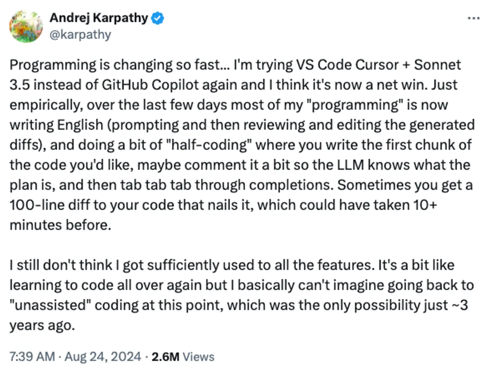
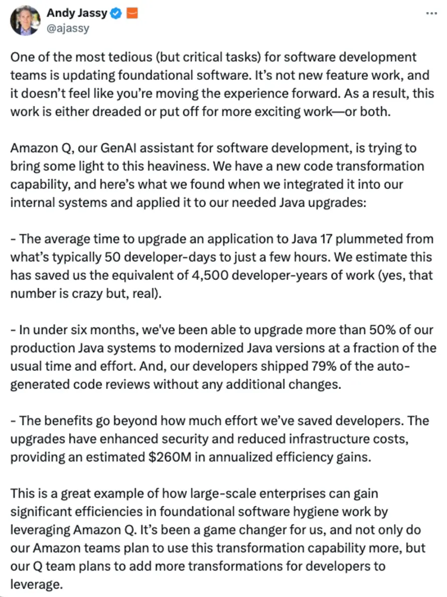
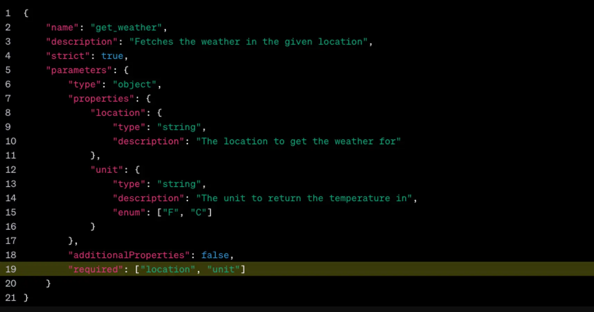

## Key takeaways

- Tools like Cursor and Claude 3.5 Sonnet are redefining programming by shifting focus from manual coding to guiding AI-generated code, signaling a move toward AI-driven development.
- The transition from generative UI to generative apps is already here, with AI tools generating mini applications from prompts, potentially revolutionizing app creation.
- Anthropic's prompt caching is enhancing AI efficiency by reducing costs and latency, driving broader AI adoption, especially in applications needing repeated context.
- OpenAI's structured outputs ensure AI-generated data adheres to precise schemas, likely becoming standard in data-sensitive fields like finance and healthcare.
- OpenAI’s fine-tuning for GPT-4o allows for tailored the AI model, offering customization and control, crucial for industries focused on data privacy.
- Tools like shadcn, v0.dev, and Tailwind are setting new standards in frontend development, with AI-driven workflows accelerating prototyping and design.

## AI and LLM are starting to make a real impact on programming

### Cursor + Claude 3.5 Sonnet: The future of programming is English and tab-tab

We believe the landscape of programming is undergoing a profound transformation with AI tools like Cursor and Claude 3.5 Sonnet. These tools aren't just speeding up workflows; they’re redefining what coding means. The shift towards using English prompts and reviewing AI-generated code diffs is changing the game—programming is becoming less about writing every line and more about guiding AI to do the heavy lifting.

It feels like we're revisiting the basics, but with a modern twist: developers are relearning their craft through collaboration with AI. This "half-coding" approach is where human intuition meets machine precision, curating code rather than writing it entirely. We expect that in the near future, coding without AI might become a relic, as developers lean on AI to handle more of the mechanical aspects of their work.

[https://x.com/karpathy/status/1827143768459637073](https://x.com/karpathy/status/1827143768459637073)

Looking ahead, we see a future where software development revolves less around manual coding and more around directing AI to create optimal solutions. The challenge will be preserving the creativity and problem-solving that make development rewarding, while still embracing AI's efficiencies. For many of us, the idea of coding without AI is already hard to imagine, signaling a significant shift in software engineering.

### Amazon developers embrace 79% of auto-generated code reviews for upgrading foundation software

Amazon's GenAI assistant, Amazon Q, is revolutionizing software maintenance by slashing upgrade times from 50 developer-days to mere hours. We think this efficiency is a game-changer, allowing developers to focus on more valuable tasks instead of getting stuck on version upgrades. In less than six months, Amazon modernized over half its production Java systems with minimal developer involvement, proving the power of AI-driven automation.

The implications are profound—by migrating to newer Java versions quickly, Amazon has boosted security and saved an estimated $260 million annually. Perhaps most striking is that 79% of AI-generated code was shipped without further modification, highlighting the growing trust in AI systems to handle tasks once reserved for human developers.

As AI continues to evolve, we expect even more profound changes in how software is developed, maintained, and upgraded. Developers are increasingly becoming overseers and guides as AI takes on more of the heavy lifting.

[https://x.com/ajassy/status/1826608791741493281](https://x.com/ajassy/status/1826608791741493281)

## The next thing after generative UI is generative apps

We’re seeing the future unfold right before our eyes with generative UI, but the next big leap is already here: generative apps. Claude and ChatGPT are already capable of generating mini applications from a user prompt and allowing direct access to them. Imagine this: a super app where you describe out loud the app you need, and it’s built for you in moments. This could be incredibly useful for a lot of random one-off tasks, and we’re basically there.

We believe this development could fundamentally change how we interact with technology. A few powerful apps could rule them all. The convenience and flexibility of simply describing what you need and having an app materialize could revolutionize productivity, making this technology an essential part of daily lives.

The user’s prompt to create a Bill Splitting App in Claude Mobile App

## New features open more opportunities

### **Prompt caching by Anthropic**

Anthropic's prompt caching is a game-changer in optimizing AI application efficiency. By caching frequently used context, this feature dramatically reduces costs and latency—up to 90% and 85%, respectively. We see this as a significant boost for scenarios like conversational agents and coding assistants, where repeated context is crucial.

Early adopters are already reporting substantial improvements, showing the practical value of this feature. Notion's integration of prompt caching into its Claude-powered AI assistant, Notion AI, is a strategic move to optimize operations and enhance user experience.

With prompt caching now in public beta for various Claude versions, developers have the chance to experiment and find the best fit for their needs. We think this flexibility will drive broader adoption, positioning prompt caching as a central tool in the next wave of AI adoption.

### Structured output by OpenAI

OpenAI's introduction of structured outputs is a significant step forward in ensuring the precision of AI-generated data. By enabling outputs to adhere to developer-supplied JSON Schemas, this feature addresses the challenge of generating reliable JSON, particularly in fields where precision is paramount.

We expect this development to shift industry standards, with developers favoring structured outputs over traditional methods, especially for tasks requiring meticulous data formatting. The impact will be particularly profound in data-sensitive fields like finance and healthcare, where the accuracy of data is crucial.

[https://platform.openai.com/docs/guides/structured-outputs/supported-schemas](https://platform.openai.com/docs/guides/structured-outputs/supported-schemas)

### GPT-4o supports fine-tuning

OpenAI’s fine-tuning for GPT-4o is a powerful step that we expect will enable developers to tailor AI models to their specific needs. With 1 million free training tokens per day through September 23, this offering presents a compelling opportunity for organizations to enhance AI performance without immediate costs.

Fine-tuning is especially valuable for applications where out-of-the-box models may not fully meet specific domain requirements. We see this as empowering developers to achieve superior results in tasks like natural language processing and specialized content generation.

What makes this offering particularly appealing is the customization and control it provides. Developers retain full ownership of their business data, which is crucial in industries like finance and healthcare, where data privacy and security are top priorities.

## Flux 1 and Deep Live Cam: New achievements in open media models

Black Forest Labs' Flux model marks a significant leap in open-source text-to-image AI. With 12 billion parameters, Flux is pushing the new achievement of image generation, especially in text and positioning. However, complex prompt adherence remains a challenge, reminding us that there's still room for improvement.

Meanwhile, Deep Live Cam's real-time face-swapping capabilities signal the next frontier in AI-driven media manipulation. The ethical safeguards built into Deep Live Cam, designed to prevent inappropriate content processing, are just the start. We think the broader ethical concerns around deepfake technology will require ongoing dialogue and regulation.

As deepfake technology proliferates, it's reasonable to expect financial institutions like Visa and Mastercard to extend their oversight to platforms dealing with AI-generated media. This could usher in a new era of compliance, where online platforms are required to implement robust measures against deepfake misuse.

[https://github.com/hacksider/Deep-Live-Cam/blob/main/demo.gif](https://github.com/hacksider/Deep-Live-Cam/blob/main/demo.gif)

## Shadcn, v0, Tailwind: The new standard for UI development

We are witnessing a significant shift in frontend development with a new workflow that blends cutting-edge tools and AI capabilities. Starting with a complex web app prototype using [v0.dev](https://v0.dev/) and shadcn UI, the process integrates into a Next.js project with React, but the real magic happens in the refinement stage. Tools like Cursor and Claude 3.5 Sonnet interpret and implement intricate design instructions, creating highly desirable web screens.

We think this approach will push the prototyping process further and faster, even designers can skip traditional design tools and jump directly into working on a live-action version of the mockup. Furthermore, we expect shadcn and Tailwind to gain traction, becoming essential components of the new toolkit in UI development.

## References

- [https://x.com/karpathy/status/1827143768459637073](https://x.com/karpathy/status/1827143768459637073)
- [https://x.com/ajassy/status/1826608791741493281](https://x.com/ajassy/status/1826608791741493281)
- [https://openai.com/index/introducing-structured-outputs-in-the-api/](https://openai.com/index/introducing-structured-outputs-in-the-api/)
- [https://news.ycombinator.com/item?id=41088013](https://news.ycombinator.com/item?id=41088013)
- [https://deeplive.cam/](https://deeplive.cam/)
- [https://www.anthropic.com/news/prompt-caching](https://www.anthropic.com/news/prompt-caching)
- [https://openai.com/index/gpt-4o-fine-tuning/](https://openai.com/index/gpt-4o-fine-tuning/)
- [https://blackforestlabs.ai/#get-flux](https://blackforestlabs.ai/#get-flux)
