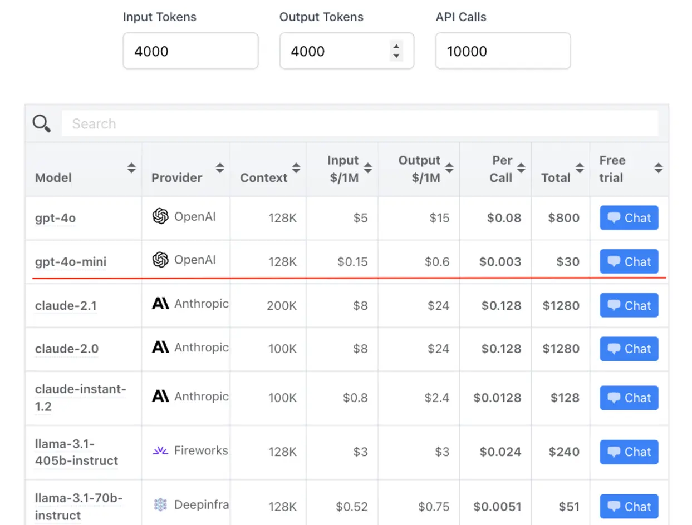

## Key takeaways

- Meta's Llama 3.1, particularly the 405B parameter model, marks a significant advancement in open-source AI, competing with leading closed-source alternatives.
- OpenAI's introduction of fine-tuning capabilities for GPT-4o-mini democratizes AI customization, offering potential for optimized business applications.
- Claude Sonnet 3.5 is revolutionizing software development for technical founders, reportedly improving development speed by 10x for UI components.
- AI advancements in sports analytics (Roboflow) and multilingual text-to-speech (ElevenLabs' Turbo v2.5) are enhancing performance analysis and communication.
- Recent cybersecurity incidents highlight the importance of diversified and resilient system designs to mitigate risks associated with single-point failures.
- The software engineering landscape in 2024 is trending towards "boring" technology, full-stack development, and increased integration of AI tools in development workflows.
- Despite being widely used, JavaScript has seen a drop in median salary, while niche languages like Erlang, Elixir, and Clojure command higher salaries.

## Meta's Llama 3.1: Open source AI for everyone

Meta's release of Llama 3.1, particularly the 405B parameter model, marks a significant leap in open source AI capabilities. This frontier-level model now competes with leading closed-source alternatives, offering comparable performance with the added benefits of transparency and customizability. The release includes improved 70B and 8B versions as well, catering to various computational needs. Meta's partnerships with tech giants like Amazon, Databricks, and NVIDIA for deployment support underscore the ecosystem-wide impact of this release.

From an engineering standpoint, Llama 3.1 presents an intriguing shift in the AI landscape. Its cost-efficiency and the ability to fine-tune without data leaving local infrastructure address key concerns in enterprise AI adoption. However, the true test will be in real-world applications and the model's ability to maintain competitive performance over time. While this release potentially democratizes access to cutting-edge AI, it also raises important questions about AI safety and responsible deployment at scale. As the open source AI ecosystem evolves, we'll be watching closely to see how it influences industry standards and innovation trajectories.

## OpenAI's GPT-4o-mini: A leap in cheap and customizable AI

OpenAI has taken a significant step in democratizing AI by introducing fine-tuning capabilities for GPT-4o-mini. This development allows users to customize the model for specific applications, potentially revolutionizing how businesses and developers interact with AI. The fine-tuning feature is currently available to tier 4 and 5 users, with plans to expand access gradually. Notably, OpenAI is offering the first 2 million training tokens per day free through September 23, 2024, lowering the barrier to entry for many organizations.

We believe this move presents exciting opportunities for optimizing AI applications. The benefits of fine-tuning include higher quality results, significant token savings, and lower latency - all crucial factors in production environments.

However, it's important to note that fine-tuning should be considered after exploring other optimization methods like prompt engineering, prompt chaining, and function calling. [Long live fine-tuning](https://christianjmills.com/posts/mastering-llms-course-notes/conference-talk-009/). These methods often yield good results with a faster feedback loop than fine-tuning, which requires dataset creation and training jobs. As we integrate this technology into our systems, we'll need to carefully weigh the trade-offs between the time investment in fine-tuning and the potential performance gains, especially for mission-critical applications.

## Claude Sonnet 3.5: Accelerating technical founder productivity

The recent release of Claude Sonnet 3.5 is reshaping the landscape of software development for technical founders. This Large Language Model (LLM) stands out from its predecessors by offering an unprecedented level of comfort and efficiency in implementation tasks. Early adopters report a staggering 10x improvement in development speed for UI components and other technical aspects of popular applications. This acceleration in coding productivity allows founders to focus more on critical architectural and infrastructure decisions, potentially revolutionizing the pace of innovation in the startup ecosystem.

The workflow enabled by Claude Sonnet 3.5 is very relatable, as we use similar methods with Claude to speed up development and design cycles, with thorough planning and prompting. However, it's crucial to note that while this tool significantly enhances coding efficiency, it doesn't replace the need for sound architectural decision-making. As we integrate this technology into our development processes, we'll need to carefully balance the rapid iteration capabilities with maintaining code quality and system integrity.

## Advancements in AI for sports and audio: Enhancing performance analysis and communication

Recent developments in artificial intelligence have led to significant advancements in both sports analytics and audio processing. Roboflow has developed a suite of computer vision tools specifically tailored for sports applications, addressing challenges such as ball tracking, player identification, and camera calibration in high-resolution video analysis.

ElevenLabs has introduced Turbo v2.5, a state-of-the-art text-to-speech model that supports 32 languages, including new additions like Vietnamese, Hungarian, and Norwegian. This model offers high-quality, low-latency conversational AI capabilities, potentially revolutionizing multilingual communication in various fields, including sports commentary and analysis.

The most practical advancement we see of the two would be ElevenLabs’ Turbo v2.5. There is not much significant difference between it’s last in terms of spoken English, but they have recently supported other languages, especially Vietnamese. The quality of speech with foreign languages has also been quite exceptional and it opens a lot of doors for software that require natural conversations or voice design and acting.

## Cybersecurity vulnerabilities and IT outages: A wake-up call for diversified systems

Recent events have exposed significant vulnerabilities in enterprise cybersecurity systems and version control platforms. A global IT outage caused by a [faulty CrowdStrike update](https://www.nbcconnecticut.com/news/business/money-report/how-a-software-update-caused-one-of-the-worlds-biggest-it-blackouts/3339921/) and the discovery of a [Cross Fork Object Reference (CFOR)](https://trufflesecurity.com/blog/anyone-can-access-deleted-and-private-repo-data-github) vulnerability in GitHub's architecture highlight the risks of over-reliance on single systems. The CrowdStrike incident demonstrated how deeply integrated security software can become a critical point of failure, while the GitHub vulnerability revealed unexpected data exposure risks in collaborative development environments.

From what we see, these incidents underscore the importance of diversified and resilient system designs. The widespread impact of the CrowdStrike outage serves as a stark reminder that we shouldn't put all our eggs in one basket, especially regarding critical infrastructure and security solutions. Moving forward, we must prioritize the development of more robust, distributed systems that can withstand single-point failures. This is not isolated to just these incidents, but similar events on our side have been clear indicators for us to better decentralize our subscriptions with vendors.

## Where JavaScript and tech sits in software engineering

The JavaScript ecosystem and broader software engineering field are undergoing significant shifts in 2024. The job market for software engineers has tightened, slowing career advancement and increasing competition. This climate is driving several key trends:

1. Adoption of "boring" technology and monoliths, prioritizing stability over cutting-edge solutions.
2. Growing momentum for Full Stack development and TypeScript.
3. Increased responsibilities "shifting left" onto developers.

The 2024 Stack Overflow survey reveals interesting insights:

- Erlang developers command the highest median salary at $100,836, followed closely by Elixir and Clojure.
- AI tools are expected to become more integrated into development workflows, particularly in documenting code (81%), testing code (80%), and writing code (76%).
- JavaScript, despite being the mainstay language of developers, has seen a drop in median salary: 

These trends suggest a software engineering landscape that values efficiency, reliability, and versatility. There is a necessity to adapt to these changes while maintaining a balanced approach to technology adoption. The increasing integration of AI tools presents both opportunities and challenges, particularly in areas of code documentation and testing. Moving forward, it's crucial to leverage these tools effectively while ensuring we don't overlook the importance of human expertise and hard skill in software development.

## References

- [https://newsletter.pragmaticengineer.com/p/what-is-old-is-new-again](https://newsletter.pragmaticengineer.com/p/what-is-old-is-new-again)
- [https://x.com/garrytan/status/1814732623073456165](https://x.com/garrytan/status/1814732623073456165)
- [https://trufflesecurity.com/blog/anyone-can-access-deleted-and-private-repo-data-github](https://trufflesecurity.com/blog/anyone-can-access-deleted-and-private-repo-data-github)
- [https://elevenlabs.io/blog/thoughtly](https://elevenlabs.io/blog/thoughtly)
- [https://web.swipeinsight.app/posts/openai-introduces-fine-tuning-for-gpt-4o-mini-8957](https://web.swipeinsight.app/posts/openai-introduces-fine-tuning-for-gpt-4o-mini-8957)
- [https://openai.com/index/gpt-4o-mini-advancing-cost-efficient-intelligence/](https://openai.com/index/gpt-4o-mini-advancing-cost-efficient-intelligence/)
- [https://github.com/roboflow/sports](https://github.com/roboflow/sports)
- [https://2023.stateofjs.com/en-US](https://2023.stateofjs.com/en-US)
- [https://newsletter.pragmaticengineer.com/p/what-is-old-is-new-again?ref=blog.pragmaticengineer.com](https://newsletter.pragmaticengineer.com/p/what-is-old-is-new-again?ref=blog.pragmaticengineer.com)
- [https://survey.stackoverflow.co/2024/](https://survey.stackoverflow.co/2024/)
