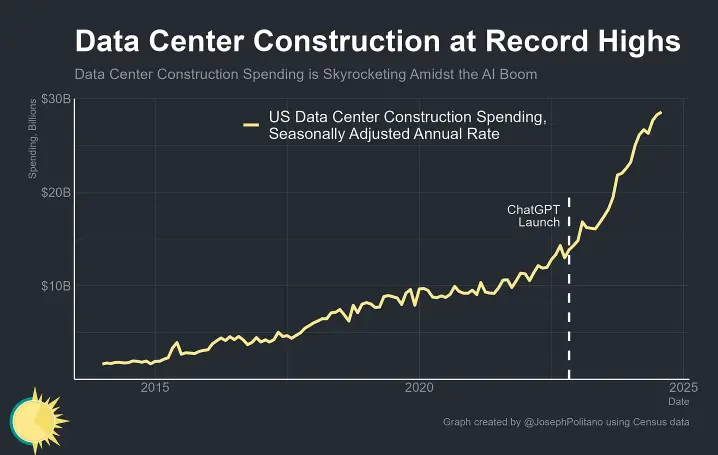
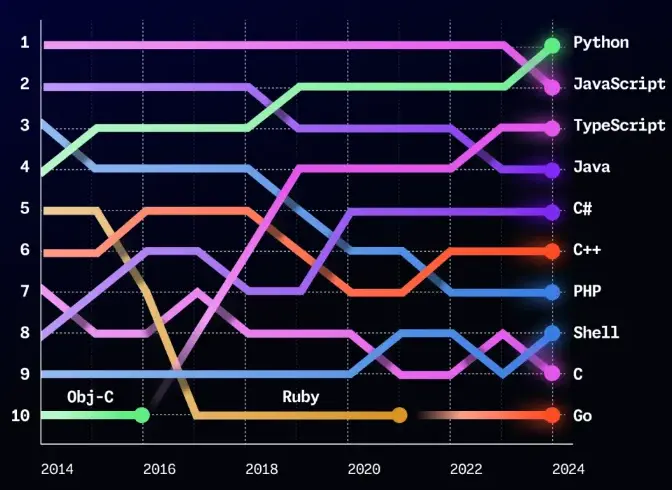

## Key takeaways

- **AI chat evolves**: Chat interfaces advance, potentially leading to a unified tool for diverse tasks, such as browser and OS integration.

- **Tech infrastructure investment**: The rising AI demand drives infrastructure needs, boosting AI applications more accessible and integral to daily functions.

- **Python takes lead**: Python surpasses JavaScript due to rising in AI adoption.

- **Coding assistance anti-patterns**: Relying too heavily on generated code risks messy projects, underscoring the need for solid engineering practices.

- **Why techies leave Big Tech**: Talent exits Big Tech due to stagnant roles, layoffs, and fewer growth opportunities, shifting interest toward startups.

- **Who is hiring?**: Skilled tech roles focus on Python, TypeScript, and Rust, with a need for expertise in WebAssembly, Nix, and system-level knowledge.

## AI chat evolves: One interface to rule them all

October brought a wave of new developments in AI, showing just how far chat interfaces have come. **Anthropic** introduced a demo called [Computer Use](https://docs.anthropic.com/en/docs/build-with-claude/computer-use) where models can use software in a way that mirrors human interaction with computer. This breakthrough opens up new ways to streamline tasks and make work more efficient.

**OpenAI also rolled out [Canvas](https://openai.com/index/introducing-canvas/)**, which takes ChatGPT from being a simple chat tool to a collaborative partner in writing and coding. Canvas gives users a shared space to work together, creating a more interactive experience. Meanwhile, **ChatGPT got an upgrade in its [web search](https://openai.com/index/introducing-chatgpt-search/) abilities**, delivering quicker, more accurate answers supported by solid sources. The plan is to continue improving this feature to cover areas like shopping and travel, making it even more practical for everyday use.

We’re observing a single chat interface that can manage various types of tasks, paving the way for the imminent release of a focused tool like LLM browser or even OS.

## The unseen investment in tech infrastructure

AI products are used ubiquitously, with usage expected to only increase moving forward. This also raises the demand for building data centers, computers, and energy supplies. Not only that, techniques to optimize the use of the resources are becoming increasingly demanded. We observe that as hardware matures, it could potentially enable many use cases for software development. Some of our views are as follows:

- While some predict a bubble similar to the internet, we see key differences: more computing power makes AI increasingly smarter and more capable.
- Demand for AI is driving infrastructure needs, which is lowering overall costs.
- As infrastructure and techniques improve, AI applications will become more refined and embedded in daily life, much like the internet’s evolution.
- Smarter AI will expand applications significantly—think of LLMs integrated into operating systems.

## Python becomes the no. 1 programming language

[**GitHub's October 2024 report**](https://github.blog/news-insights/octoverse/octoverse-2024/) came with big news: Python has overtaken JavaScript as the most popular language. This shift is thanks to a big jump in the adoption of modern tech and a wave of developers moving from JavaScript to TypeScript.

Some key trends from the report:

- **Smaller scale models**, such as Meta’s LLaMA, are becoming widely adopted. Academic research has become the pivotal domain attracting significant development effort.
- AI models are becoming **standard toolkits** for developers. Soon, AI will not just be a code generator, but a general problem-solving tool.
- The growth of **Rust** attests to the industry’s increasing emphasis on safety becoming a focal point in software development.
- **Africa and Latin America** are emerging as significant hubs for outsourcing and tech entrepreneur.

## Coding assistance anti-patterns

Even as new tools become available, some issues have surfaced in how they’re used. Generated code now makes up a big part of work at software companies, but it’s not without problems:

- Leaning too heavily on automated suggestions can lead to messy code.
- The idea that tools can replace a second pair of eyes in coding doesn’t hold up.
- Generated code tends to go for brute force rather than well-thought-out solutions, which can bloat projects.

The bottom line is, **teams should double down on solid engineering practices**, including unit testing and other proven quality checks. This helps ensure that these tools boost productivity without adding hidden complexities.

## Why techies are leaving Big Tech

There is a [discussion](https://newsletter.pragmaticengineer.com/p/leaving-big-tech) around why talent leaving Big Tech, and the reasons go beyond what you might expect. Many professionals spoke about feeling stuck—doing more administrative work and less actual building. The lack of challenging projects has left them frustrated and uninspired.

The generous paychecks at these firms have given many the cushion they need to take bigger career risks, such as joining startups or starting their own ventures. But there’s more to it now: job security isn’t what it used to be. Mass layoffs, once a rarity, are making folks rethink whether Big Tech is as safe as it once seemed. This has led to a job market that splits experienced pros, who remain in high demand, from juniors, who find fewer opportunities. Companies may need to consider investing in mentorship and training to keep fresh talent flowing.

## Who is hiring?

[The job market in October](https://docs.google.com/spreadsheets/d/19ZCs7CYyHJBMFfNqcIGleuWpGi5RfXnoGD-Rgz-BGt0/) showed both promise and challenges. There’s still a strong demand for skilled workers, but the focus has shifted to those with specific expertise. **Remote roles** are widely available.

When it comes to tech stacks, **Python, TypeScript, and Rust** are highly sought after. These languages have proven their value in building modern, efficient systems. On top of that, there’s a call for specialized skills like **WebAssembly**, **Nix** and system-level knowledge, hinting at a shift toward performance-focused work.

Looking at job descriptions, common areas of expertise include **platform building**, **data management**, **systems work**, and **security**. Companies are searching for well-rounded developers who can tackle complex projects and create solid solutions.

## References

- [https://github.blog/news-insights/octoverse/octoverse-2024](https://github.blog/news-insights/octoverse/octoverse-2024/)
- [https://newsletter.pragmaticengineer.com/p/leaving-big-tech](https://newsletter.pragmaticengineer.com/p/leaving-big-tech)
- [Thoughworks Tech Radar Vol 31](https://www.thoughtworks.com/content/dam/thoughtworks/documents/radar/2024/10/tr_technology_radar_vol_31_en.pdf)
- [https://www.thoughtworks.com/insights/blog/technology-strategy/macro-trends-tech-industry-october-2024](https://www.thoughtworks.com/insights/blog/technology-strategy/macro-trends-tech-industry-october-2024)
- [https://openai.com/index/introducing-canvas](https://openai.com/index/introducing-canvas/)
- [https://openai.com/index/introducing-chatgpt-search](https://openai.com/index/introducing-chatgpt-search/)
- [https://docs.anthropic.com/en/docs/build-with-claude/computer-use](https://docs.anthropic.com/en/docs/build-with-claude/computer-use)
- [https://www.apricitas.io/p/the-ai-investment-boom](https://www.apricitas.io/p/the-ai-investment-boom)
- [Alphabet 2024 Q3 earnings call](https://www.youtube.com/watch?v=wjkf4t8BfLM)
