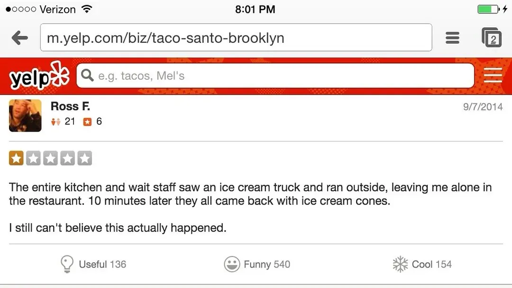
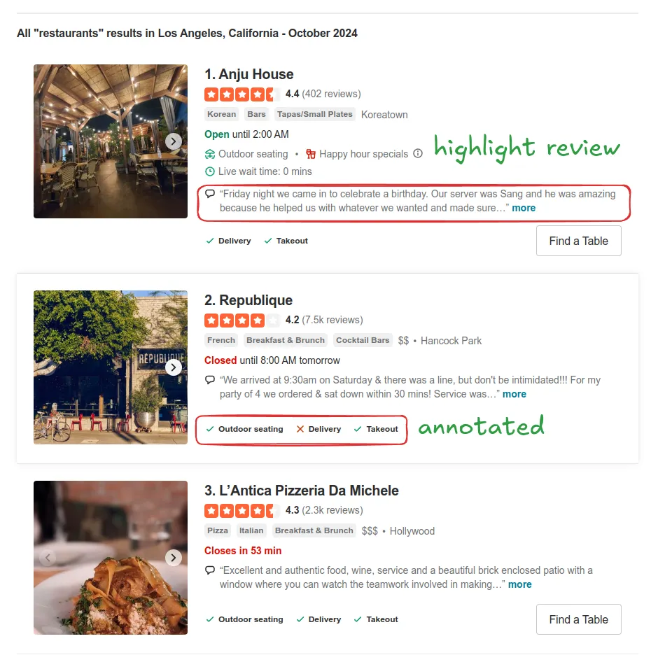
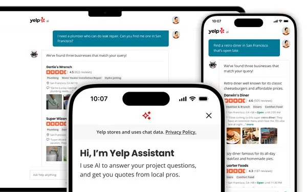

Yelp Inc. is a platform that helps users discover local businesses through reviews, ratings, and recommendations. Recently, they've integrated AI and large language models (LLMs) to improve content moderation, search capabilities, and user interactions with features like Yelp assistant.

## Key takeaways

- Yelp uses LLMs to catch inappropriate reviews, blocking 23,600+ bad ones in 2023.
- Yelp uses the CLIP model to accurately categorize and understand the content of photos.
- Yelp uses LLMs to summary highlight review.
- Yelp assistant helps users find service providers by using LLM with their ML system.

## Yelp contents as embeddings

### Text embeddings

Yelp’s platform has tons of user-generated content, like reviews, and to keep users trusting the site, they need to make sure inappropriate stuff (like hate speech, harassment, lewdness, or threats) gets spotted and removed. Relying only on human moderators isn’t enough, so they’ve turned to automated tools to help. They went with LLMs because these models are great at picking up on tricky, harmful language across different situations.

They mainly looked at how well LLMs can catch bad content like:

- Hate speech, which is offensive stuff aimed at people or groups based on things like race, gender, religion, or sexuality.
- Lewdness, including dirty jokes, pickup lines, asking for sexual favors, or sexual harassment.
- Threats, harassment, and other extreme personal attacks.

Yelp put together a dataset ( you can find [this datasets at here](https://huggingface.co/datasets/Yelp/yelp_review_full), based on 5 star rating system review) of old inappropriate reviews to train their model. This dataset had labeled examples of really bad language. To make the model work even better, they used a few tricks like:

- **Scoring system**: Moderators rated how bad the inappropriate content was.
- **Sentence embeddings**: They used LLMs to find reviews that were similar to high-quality examples to bulk up the dataset.
- **Sampling techniques**: They adjust the dataset by over-sampling and under-sampling to boost recall, especially for rare types of inappropriate content. **They also used zero-shot and few-shot technique** to handle cases where there wasn’t enough data for certain categories.

**Yelp used a curated dataset and LLM model from HuggingFace to classify inappropriate reviews.** They evaluated model performance by visualizing sentence embeddings and fine-tuned the model to improve accuracy.

Since incorporating LLMs to help detect harmful and inappropriate content, it enabled Yelp moderators to proactively prevent **23,600+ reviews from ever publishing to Yelp in 2023**.

### Photo embeddings with CLIP model

Yelp uses business and photo embeddings to enhance data accessibility and improve recommendations, semantic search, and clustering.

1. **Business embeddings**: These are created by averaging the vector embeddings of the 50 most recent reviews of a business, representing its metadata. Before LLM trends grows, they are apply ML for this feature.
2. **Photo embeddings**: Yelp uses **OpenAI's CLIP model** to generate semantic representations of images. CLIP is a zero-shot model that pairs images with relevant text, helping classify photos more accurately with minimal data.

**Semantic Understanding:** CLIP is employed to generate semantic embeddings of images, enabling the system to understand and categorize the content of photos effectively. For example from Yelp, we observe that many **Interior** and **Exterior** photos get classified as **Other** by the CLIP model. Here are some examples for **Interior**.

**Category Identification:** The model classifies photos into predefined categories such as **Food**, **Drinks**, **Menu**. For example, Images labeled **Waffles** in Yelp dataset were considered misclassified as **Chicken Wings or Fried Chicken** by the CLIP model.

Yelp's project involves generating new embeddings for its extensive data using models like CLIP. These embeddings (for reviews, photos, and metadata) allow Yelp to improve the breadth, depth, and accuracy of its content, making it more useful for internal teams. They plan to fine-tune the CLIP model to enhance photo embeddings and expand business embeddings by integrating multiple data types. With hundreds of millions of embeddings, different teams at Yelp are already leveraging this data to enhance their products and services.

## Review highlights and tagging

They’ve also improved the search experience with **AI and LLMs** (Large Language Models). These updates help you find exactly what you’re looking for by analyzing all the user-generated content on Yelp and giving you smarter, more relevant search results. They’ve even added a fun new **“Surprise Me”** feature that suggests places to eat when you’re not sure what you want, and new clickable tags to make narrowing down your search easier.

Another cool addition is how Yelp’s making reviews more engaging. You can now **add videos to your reviews**, making them more immersive and interactive. They’ve also added **new review reactions** (think thumbs up or similar) and **review topics** to help you write better, more organized reviews.

## Yelp assistant

Yelp is using Large Language Models (LLMs) in some cool ways to make things easier for both users and businesses. One of the main features powered by LLMs is **Yelp assistant**, a conversational AI tool that helps you find and hire service pros. You can just tell Yelp assistant what you need, and it’ll ask you follow-up questions, then match you with the best local pros for the job. It’s smart because it pulls from Yelp’s huge collection of business info and reviews, making sure you get the right fit.

Yelp’s also got the **Yelp Fusion AI API**, which lets other companies integrate Yelp’s content into their own apps or platforms. So, if you’re on a different app and you ask something like, "Find a coffee shop with free Wi-Fi nearby," the LLMs will pull from Yelp’s data and give you solid recommendations, complete with reviews, ratings, and photos. It’s a way for third-party apps to give their users access to Yelp’s content with smart, natural language searches.

## Conclusion

In terms of user experience, Yelp's integration of AI and large language models (LLMs) has changed the platform by improving search intelligence, review insight, and content moderation effectiveness. Yelp is transforming the way businesses communicate with consumers by applying these advanced technologies. Yelp is using LLMs in a bunch of different ways, from helping user find service pros with LLM, to making search results smarter, to powering other apps with Yelp’s data. It’s all about making things easier, faster, and more personalized for users.

## References

- https://engineeringblog.yelp.com/2023/04/yelp-content-as-embeddings.html
- https://blog.yelp.com/businesses/new-yelp-business-features-august-2023/
- https://engineeringblog.yelp.com/2018/05/scaling-collaborative-filtering-with-pyspark.html
- https://engineeringblog.yelp.com/2024/03/ai-pipeline-inappropriate-language-detection.html
- https://www.yelp-press.com/press-releases/press-release-details/2023/Yelp-Introduces-New-Ways-to-Discover-and-Connect-with-Local-Businesses-and-Contribute-Helpful-Content/default.aspx
