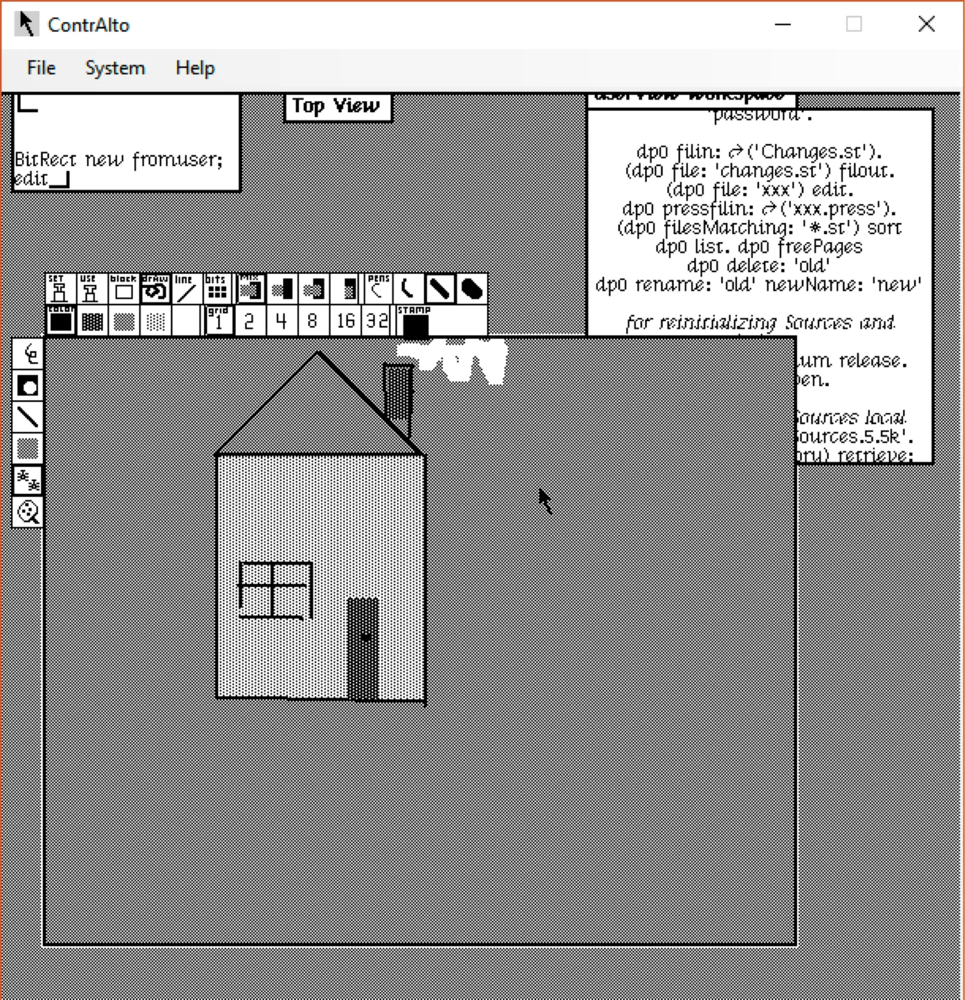
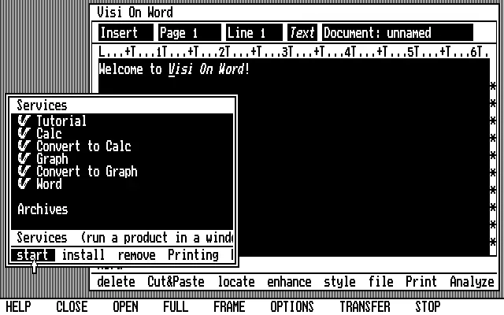
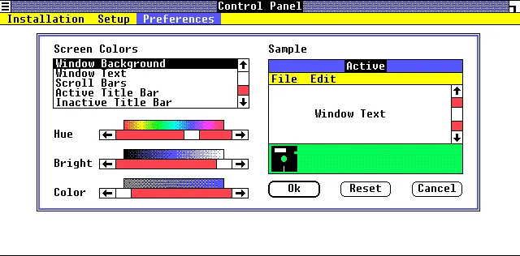
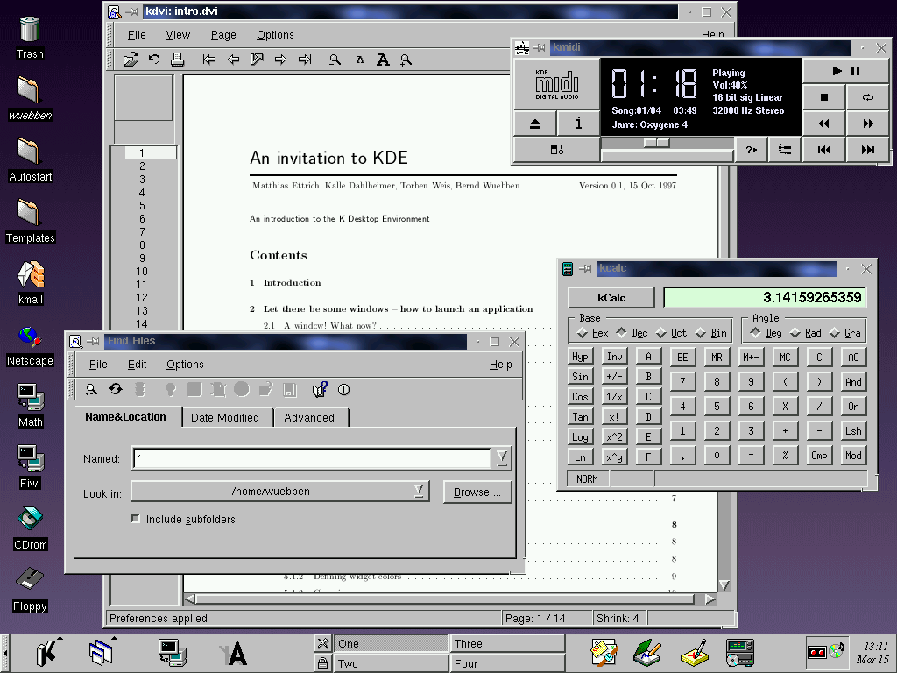
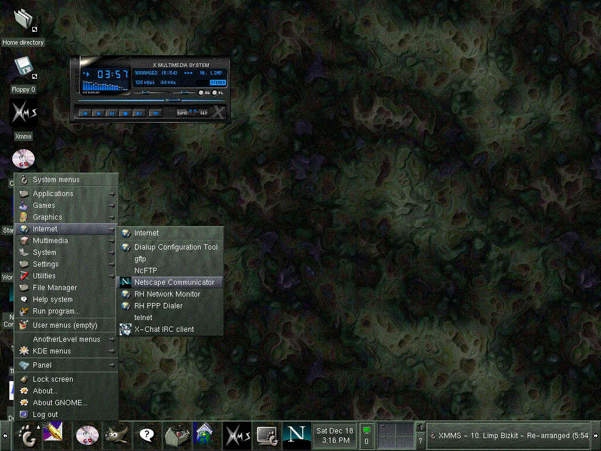
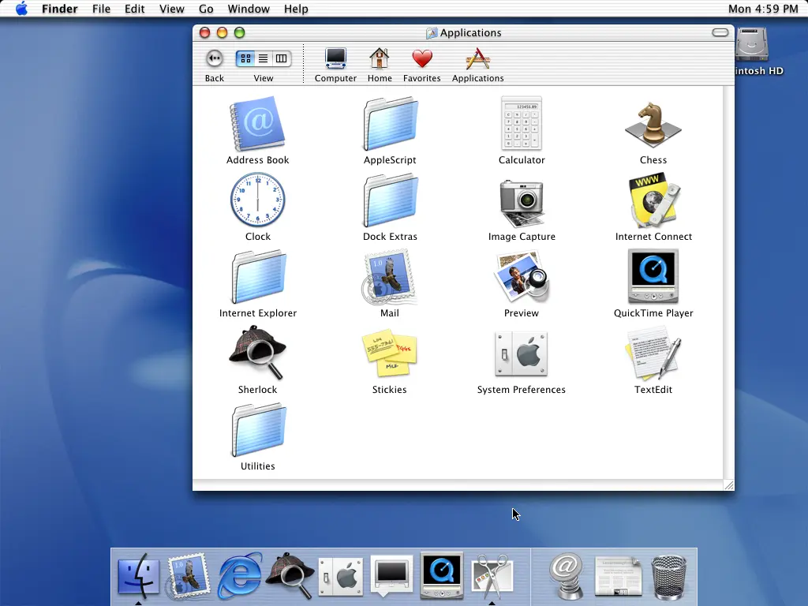

A good user interface should make it possible to complete any task quickly and with enjoyment. The user interface that you see on your MacOS or Windows PC has taken a long time to develop. This essay will briefly examine the changes in computer interface design over the last 30 years.

## Xerox Alto

Xerox Alto was the first computer with a graphical user interface (GUI). The first machines were unveiled on March 1st, 1973. A decade before mass-market workstations were made accessible, the Alto was built from the ground up to support the desktop paradigm.

## Xerox Star

The Xerox Star workstation was the first commercial computer to use many of the features that are now commonplace in personal computers. It included a bitmapped display, a graphical user interface with windows, icons, folders, a two-button mouse, Ethernet networking, file servers and print servers.

## Apple Lisa

Lisa was one of the first personal computers to offer a graphical user interface (GUI). Although it received technical praise, Lisa was seen as a commercial failure. Nevertheless, Lisa introduced a number of cutting-edge capabilities that would subsequently recur on the Macintosh and IBM PC compatibles.

## VisiCorp Visi On

Visi On was a short-lived but significant graphical user interface-based operating environment application. Visi On had high minimum system requirements for its day, hence it was never widely used. It had a significant impact on the creation of Microsoft's Windows operating system.

## System 1

Macintosh "System 1" was the start of the Mac OS series. Many features that would last for years were introduced by this operating system. Some of these features are still present in the current Mac operating system, Apple's Mac OS, called Mac OS X.

## Amiga Workbench 1.0

Commodore created Workbench as a graphical file manager for the AmigaOS operating system. Instead of the more popular desktop paradigm, it uses a workbench metaphor to depict file system organization.

## Windows 1.0

Windows 1.0 was released on November 20, 1985. It was the first major operating system for personal computers.

## Windows 2.0

Microsoft's Windows 2.0 went into manufacturing on December 9th, 1987. It replaced Windows 1.0 and went into production a month after it was released to the public in 1986.

## OS/2 1.1

OS/2 1.0 was previewed in April 1987, made public in December 1987. It was originally developed by Microsoft and IBM.

## Windows 3.0

Windows 3.0 is the third major version of Microsoft's Windows operating system. Launched in 1990, it has a redesigned graphical user interface (GUI) and replaces the list of file names with icons. It sold 10 million copies before Windows 3.1 replaced it in 1992.

## Mac OS System 7

System 7 is a graphical user interface-based operating system for Macintosh computers. Apple officially changed the operating system's name to "Mac OS" with version 7.6 in 1997.

## Windows 3.1

On April 6, 1992, Windows 3.0 was replaced, and Windows 4.0 entered production. The TrueType font system was created in order to enable Windows applications to use scalable fonts without the use of additional programs like Adobe Type Manager.

## Windows 95

Windows 95 introduced a redesigned shell based around a desktop-based metaphor. File shortcuts (also known as shell links) were introduced and the desktop was re-purposed to hold shortcuts to applications, files and folders, reminiscent of Mac OS.

## KDE 1.0

KDE is a modern desktop environment for UNIX workstations that is network transparent. Similar to the desktop environments offered under MacOS or Windows 95/NT, KDE aims to meet the requirement for an intuitive desktop for UNIX workstation users.

## GNOME 1.0

GNOME was founded on August 15, 1997. The GTK (GNOME Toolkit, formerly known as GIMP Toolkit) was selected as the foundation of GNOME in place of the K Desktop Environment's reliance on a proprietary software license until version 2.0.

## Mac OS X 10.0

Apple releases Mac OS X 10.0 - code-named "Cheetah" - on September 26, 2003. The next-generation of Apple's desktop and server operating system marks the 10th anniversary of Mac OS 9.1 (codenamed "Mountain Lion").

## Windows XP

Windows XP is a major update to Microsoft's Windows NT operating system. Critics noted its improved hardware support, greater performance and stability.

## Mac OS X Snow Leopard

Apple has released a new version of its Mac OS called Snow Leopard (version 10.6). Snow Leopard's objectives were enhanced performance, more efficiency, and a smaller overall memory footprint for computers running Apple's Mac OS X operating system. The software was famously advertised as having "zero new features".

## Reference

- https://history.user-interface.io
- https://www.betaarchive.com/forum/viewtopic.php?t=38736
- https://medium.theuxblog.com/a-short-history-of-computer-user-interface-design-29a916e5c2f5
