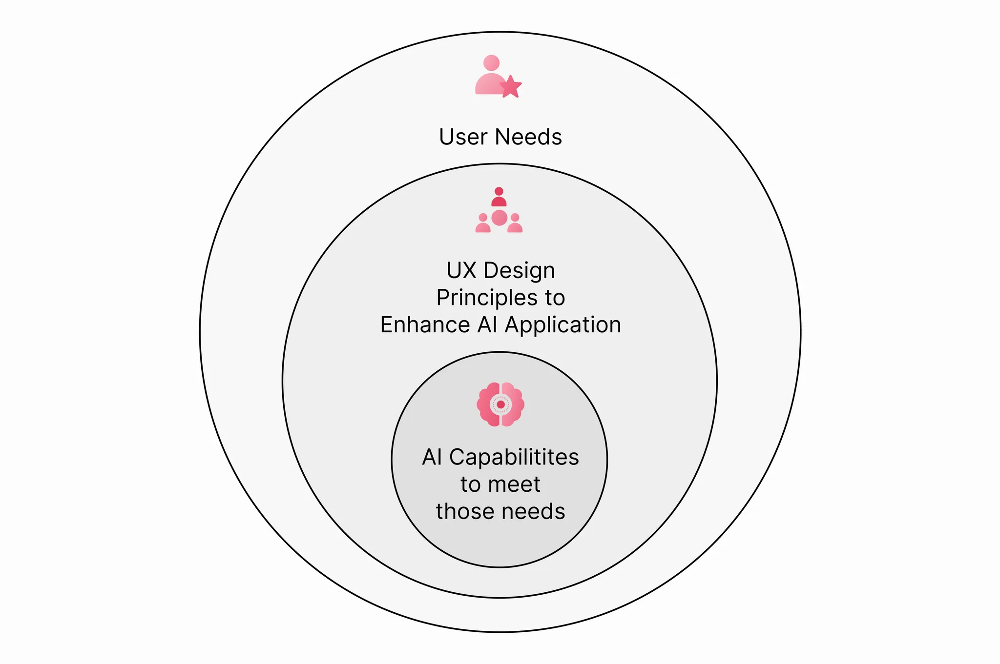
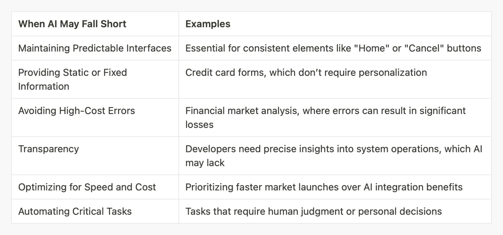
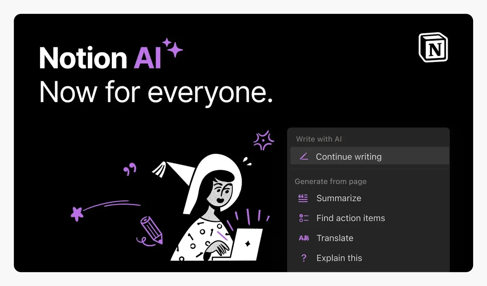
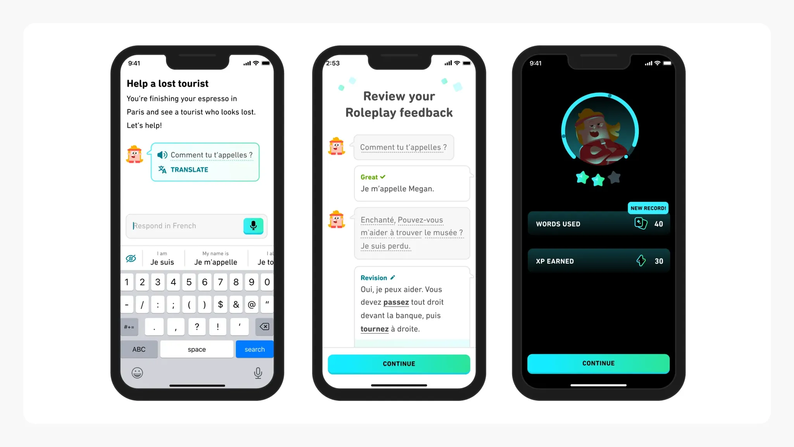
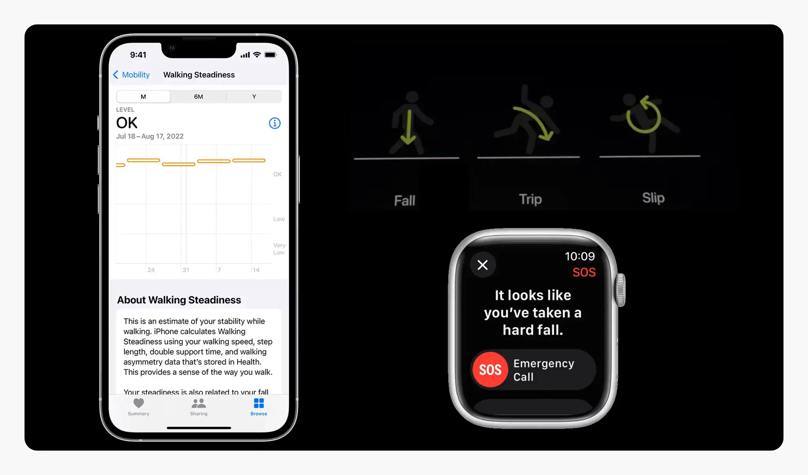
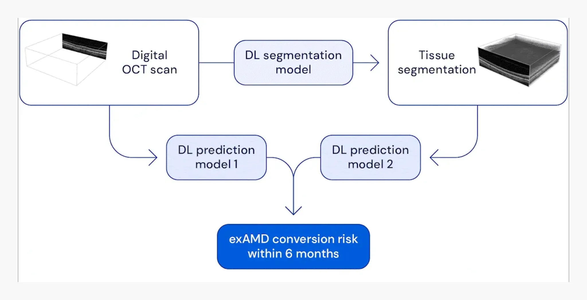

---
tags:
  - UX-UI
  - product-design
  - report
title: "Product Design Commentary #6: AI in Design - Cool ideas and how to make them happen"
date: 2024-11-21
description: Artificial Intelligence (AI) brings boundless opportunities to enhance both user experience and daily life. While foundational technologies often seem under the purview of data scientists and engineers, designers play a crucial role in bridging the gap between user needs and emerging technologies. This article explores the role of UX and how to determine which user problems are best solved with AI while assessing their effectiveness.
authors:
  - bringastar
  - Maniub102
---

Artificial Intelligence (AI) brings boundless opportunities to enhance both user experience and daily life. While foundational technologies often seem under the purview of data scientists and engineers, designers play a crucial role in bridging the gap between user needs and emerging technologies. This article explores **the role of UX** and **how to determine which user problems are best solved with AI** while assessing their effectiveness.

## Understanding UX in AI-Driven Design

To develop effective AI-powered applications, it is vital to deeply understand user needs and apply UX principles throughout the design process. Only then can we create AI solutions that truly meet end-user expectations.

Consider a trading platform aiming to implement an AI system to analyze crypto market trends. While some users might find such a feature disruptive to their trading habits and fear potential data breaches, others may over-rely on the system's recommendations, even when those recommendations are flawed. This could lead to severe issues, such as automated trading strategies triggering "flash crashes," where large-scale sell-offs are executed based on negative signals, causing significant losses for both AI users and the broader market.

This scenario highlights a common challenge in applying AI across industries. It underscores the importance of close collaboration between UX designers, AI developers, and engineers to overcome these obstacles, enhance system efficiency, and foster user acceptance.

Machine learning (ML) is not a one-size-fits-all solution. Misguided applications of ML can result in unintended consequences. Identifying the right problem to address and evaluating whether ML is the most suitable tool is paramount. **While AI and ML can solve complex problems, they cannot independently identify what problems need solving**—a critical role that UX plays in steering the application of technology effectively.

## What’s New When Working with AI?

When designing any product, user-centered decisions are key. Three critical considerations for integrating AI into products are:

### Identifying the Intersection of User Needs and AI Strengths

Determine the real-world problems users need to solve and evaluate whether AI offers unique value in addressing these issues. This requires a deep understanding of user needs and AI capabilities to ensure the proposed solution is both practical and valuable.

### Balancing Automation vs. Augmentation

Decide whether AI should fully automate a task or merely enhance user performance. Automation suits repetitive, mundane, or hazardous tasks, while augmentation is better suited for tasks where users want active involvement and where social or cognitive value is significant.

### Designing and Evaluating Reward Functions

Every AI model is guided by a reward function, also called an “objective function” or “loss function.” This is a set of mathematical formulas that define the system's perception of "correct" versus "incorrect" predictions. Careful design of the reward function ensures long-term benefits and avoids unintended outcomes that might adversely affect user experience.

### Use Case Examples: When AI Works Best vs. When It Doesn't

## Where to Integrate AI into Products and Solutions

### Enhancing Efficiency

AI can learn user behaviors, identify patterns, and make actionable suggestions to save time and resources. For instance, [**Siri**](https://support.apple.com/en-vn/guide/iphone/iph6f94af287/ios) suggests apps based on daily habits, like opening a fitness tracker at 6 a.m. if the user jogs at that time. Similarly, platforms like Netflix and YouTube recommend content based on viewing history.

AI also enhances logistics efficiency. Delivery services like DHL and FedEx optimize delivery routes, cutting fuel costs by up to 30%. These systems predict optimal paths and times, saving shipping costs and improving delivery speed.

### Reducing Mundane Tasks

AI is ideal for automating repetitive, low-value tasks. For example, AI tools in Photoshop now automate background removal or complex graphic designs with simple commands, tasks that once required significant manual effort.

In finance, AI-powered tools consolidate data from various crypto exchanges, [generate weekly portfolio reports](https://medium.com/@batuhansenerr/ai-powered-financial-analysis-multi-agent-systems-transform-data-into-insights-d94e4867d75d), and issue alerts for sudden price changes. These tools enable investors to make informed decisions faster, automating tedious tracking processes.

Automation, however, isn't always ideal. Some tasks, like journaling or creative work, offer intrinsic value when performed manually. Instead of fully automating such activities, AI can assist by suggesting ideas or providing guidance, enhancing the user’s creative experience without taking over.

### Supporting User Tasks

AI can act as a powerful assistant, helping users achieve goals seamlessly. Financial apps like **Acorns** and **Wealthfront** use AI to help users manage savings, track progress toward milestones like homeownership, and adjust strategies based on personal financial data.

AI can also help your users accomplish tasks that were previously impossible or difficult to access.

Grammarly and Notion AI assist users in writing tasks, ranging from crafting marketing content to editing documents. These AI tools help correct grammar mistakes, suggest better phrasing, and even provide content ideas. They enable users, even those who aren't writing experts, to create professional-quality pieces, saving time and enhancing the overall quality of their output.

Similarly, [Duolingo](https://blog.duolingo.com/duolingo-max/) incorporates gamification into language learning through daily and weekly challenges. These challenges are tailored to match the learner's current proficiency level, helping them progress while maintaining an effective and engaging learning routine.

### Improving Safety and Health

AI enhances user safety through real-time data processing. Apple devices analyze user movements to detect falls, automatically contacting emergency services if necessary.

In healthcare, AI systems like DeepMind's retinal disease detection analyze medical images to [diagnose conditions](https://deepmind.google/discover/blog/using-ai-to-predict-retinal-disease-progression/) early. With accuracy rivaling specialists, such tools empower healthcare providers to deliver faster, more reliable care.

_AI system for predicting exAMD. Predictions from the raw and segmented retina scans are combined to calculate the risk of AMD progression within 6 months._

## Conclusion

AI is not a silver bullet for every problem. As designers, our ultimate goal is to solve user challenges and help them achieve their objectives. By understanding their needs and developing comprehensive solutions, we can identify where AI best fits to amplify outcomes. Start with the problem, then let AI elevate the solution.

**Learn more:**

- A chapter from Google's guide on [User Needs + Defining Success (Responsible AI)](https://pair.withgoogle.com/chapter/user-needs/), focusing on understanding and meeting user needs during the development of AI systems.

- The article ["Applications Of Machine Learning For Designers"](https://www.smashingmagazine.com/2017/04/applications-machine-learning-designers/) on Smashing Magazine discusses the applications of machine learning for designers, helping them understand how to integrate this technology into their design process.
