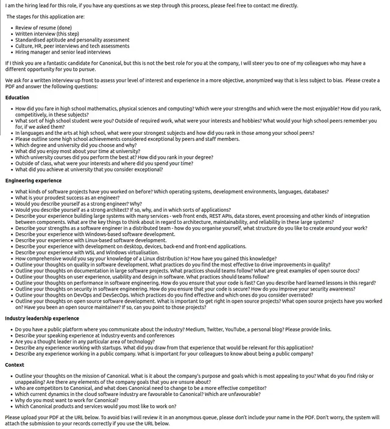
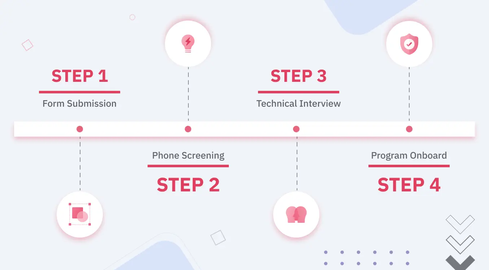
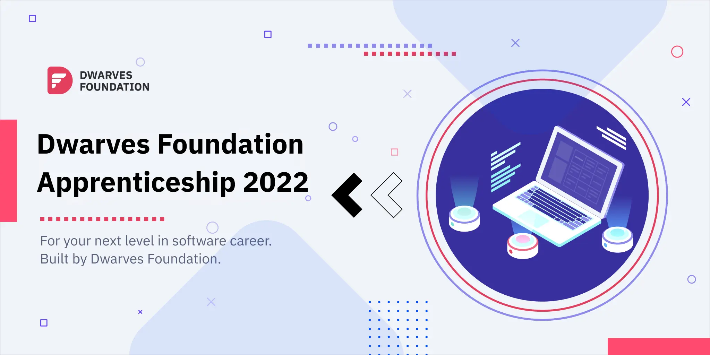

Hey,

It’s Han and Nikki, back in your inbox for another Dwarves Updates.

First, we are delighted to share that [Dwarves placed top 100 in the Financial Times’ Asia-Pacific High-Growth Company](https://www.linkedin.com/posts/dwarvesf_ft-ranking-asia-pacific-high-growth-companies-activity-6915126757280931840-ayx1).

When we hustle daily, sometimes we forget to look back and pat ourselves in the back. This achievement serves as a reminder that we’re pretty darn good at what we’re doing.

Huge appreciation to our team, alongside our friends and partners, we’re lucky to have you move along with us.

In today’s edition:
- Job interviews need a makeover
- The 4 stages of hiring at Dwarves
- Dwarves Apprenticeship 2022
- Other talking points

### Job interviews need a makeover
A few weeks back when preparing for [Dwarves Foundation Apprenticeship 2022](https://memo.d.foundation/careers/apprentice/dwarves-foundation-apprenticeship-batch-of-2022/), we got to rethink the typical interview process in the tech industry. We came across a [Reddit post](https://www.reddit.com/r/WorkReform/comments/th5eou/this_was_the_first_step_in_the_interview_process/) which almost knocked the wind out of us.

Candidates were asked to carry out a _written interview_ answering all these questions, right out the door. We didn’t even read through all the questions. We closed the browser tab asap.

#### Interviews should never leave candidates feel like they are begging for a job
Interviews should make candidates feel they are the ones interviewing their future co-workers and getting to know the environment in which they probably spend their next 2-3 years.

The way we see it, if our hiring goal is to find talented people to work with us, and not for us, interviews should be casual conversations where equal parties get to find out more about their future collaboration, discuss software and tech, and only things that matter for the job.

We still consider Dwarves to be a small team (with 70 engineers and designers, and a handful of operating folks), hiring process is an important part for us because we know each person on the team will have a big impact.

#### The 4 stages of hiring at Dwarves
Even then, it’s not a fixed process. Sometimes when we know that the candidate is a must-have on our team, we don’t mind skipping a step or two.

- Tech capability is the north star metric. First and foremost, we want people who will get things done. We can be very challenging when it comes to how well the person will do their job.
- Minimal commonplace interview questions. Every candidate is well prepared for these questions, and the answers barely help us truly discover the person. We won’t ask what their hobbies are, because it’s probably listening to music, reading books or playing sports.
- Other engineers will join the interview alongside our hiring managers. Hiring managers won’t work with the candidates on a daily basis, other engineers will. We need their opinions if the candidates are going to be a great add for the team.
- Candidates are encouraged to ask questions, raise opinions, and leave feedback. Anything that helps them assess if the company fits their career ambitions is important. If we are to spend the next phase of our journeys with each other, might as well make sure we’re going to have a good time doing so.

Form submission: 20 mins, Phone screening: 30 mins, Technical interview: 1 hour. In total: 1 hour 50 mins. That’s it.

### Dwarves Foundation Apprenticeship 2022
“If you can’t be replaced, you can’t be promoted”, that’s [Dilbert’s Law of Work](http://arith.stanford.edu/gates/dilbert.html) #3.

Being irreplaceable oftentimes means there is no advancing in our career, we get stuck at one position instead of going up. That’s not “securing a job”, that’s setting ourselves up for burnouts and failures.

In order for everyone in the team to have the needed guidance to grow and achieve great things with their career, teaching and training is a big part of what we do at Dwarves. Dwarves Apprenticeship is one of the initiatives.

Our first apprenticeship program was last year, making Dwarves the first company in Vietnam offering a proper apprenticeship to tech talents.

With takeaways from last year, this year we plan to be even better.

Dwarves Foundation Apprenticeship 2022 is a 6-month fully paid work-study-train program designed to equip mid-level and above software engineers with splendid software practices, strong professional skills, and work ethics.

**For the team at Dwarves,**

- Senior engineers wanting to get into leadership roles will get to further develop their trainer/leader mindset.
- Squads will be formed in which teammates work together and care for one another’s wellbeing.

**For the apprentices, it’s not going to be a classroom. It’s going to be a real, fully paid job.**

- Strengthen the foundation with software best practices; learn new, interesting tech stack.
- Get hands-on practical experience by working on real projects, learning the needed skills in a real environment.
- 1-1 mentorship and clearly defined program schedule to help develop technical skills, soft skills and English communication skills.
- Work alongside and get support from experienced mentors and teammates.
- Starting to develop a career path that suits their personal ambitions.

We are only open for **20** positions to ensure the program's quality. The process has started, and we've already onboarded the first Apprentices.

If you seek to take a turn in software with a dynamic workplace, to work alongside young teammates of humble spirit and the will to make impactful things happen, we’re open for application **until April 25**.

- [Program Details](https://memo.d.foundation/careers/apprentice/dwarves-foundation-apprenticeship-batch-of-2022/)
- [Application Form](https://form.typeform.com/to/LfCWfoml)

### Other talking points
[**Dwarves Discord**](http://discord.gg/dwarvesv) server hits 300 members recently.

- Catching up with the tech peeps who are not (yet) part of our company, is quite cool. Even if our paths can't cross now, we're grateful to have them around for random chats & knowledge sharing.
- More people are showing up during our Monday Radio Talk. The latest Radio Talk on [Serverless Architecture](https://www.youtube.com/watch?v=x9aBcOzirwg) was definitely a heat debate.

**Dwarves’ Brainery and Engage & Earn are in full effect**

- [Brainery](https://brain.d.foundation) is our knowledge hub, where we what we learn with the world.
- [Engage & Earn](http://discord.gg/dwarvesv) is our system of recognizing people who put in the effort to share knowledge.
- Both Brainery and Engage & Earn are open for everyone to join.

**Dalat Chalet is coming very soon**

- While every other company opens offices in Ha Noi or Da Nang because those locations are IT hotspots, we’re ramping up the last final steps of our Dalat Chalet because we’re already 100% remote.
- It’s going to be a home away from home: to stay, to work, to eat, to drink, to sightsee, to chill, to bond.
- Dwarves are packing our bags for our very first getaway to Dalat Chalet soon.

May we continue this year with genuine happiness & success. We hope your codes are flawless, your managers recognize and appreciate you, and that you get to love what you do.

Until next time,

Han and Nikki.