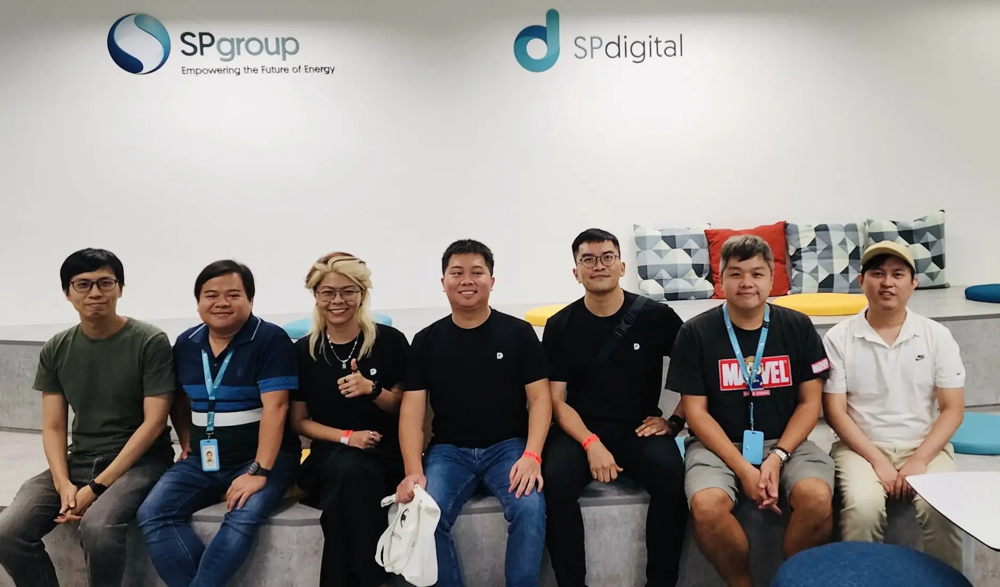

> **Recap:** Our long-awaited visit to SP Group revealed that digital transformation in large enterprises faces more cultural than technical challenges. We discovered that successful partnerships require treating external engineers as part of one team, and that effective engineers need to understand industry-specific problems beyond just coding solutions.

We've always wanted to visit [SP Group](http://spgroup.com.sg/), one of our partners, but the pandemic made it impossible until now. This year, the opportunity finally came when we decided to attend Echelon X in Singapore.

Meeting the SPG team in person was insightful and rewarding. We learned more about the challenges of digital transformation for enterprises, remembered why SPG chose to work with us, and saw how we could promote a growth mindset for our engineers.

Plus, our friends at SPG make amazing soju beer bombs.

Everyone in our team for this visit would have their own takeaways, but a few things resonate with all of us.

- For a partnership to work, all engineers from SPG and Dwarves should act as one team. SPG treats our team as their own, which helps our collaboration. They train and lead everyone together, fostering unity.
- SPG showed us that digital transformation is more about people and their ways of working than technology. There's a gap between the tech department and the rest of the organization. True transformation starts by overcoming resistance to change and fostering a culture of learning and adaptability.
- SPG is so large that each department operates almost like an independent company. Employees are deeply rooted in their established workflows, and introducing new technology often feels like adding more work rather than simplifying it.
- Data security is a big concern at SPG. Internal teams have strict, lengthy processes to access data, and it's even harder for external partners like us. While AI and other tech are being discussed, the main issue is keeping data safe. Engineers must be aware of security and privacy, often dealing with regulatory challenges.
- While adopting trending tech like AI and AR is great, the real challenge is using them to solve business problems. What sets top engineers apart is their ability to understand industry-specific issues and use technology to address them.

All in all, visiting SPG for us reinforced our direction of how we should grow our team and how we should look at the bigger picture of the tech scene. Engineers need to expand their perspectives beyond just coding.

We are greatly grateful for how welcoming and open the SPG team was to us. We look forward to continue contributing to the changes SPG is making every day.

---

**WALA: to walk around, learn around.**

In our line of work, we hear and talk about domain knowledge all the time. WALA aims for exactly that: we, people in tech, take a break from sitting in front of our computers, to go out, connect with new people, and get to understand other businesses.

Through stories collected from Techie WALAs, we hope our community members get the chance to learn from others' successes and failures, gain insights into what works and doesn't, and reflect on their own works and practices.

Besides, breaking away from the stereotype of "tech people are introverts" is always fun.
